# Detekcija slobodnih i zauzetih mjesta na parkingu pomoću YOLO modela

[Poveznica na GitHub repozitorij sa projektom](https://github.com/Noname3123/SDU_YOLO_PARKING_LOT)

## Tablica sadržaja
- [Detekcija slobodnih i zauzetih mjesta na parkingu pomoću YOLO modela](#detekcija-slobodnih-i-zauzetih-mjesta-na-parkingu-pomoću-yolo-modela)
  - [Tablica sadržaja](#tablica-sadržaja)
  - [1. Motivacija](#1-motivacija)
  - [2. Tim](#2-tim)
    - [Damjan Đekić](#damjan-đekić)
    - [Benjamin Jakupović](#benjamin-jakupović)
  - [3. Pregled područja](#3-pregled-područja)
  - [4. Opis skupa podataka](#4-opis-skupa-podataka)
  - [5. Opis primijenjenih metoda](#5-opis-primijenjenih-metoda)
    - [5.1. Parametri treniranja](#51-parametri-treniranja)
  - [6. Opis eksperimenta](#6-opis-eksperimenta)
  - [7. Validacija i objašnjenje rezultata](#7-validacija-i-objašnjenje-rezultata)
    - [7.1. Prvo treniranje - Yolo11 large](#71-prvo-treniranje---yolo11-large)
      - [7.1.1. Parametri treniranja](#711-parametri-treniranja)
      - [7.1.2. Interpretacija metrika](#712-interpretacija-metrika)
        - [7.1.2.1. Funkcije gubitka (Loss Functions)](#7121-funkcije-gubitka-loss-functions)
        - [7.1.2.2. Preciznost (Precision)](#7122-preciznost-precision)
        - [7.1.2.3. Odziv (Recall)](#7123-odziv-recall)
        - [7.1.2.4. Srednja prosječna preciznost (mAP)](#7124-srednja-prosječna-preciznost-map)
      - [7.1.3. Precision-Confidence Curve](#713-precision-confidence-curve)
      - [7.1.4. Precision-Recall Curve](#714-precision-recall-curve)
      - [7.1.5. Recall-Confidence Curve](#715-recall-confidence-curve)
      - [7.1.6. F1-Confidence Curve](#716-f1-confidence-curve)
      - [7.1.7. Interpretacija matrica konfuzije](#717-interpretacija-matrica-konfuzije)
      - [7.1.8. Ukupna ocjena](#718-ukupna-ocjena)
    - [7.2. Drugo treniranje - Yolo11 large](#72-drugo-treniranje---yolo11-large)
      - [7.2.1. Parametri treniranja](#721-parametri-treniranja)
      - [7.2.2. Interpretacija metrika](#722-interpretacija-metrika)
        - [7.2.2.1. Funkcije gubitka (Loss Functions)](#7221-funkcije-gubitka-loss-functions)
        - [7.2.2.2. Preciznost (Precision)](#7222-preciznost-precision)
        - [7.2.2.3. Odziv (Recall)](#7223-odziv-recall)
        - [7.2.2.4. Srednja prosječna preciznost (mAP)](#7224-srednja-prosječna-preciznost-map)
      - [7.2.3. Precision-Confidence Curve](#723-precision-confidence-curve)
      - [7.2.4. Precision-Recall Curve](#724-precision-recall-curve)
      - [7.2.5. Recall-Confidence Curve](#725-recall-confidence-curve)
      - [7.2.6. F1-Confidence Curve](#726-f1-confidence-curve)
      - [7.2.7. Interpretacija matrica konfuzije](#727-interpretacija-matrica-konfuzije)
      - [7.2.8. Ukupna ocjena](#728-ukupna-ocjena)
    - [7.3. Treće treniranje - Yolo11 large](#73-treće-treniranje---yolo11-large)
      - [7.3.1. Parametri treniranja](#731-parametri-treniranja)
      - [7.3.2. Interpretacija metrika](#732-interpretacija-metrika)
        - [7.3.2.1. Funkcije gubitka (Loss Functions)](#7321-funkcije-gubitka-loss-functions)
        - [7.3.2.2. Preciznost (Precision)](#7322-preciznost-precision)
        - [7.3.2.3. Odziv (Recall)](#7323-odziv-recall)
        - [7.3.2.4. Srednja prosječna preciznost (mAP)](#7324-srednja-prosječna-preciznost-map)
      - [7.3.3. Precision-Confidence Curve](#733-precision-confidence-curve)
      - [7.3.4. Precision-Recall Curve](#734-precision-recall-curve)
      - [7.3.5. Recall-Confidence Curve](#735-recall-confidence-curve)
      - [7.3.6. F1-Confidence Curve](#736-f1-confidence-curve)
      - [7.3.7. Interpretacija matrica konfuzije](#737-interpretacija-matrica-konfuzije)
      - [7.3.8. Ukupna ocjena](#738-ukupna-ocjena)
    - [7.4. Četvrto treniranje - Yolo11 large](#74-četvrto-treniranje---yolo11-large)
      - [7.4.1. Parametri treniranja](#741-parametri-treniranja)
      - [7.4.2. Interpretacija metrika](#742-interpretacija-metrika)
        - [7.4.2.1. Funkcije gubitka (Loss Functions)](#7421-funkcije-gubitka-loss-functions)
        - [7.4.2.2. Preciznost (Precision)](#7422-preciznost-precision)
        - [7.4.2.3. Odziv (Recall)](#7423-odziv-recall)
        - [7.4.2.4. Srednja prosječna preciznost (mAP)](#7424-srednja-prosječna-preciznost-map)
      - [7.4.3. Precision-Confidence Curve](#743-precision-confidence-curve)
      - [7.4.4. Precision-Recall Curve](#744-precision-recall-curve)
      - [7.4.5. Recall-Confidence Curve](#745-recall-confidence-curve)
      - [7.4.6. F1-Confidence Curve](#746-f1-confidence-curve)
      - [7.4.7. Interpretacija matrica konfuzije](#747-interpretacija-matrica-konfuzije)
      - [7.4.8. Ukupna ocjena](#748-ukupna-ocjena)
    - [7.5. Peto treniranje - Yolo11 large](#75-peto-treniranje---yolo11-large)
      - [7.5.1. Parametri treniranja](#751-parametri-treniranja)
      - [7.5.2. Interpretacija metrika](#752-interpretacija-metrika)
        - [7.5.2.1. Funkcije gubitka (Loss Functions)](#7521-funkcije-gubitka-loss-functions)
        - [7.5.2.2. Preciznost (Precision)](#7522-preciznost-precision)
        - [7.5.2.3. Odziv (Recall)](#7523-odziv-recall)
        - [7.5.2.4. Srednja prosječna preciznost (mAP)](#7524-srednja-prosječna-preciznost-map)
      - [7.5.3. Precision-Confidence Curve](#753-precision-confidence-curve)
      - [7.5.4. Precision-Recall Curve](#754-precision-recall-curve)
      - [7.5.5. Recall-Confidence Curve](#755-recall-confidence-curve)
      - [7.5.6. F1-Confidence Curve](#756-f1-confidence-curve)
      - [7.5.7. Interpretacija matrica konfuzije](#757-interpretacija-matrica-konfuzije)
      - [7.5.8. Ukupna ocjena](#758-ukupna-ocjena)
    - [7.6. Šesto treniranje - Yolo11 large](#76-šesto-treniranje---yolo11-large)
      - [7.6.1. Parametri treniranja](#761-parametri-treniranja)
      - [7.6.2. Interpretacija metrika](#762-interpretacija-metrika)
        - [7.6.2.1. Funkcije gubitka (Loss Functions)](#7621-funkcije-gubitka-loss-functions)
        - [7.6.2.2. Preciznost (Precision)](#7622-preciznost-precision)
        - [7.6.2.3. Odziv (Recall)](#7623-odziv-recall)
        - [7.6.2.4. Srednja prosječna preciznost (mAP)](#7624-srednja-prosječna-preciznost-map)
      - [7.6.3. Precision-Confidence Curve](#763-precision-confidence-curve)
      - [7.6.4. Precision-Recall Curve](#764-precision-recall-curve)
      - [7.6.5. Recall-Confidence Curve](#765-recall-confidence-curve)
      - [7.6.6. F1-Confidence Curve](#766-f1-confidence-curve)
      - [7.6.7. Interpretacija matrica konfuzije](#767-interpretacija-matrica-konfuzije)
      - [7.6.8. Ukupna ocjena](#768-ukupna-ocjena)
    - [7.7. Prvo treniranje - Yolo11 medium](#77-prvo-treniranje---yolo11-medium)
      - [7.7.1. Parametri treniranja](#771-parametri-treniranja)
      - [7.7.2. Interpretacija metrika](#772-interpretacija-metrika)
        - [7.7.2.1. Funkcije gubitka (Loss Functions)](#7721-funkcije-gubitka-loss-functions)
        - [7.7.2.2. Preciznost (Precision)](#7722-preciznost-precision)
        - [7.7.2.3. Odziv (Recall)](#7723-odziv-recall)
          - [7.7.2.4. Srednja prosječna preciznost (mAP)](#7724-srednja-prosječna-preciznost-map)
      - [7.7.3. Precision-Confidence Curve](#773-precision-confidence-curve)
      - [7.7.4. Precision-Recall Curve](#774-precision-recall-curve)
      - [7.7.5. Recall-Confidence Curve](#775-recall-confidence-curve)
      - [7.7.6. F1-Confidence Curve](#776-f1-confidence-curve)
      - [7.7.7. Interpretacija matrice konfuzije](#777-interpretacija-matrice-konfuzije)
      - [7.7.8. Ukupna ocjena](#778-ukupna-ocjena)
    - [7.8. Drugo treniranje - Yolo11 medium](#78-drugo-treniranje---yolo11-medium)
      - [7.8.1 Parametri treniranja](#781-parametri-treniranja)
      - [7.8.2. Interpretacija metrika](#782-interpretacija-metrika)
        - [7.8.2.1. Funkcije gubitka (Loss Functions)](#7821-funkcije-gubitka-loss-functions)
        - [7.8.2.2. Preciznost (Precision)](#7822-preciznost-precision)
        - [7.8.2.3. Odziv (Recall)](#7823-odziv-recall)
          - [7.8.2.4. Srednja prosječna preciznost (mAP)](#7824-srednja-prosječna-preciznost-map)
      - [7.8.3. Precision-Confidence Curve](#783-precision-confidence-curve)
      - [7.8.4. Precision-Recall Curve](#784-precision-recall-curve)
      - [7.8.5. Recall-Confidence Curve](#785-recall-confidence-curve)
      - [7.8.6. F1-Confidence Curve](#786-f1-confidence-curve)
      - [7.8.7. etacija matrice konfuzije](#787-etacija-matrice-konfuzije)
      - [7.8.8. Ukupna ocjena](#788-ukupna-ocjena)
    - [7.9. Treće treniranje - Yolo11 medium](#79-treće-treniranje---yolo11-medium)
      - [7.9.1. Parametri treniranja](#791-parametri-treniranja)
      - [7.9.2. Interpretacija metrika](#792-interpretacija-metrika)
        - [7.9.2.1. Funkcije gubitka (Loss Functions)](#7921-funkcije-gubitka-loss-functions)
        - [7.9.2.2. Preciznost (Precision)](#7922-preciznost-precision)
        - [7.9.2.3. Odziv (Recall)](#7923-odziv-recall)
          - [7.9.2.4. Srednja prosječna preciznost (mAP)](#7924-srednja-prosječna-preciznost-map)
      - [7.9.3. Precision-Confidence Curve](#793-precision-confidence-curve)
      - [7.9.4. Precision-Recall Curve](#794-precision-recall-curve)
      - [7.9.5. Recall-Confidence Curve](#795-recall-confidence-curve)
      - [7.9.6. F1-Confidence Curve](#796-f1-confidence-curve)
      - [7.9.7. Interpretacija matrice konfuzije](#797-interpretacija-matrice-konfuzije)
      - [7.9.8. Ukupna ocjena](#798-ukupna-ocjena)
    - [7.10. Četvrto treniranje - Yolo11 medium](#710-četvrto-treniranje---yolo11-medium)
      - [7.10.1 Parametri treniranja](#7101-parametri-treniranja)
      - [7.10.2. Interpretacija metrika](#7102-interpretacija-metrika)
        - [7.10.2.1. Funkcije gubitka (Loss Functions)](#71021-funkcije-gubitka-loss-functions)
        - [7.10.2.2. Preciznost (Precision)](#71022-preciznost-precision)
        - [7.10.2.3. Odziv (Recall)](#71023-odziv-recall)
        - [7.10.2.4. Srednja prosječna preciznost (mAP)](#71024-srednja-prosječna-preciznost-map)
      - [7.10.3. Precision-Confidence Curve](#7103-precision-confidence-curve)
      - [7.10.4. Precision-Recall Curve](#7104-precision-recall-curve)
      - [7.10.5. Recall-Confidence Curve](#7105-recall-confidence-curve)
      - [7.10.6. F1-Confidence Curve](#7106-f1-confidence-curve)
      - [7.10.7. Interpretacija matrica konfuzije](#7107-interpretacija-matrica-konfuzije)
      - [7.10.8. Ukupna ocjena](#7108-ukupna-ocjena)
    - [7.11. Peto treniranje - Yolo11 medium](#711-peto-treniranje---yolo11-medium)
      - [7.11.1. Parametri treniranja](#7111-parametri-treniranja)
      - [7.11.2. Interpretacija metrika](#7112-interpretacija-metrika)
        - [7.11.2.1. Funkcije gubitka (Loss Functions)](#71121-funkcije-gubitka-loss-functions)
        - [7.11.2.2. Preciznost (Precision)](#71122-preciznost-precision)
        - [7.11.2.3. Odziv (Recall)](#71123-odziv-recall)
          - [7.11.2.4. Srednja prosječna preciznost (mAP)](#71124-srednja-prosječna-preciznost-map)
      - [7.11.3. Precision-Confidence Curve](#7113-precision-confidence-curve)
      - [7.11.4. Precision-Recall Curve](#7114-precision-recall-curve)
      - [7.11.5. Recall-Confidence Curve](#7115-recall-confidence-curve)
      - [7.11.6. F1-Confidence Curve](#7116-f1-confidence-curve)
      - [7.11.7. Interpretacija matrice konfuzije](#7117-interpretacija-matrice-konfuzije)
      - [7.11.8. Ukupna ocjena](#7118-ukupna-ocjena)
    - [7.12. Šesto treniranje - Yolo11 medium](#712-šesto-treniranje---yolo11-medium)
      - [7.12.1. Parametri treniranja](#7121-parametri-treniranja)
      - [7.12.2. Interpretacija metrika](#7122-interpretacija-metrika)
        - [7.12.2.1. Funkcije gubitka (Loss Functions)](#71221-funkcije-gubitka-loss-functions)
        - [7.12.2.2. Preciznost (Precision)](#71222-preciznost-precision)
        - [7.12.2.3. Odziv (Recall)](#71223-odziv-recall)
          - [7.12.2.4. Srednja prosječna preciznost (mAP)](#71224-srednja-prosječna-preciznost-map)
      - [7.12.3. Precision-Confidence Curve](#7123-precision-confidence-curve)
      - [7.12.4. Precision-Recall Curve](#7124-precision-recall-curve)
      - [7.12.5. Recall-Confidence Curve](#7125-recall-confidence-curve)
      - [7.12.6. F1-Confidence Curve](#7126-f1-confidence-curve)
      - [7.12.7. Interpretacija matrice konfuzije](#7127-interpretacija-matrice-konfuzije)
      - [7.12.8. Ukupna ocjena](#7128-ukupna-ocjena)
  - [8. Zaključak](#8-zaključak)
  - [9. Literatura](#9-literatura)
  - [10. Prilozi](#10-prilozi)

## 1. Motivacija

Cilj je bio doraditi YOLO model koji je napravljen za kolegij "Analitika podataka velikog obujma". Model je izrađen za distribuirani sustav ParkMan.
Jedna od funkcionalnosti ParkMan-a uključuje "brojanje" zauzetih mjesta na parkinzima, temeljem slike sigurnosne kamere na parkirnim mjestima. Kako bi se to implementiralo, korišten je YOLO model koji je treniran nad PKLOT skupom podataka. PKLOT skup podataka nastoji detektirati parkirna mjesta na parkinzima te ih klasificirati u "slobodno" i "zauzeto".

Inicijalni model je treniran sa 20 epoha nad PKLOT skupom podataka. Trenirani model je prikazivao visoke performanse detekcije, koje su vidljive na grafovima ispod.

Kao što se vidi na grafovima iznad, model je pretreniran te postiže savršene rezultate za parkinge iz PKLOT skupa. Budući da PKLOT sadržava iste parkinge sa različitim korištenostima u trening, validacijskom i test setu, model nije u mogućnosti generalizirati i prepoznati mjesta na novim parkinzima. Razlog proizlazi iz toga što je model učio detektirati parkirna mjesta te ih klasificirati u odgovarajuće kategorije (slobodno i zauzeto). Budući da različiti parkinzi imaju različit raspored mjesta, treniranje generaliziranog modela je zahtjevan proces koji uključuje doradu skupa podataka sa neviđenim parkinzima.

Kako bi se olakšao proces i poboljšala sposobnost generaliziranja, promijenjen je pristup klasifikaciji. Umjesto da se detektiraju parkirna mjesta i klasificiraju u slobodno i zauzeto, model detektira objekte na slici te ih klasificira u vozila (automobili, motorcikli, kamioni, busevi) i ostale objekte. Promjena pristupu klasifikaciji je olakšala sposobnost generalizacije modela uz zadržavanje funkcionalnosti potrebnih za ParkMan sustav - brojanje zauzetih mjesta na parkingu.

## 2. Tim 
Treniranje modela je bilo implementirano u paru te su zadaci bili podijeljeni.

### Damjan Đekić
- Augmentacija i proširenje skupa podataka za treniranje pomoću dodatnih efekata na slici
- Treniranje YOLO11 medium modela sa različitim kombinacijama parametara

### Benjamin Jakupović
- Prilagodba skupa podataka za treniranje (usklađivanje klasa iz VisDrone skupa podataka kako bi se uskladilo za potrebe zadatka) 
- Prilagodba skupa podatka za validaciju i testiranje (usklađivanje klasa iz PKLOT skupa podataka kako bi se uskladilo sa train podacima)
- Treniranje YOLO11 large modela sa različitim kombinacijama parametara

## 3. Pregled područja

Računalni vid je područje umjetne inteligencije koje omogućava računalima da percipiraju i interpretiraju informacije iz slika ili videozapisa, slično kao i ljudski vid. Jedna od ključnih primjena računalnog vida je detekcija objekata, gdje je cilj prepoznati i locirati objekte unutar slike, što je bio cilj i ovog projekta. U tu svrhu razvijeni su brojni modeli, a jedan od najpoznatijih i najučinkovitijih je YOLO (You Only Look Once). 

YOLO modeli su poznati po svojoj brzini i efikasnosti jer obavljaju detekciju objekata u stvarnom vremenu kroz samo jedan prolaz mreže. YOLOv11 predstavlja jednu od novijih iteracije ove arhitekture, koja dodatno poboljšava preciznost i prilagodljivost kroz napredne tehnike učenja i optimizacije.

Model kombinira detekciju objekata, klasifikaciju i regresiju pozicija unutar jedinstvene neuronske mreže, što ga čini posebno pogodnim za aplikacije u nadzoru, autonomnim vozilima i industrijskoj automatizaciji. Zbog svoje uravnoteženosti između točnosti i brzine, YOLOv11 je popularan izbor za istraživače i praktičare u području računalnog vida. Baš zbog takvog širokog podučja primjene, odlučili smo se pokušati istrenirati ovaj model da prepoznaje vozila na slikama, a za to smo koristili YOLOv11 varijante "medium" i "large".

## 4. Opis skupa podataka 

Prva iteracija YOLO modela, koja je trenirana za kolegij "Analitika podataka velikog obujma" je trenirana nad PKLOT skupom podataka. PKLOT skup podataka je licenciran sa CC BY 4.0 licencom te sadrži 12,416 anotiranih slika parkirnih mjesta, preuzetih sa nadzornih kamera parkinga. Skup podataka sadrži različite raspone vremenskih uvjeta i zauzetosti parkinga te je namjenjen za detekciju i klasifikaciju parkirnih mjesta kao slobodnih i zauzetih [1]. Skup podataka već ima unaprijed pripremljenu podjelu koja se sastoji od 8,691 slika za treniranje, 2,483 slika za validaciju te 1,242 slika za testiranje.

Kako bi se generalizirao model, tražio se novi skup podataka koji je optimiziran za detekciju objekata na slikama. Skup podataka koji je najviše odgovarao zahtjevima zadatka je VisDrone(2019). VisDrone je skup podataka koji sadrži slike koje su slikali različite vrste dronova, u različitim vremenskim uvjetima. Skup podataka sadrži 10,209 statičnih slika dronova koji pokrivaju razna područja [2]:
  1. lokaciju (14 različitih gradova u Kini)
  2. okoliš (urbani i izvan grada)
  3. objekte (ljudi, vozila, bicikli...)
  4. gustoću (rijetke scene i scene s velikom gustoćom objekata).
  
Prije treniranja modela, VisDrone skup podataka se trebao prilagoditi potrebama zadatka.

Uzeo se train podskup VisDrone skupa podataka, koji se sastoji od 6,471 slika te se uskladio sa potrebama zadatka. Svi objekti u skupu podataka koji su bili vozila (automobili, busevi, kamioni, motorcikli) su se ponovno anotirali kao nadklasa "vozilo" (engl. *vehicle*), a svi ostali objekti su anotirani kako "ne-vozila" (engl. *non-vehicle*).

Zatim se iz PKLOT skupa uzeo testni i validacijski podskup. Za PKLOT podskup je također bilo potrebno uskladiti klase - *space-occupied* klasa je postala *vehicle*, a *space-free* je postala *non-vehicle*.

Skup podataka se proširio dodatnim slikama na način da su se postojećim slikama (iz train skupa) mijenjali određene parametri. U tu svrhu, izrađena je Python skripta koja augmentira postojeće slike. Vrši to na način da uzima svaku sliku iz skupa podataka za treniranje te kreira pet novih slika na temelju svake od njih, izmjenjujući jednu od karakteristika te slike koje su unaprijed definirane, a to su: **svjetlina**, **kontrast**, **šum**, **zamućenje** i **gamma** (vrsta podešavanja tonova srednje vrijednosti piksela bez utjecaja svijetle ili tamne dijelove slike). Novokreirane slike spremljene su u formatu *originalniNaziv_augmentacija*, a uz to su kopirane anotacije i oznake za svaku sliku te spremljene u istom formatu kako bi se mogle proslijediti YOLO modelu na učenje.

Konačan skup podataka je bio podijeljen na train, test i validacijski skup.
Train skup je prilagođeni VisDrone2019 te se sastoji od 19,413 slika (originalnih i augmentiranih). Test skup se sastoji od 1,242 originalnih PKLOT slika, dok se validacijski skup sastoji od 2,483 originalnih PKLOT slika.

## 5. Opis primijenjenih metoda
Za potrebe detekcije vozila sa slika korišteni su YOLOv11 modeli (*medium* i *large*), trenirani kroz više iteracija uz različite kombinacije hiperparametara i konfiguracija podataka. Treniranje je provedeno nad prilagođenim skupom podataka koji uključuje slike parkirališta s klasama `"vehicle"` i `"non-vehicle"`.

### 5.1. Parametri treniranja
TIjekom eksperimentiranja korištene su sljedeće ključne postavke:
- **Broj epoha (`epochs`)**: Modeli su trenirani kroz 5, 10 i 20 epoha, ovisno o eksperimentu. U nekim pokušajima aktiviran je i mehanizam ranog zaustavljanja (`early stopping`) s parametrima poput `patience: 2` ili `patience: 10`.
- **Batch size (`batch`)**: Veličina batch-a je konstantno postavljena na 4, radi ograničenih GPU resursa.
- **Veličina ulazne slike (`imgsz`)**: Korištene su rezolucije `416x416` i `640x640`, pri čemu je veća rezolucija testirana radi poboljšanja detekcija manjih objekata.
- **Augmentacija (`augment`)**: Standardne augmentacije su u eksperimentima bile isključene, budući da smo se oslonili na prethodno napravljene augmentacije s naše strane pomoću već spomenute Python skripte. Iako su augmentacije bile isključene, u svim treniranjima korištena je **mosaic augmentacija**
- **Warmup (`warmup_echos`)**: U zadnjim iteracijama dodano je zagrijavanje modela kroz prve 3 epohe, budući da je imao dovoljno epoha nakon toga za treniranje.

## 6. Opis eksperimenta
Eksperiment je osmišljen s ciljem istraživanja učinkovitosti različitih konfiguracija treniranja YOLOv11 modela za zadatak detekcije vozila na slikama. Polazni model treniran je isključivo nad PKLOT skupom podataka, no pokazao je visok stupanj prekomjernog prilagođavanja i lošu generalizaciju na nove parkinge.

Kako vismo nadvladali ograničenja početnog pristupa, promjenili smo metodologiju klasifikacije: umjesto izravne klasifikacije slobodnih i zauzetih parkirnih mjesta, model je treniran za detekciju vozila i drugih objekata, neovisno o rasporedu parkinga. Time se omogućava generalizacija na nepoznate scene, uz zadržavanje funkcionalnosti za kasniju interpretaciju zauzetosti.

Eksperiment je organiziran u više faza treniranja modela, gdje je svaka faza imala svoje specifične ciljeve, hiperparametre i kombinaciju ulaznih podatkaka:
- Istražene su dvije varijante modela: **YOLOv11 medium** i **YOLOv11 large**.
Korišteni su različiti brojevi epoha (od 5 do 20), veličine serija (`batch = 4`), i veličine ulaznih slika (`imgsz = 416` i `640`).
- Ispitivano je ponašanje modela bez aktiviranih YOLO augmentacija, dok je `mosaic augmentacija` bila uključena u svim pokušajima.
- Uveden je mehanizam ranog zaustavljanja (early stopping) temeljen na stagnaciji metrika (`patience` od 2 do 10 epoha).
- Neke iteracije uključivale su i **warmup fazu**, u kojoj se learning rate postupno povećavao u prvim epohama.

Tijekom svih eksperimenata koristio se unaprijed pripremljeni i augmentirani skup podataka, koji uključuje dvije klase: `vehicle` i `non-vehicle`. Svaki pokušaj treniranja bio je praćen analizom metrika (gubitak, preciznost, odziv, mAP), vizualizacijom rezultata i interpretacijom matrica konfuzije, što je omogućilo evaluaciju sposobnosti modela da generalizira i prepoznaje različite klase.

U nastavku dokumenta detaljno su opisani pojedinačni pokušaji treniranja, uključujući korištene parametre, rezultate i interpretaciju za svaku iteraciju treniranja.

## 7. Validacija i objašnjenje rezultata
### 7.1. Prvo treniranje - Yolo11 large
#### 7.1.1. Parametri treniranja
Model je treniran s specifičnim skupom parametara definiranim u `args.yaml` datoteci. Ključni parametri za ovo izvođenje su:
- **`epochs: 5`**: Model je treniran kroz 5 epoha. Epoha predstavlja jedan potpuni prolazak kroz cjelokupni skup podataka za treniranje. Pet epoha je relativno malen broj, što ukazuje na to da je ovo vjerojatno bio početni ili eksplorativni trening kako bi se procijenile performanse modela i valjanost pristupa.
- **`batch: 4`**: Veličina serije (batch size) postavljena je na 4. To znači da je model obrađivao 4 slike istovremeno tijekom svake iteracije treniranja. Manja veličina serije često se koristi kada su resursi GPU-a ograničeni, ali može dovesti do nestabilnijeg gradijenta tijekom učenja.
- **`imgsz: 416`**: Slike za treniranje i validaciju su smanjene na rezoluciju od 416x416 piksela. Ovo je uobičajena rezolucija za YOLO modele koja nudi dobar kompromis između brzine obrade i točnosti detekcije.

#### 7.1.2. Interpretacija metrika
Rezultati treniranja, zabilježeni u `results.csv`, pružaju uvid u proces učenja modela kroz 5 epoha.

##### 7.1.2.1. Funkcije gubitka (Loss Functions)
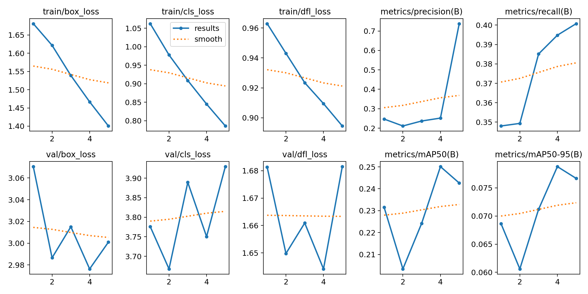

Funkcije gubitka (`box_loss`, `cls_loss`, `dfl_loss`) pokazuju koliko model "griješi" prilikom predviđanja. Niža vrijednost označava bolje performanse.
- **Gubitak na trening skupu**: Vrijednosti `train/box_loss`, `train/cls_loss` i `train/dfl_loss` konzistentno opadaju tijekom epoha (npr. `train/box_loss` pada s 1.68 na 1.40). To je pozitivan znak koji pokazuje da model uspješno uči iz podataka na kojima se trenira.
- **Gubitak na validacijskom skupu**: Vrijednosti `val/box_loss`, `val/cls_loss` i `val/dfl_loss` su znatno veće od trening vrijednosti i ne pokazuju jasan trend opadanja. Primjerice, `val/box_loss` ostaje oko vrijednosti 3.0. Visoka vrijednost `val/cls_loss` (gubitak klasifikacije, ~3.8) posebno sugerira da se model muči s ispravnom klasifikacijom objekata na podacima koje prije nije vidio. Ova velika razlika između trening i validacijskog gubitka jasan je pokazatelj prekomjernog prilagođavanja (overfitting), gdje model "pamti" trening podatke umjesto da uči generalizirane značajke.

##### 7.1.2.2. Preciznost (Precision)

Preciznost mjeri udio točnih pozitivnih detekcija među svim detekcijama koje je model napravio. Na primjer, ako model detektira 10 automobila, a 8 od njih su stvarno automobili, preciznost je 80%. U zadnjoj, petoj epohi, metrika `metrics/precision(B)` pokazuje značajan skok na `0.73785`. Iako ovo izgleda obećavajuće, treba biti oprezan jer je u prethodnim epohama vrijednost bila znatno niža (oko 0.21-0.25). Ovakav nagli skok može biti posljedica rasporeda učenja (learning rate schedule) i ne mora nužno predstavljati stabilno poboljšanje performansi.

##### 7.1.2.3. Odziv (Recall)

Odziv mjeri koliko je model uspješan u pronalaženju svih relevantnih objekata na slici. Ako na slici ima 10 automobila, a model ih pronađe 7, odziv je 70%. Metrika `metrics/recall(B)` pokazuje blagi, ali stabilan rast s `0.348` na `0.400` kroz 5 epoha. To znači da model postupno postaje bolji u pronalaženju svih postojećih objekata, iako još uvijek propušta više od polovice (oko 60%).

##### 7.1.2.4. Srednja prosječna preciznost (mAP)

mAP (mean Average Precision) je ključna metrika za zadatke detekcije objekata jer kombinira preciznost i odziv u jednu vrijednost, čineći je najvažnijim pokazateljem ukupnih performansi modela.
- **`metrics/mAP50(B)`**: Ova metrika mjeri performanse pri pragu preklapanja (IoU - Intersection over Union) od 50%. Vrijednosti se kreću oko `0.24`, što ukazuje na osnovnu sposobnost detekcije. Model može locirati objekte, ali ne s visokom preciznošću.
- **`metrics/mAP50-95(B)`**: Ovo je stroža i standardna metrika koja usrednjava mAP preko različitih IoU pragova (od 50% do 95% u koracima od 5%). Rezultati su ovdje znatno niži (oko `0.07-0.08`). To potvrđuje da, iako model može grubo detektirati objekte (što pokazuje `mAP50`), pozicije i veličine predviđenih okvira (bounding boxes) nisu dovoljno precizne da bi zadovoljile više pragove preklapanja.

#### 7.1.3. Precision-Confidence Curve

Na grafu Precision-Confidence, plava linija koja predstavlja "all classes" pokazuje preciznost (Precision) u odnosu na prag pouzdanosti (Confidence). Vidljivo je da preciznost raste s povećanjem praga pouzdanosti. Na primjer, pri pragu pouzdanosti od približno 0.85, preciznost naglo raste prema 1.0. Narančasta linija, koja predstavlja klasu "vehicle", također pokazuje porast preciznosti s povećanjem pouzdanosti, dostižući visoke vrijednosti. Plava linija, koja predstavlja "non-vehicle" klasu, ostaje na gotovo nuli, što znači da model vrlo rijetko točno detektira objekte koji nisu vozila, odnosno ima vrlo nisku preciznost za tu klasu. Legenda također pokazuje da je ukupna preciznost za sve klase (all classes) 1.00 pri pragu pouzdanosti od 0.947, što je najvjerojatnije točka gdje model s visokom sigurnošću predviđa samo mali broj, ali vrlo točnih detekcija.

#### 7.1.4. Precision-Recall Curve

Graf Precision-Recall prikazuje odnos između preciznosti (Precision) i odziva (Recall). Idealna krivulja bila bi blizu gornjeg desnog kuta, što znači visoku preciznost i visok odziv. Plava linija ("all classes") pokazuje da model postiže relativno nisku preciznost (oko 0.3) čak i pri visokom odzivu, koja se zatim blago smanjuje kako odziv raste. Narančasta linija ("vehicle") ima znatno bolje performanse, s preciznošću koja počinje oko 0.6 i postupno pada kako odziv raste. Linija za "non-vehicle" klasu ostaje na nuli. Vrijednost mAP@0.5 za "all classes" iznosi 0.250, što je niska vrijednost i ukazuje na općenito loše performanse detekcije objekata za sve klase pri pragu IoU od 0.5. Vrijednost mAP@0.5 za klasu "vehicle" iznosi 0.500, što je bolji, ali još uvijek umjeren rezultat. Klasa "non-vehicle" ima mAP@0.5 od 0.000, što potvrđuje da model ne detektira tu klasu.

#### 7.1.5. Recall-Confidence Curve

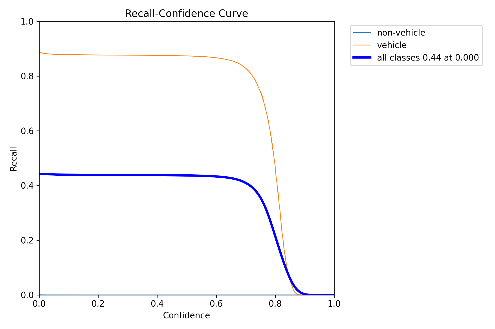

Na grafu Recall-Confidence, plava linija ("all classes") prikazuje kako se odziv (Recall) mijenja s pragom pouzdanosti (Confidence). Odziv počinje visok i postupno opada kako prag pouzdanosti raste. To je očekivano, jer povećanje pouzdanosti znači da model postaje selektivniji i propušta više detekcija. Narančasta linija ("vehicle") pokazuje znatno veći odziv u odnosu na "all classes", zadržavajući visoku razinu do praga pouzdanosti od oko 0.8, nakon čega naglo pada. Linija za "non-vehicle" klasu ponovno ostaje na gotovo nuli. Legenda pokazuje da je odziv za "all classes" 0.44 pri pragu pouzdanosti od 0.000, što je točka gdje je model najmanje selektivan i pokušava pronaći što više objekata.

#### 7.1.6. F1-Confidence Curve

F1-Confidence krivulja prikazuje F1 rezultat (harmonijsku sredinu preciznosti i odziva) u odnosu na prag pouzdanosti (Confidence). F1 rezultat je mjera točnosti modela i traži balans između preciznosti i odziva. Plava linija ("all classes") pokazuje da F1 rezultat dostiže svoj maksimum (oko 0.3) pri pragu pouzdanosti od približno 0.7. Nakon toga, F1 rezultat naglo opada. Narančasta linija ("vehicle") dostiže znatno viši F1 rezultat (oko 0.6) pri sličnom pragu pouzdanosti, što ukazuje na bolje balansirane performanse za tu klasu. Linija za "non-vehicle" klasu ostaje na nuli. Legenda pokazuje da je F1 za "all classes" 0.30 pri pragu pouzdanosti od 0.729, što predstavlja optimalnu točku za balans između preciznosti i odziva za sve klase.

#### 7.1.7. Interpretacija matrica konfuzije

Normalizirana matrica konfuzije pruži detaljan uvid u performanse klasifikacije modela za prvi trening. Model je klasificirao objekte u tri kategorije: "non-vehicle", "vehicle" i "background".

**Normalizirana matrica konfuzije:**

Normalizirana matrica prikazuje udjele, što omogućuje lakšu usporedbu performansi među klasama.
* **"non-vehicle" klasa:**
    * Samo 0.05 (5%) stvarnih "non-vehicle" objekata je ispravno klasificirano.
    * Ogromnih 0.95 (95%) stvarnih "non-vehicle" objekata je pogrešno klasificirano kao "background". Ovo je kritičan problem jer model gotovo u potpunosti ignorira ovu klasu.
* **"vehicle" klasa:**
    * Model pokazuje visoku točnost za klasu "vehicle", s 0.92 (92%) točno klasificiranih instanci.
    * Samo 0.08 (8%) "vehicle" objekata je pogrešno klasificirano kao "background".
* **"background" klasa:**
    * Model je izuzetno uspješan u prepoznavanju "background" klase s 0.99 (99%) točnih detekcija.
    * Samo 0.01 (1%) "background" objekata je pogrešno klasificirano kao "non-vehicle".

**Zaključak iz matrica konfuzije:**
Analiza matrica konfuzije jasno pokazuje da se model u prvom treningu gotovo isključivo fokusirao na prepoznavanje "vehicle" i "background" klasa. Performanse za klasu "non-vehicle" su izuzetno loše, s modelom koji gotovo sve stvarne "non-vehicle" objekte klasificira kao pozadinu. Ovo je u skladu s ranije primijećenim niskim vrijednostima mAP-a za "all classes" i nultim vrijednostima za "non-vehicle" klasu u Precision-Recall i drugim krivuljama. Modelu nedostaje sposobnost razlikovanja između "non-vehicle" objekata i pozadine, što sugerira da su "non-vehicle" objekti možda premali, nedovoljno zastupljeni u skupu podataka ili se previše preklapaju s pozadinom u smislu vizualnih značajki.

#### 7.1.8. Ukupna ocjena
Na temelju 5 epoha treniranja, model pokazuje da je u ranoj fazi učenja. Opadajući gubitak na trening skupu je dobar znak, ali visoki validacijski gubitak i niske mAP vrijednosti (posebno mAP50-95) jasno ukazuju na to da model još nije sposoban za generalizaciju na nove podatke i pati od overfittinga. Potrebno je znatno duže treniranje (više epoha), potencijalno uz prilagodbu hiperparametara (npr. learning rate, augmentacije) kako bi se postigle bolje performanse i omogućilo modelu da nauči robusnije značajke za detekciju.

### 7.2. Drugo treniranje - Yolo11 large
#### 7.2.1. Parametri treniranja
U drugoj iteraciji, parametri su prilagođeni s ciljem poboljšanja performansi. Ključne promjene i postavke iz `args.yaml` su:
- **`epochs: 5`** i **`patience: 2`**: Iako je treniranje postavljeno na 5 epoha, uveden je mehanizam ranog zaustavljanja (`patience: 2`). To znači da će se treniranje prekinuti ako se ključna metrika (u ovom slučaju `metrics/mAP50-95(B)`) ne poboljša dvije epohe zaredom. Budući da je treniranje završilo nakon 4. epohe, to ukazuje da model nije pokazao napredak u 3. i 4. epohi u odnosu na vrhunac postignut u 2. epohi.
- **`batch: 4`**: Veličina serije ostala je ista, 4 slike po iteraciji.
- **`imgsz: 640`**: Rezolucija slika povećana je sa 416x416 na 640x640 piksela. Cilj ove promjene bio je pružiti modelu više detalja sa svake slike, što potencijalno može pomoći u detekciji manjih objekata i poboljšanju ukupne preciznosti.

#### 7.2.2. Interpretacija metrika
Rezultati iz `results.csv` pokazuju slične trendove kao i u prvom treniranju, unatoč promjeni rezolucije slike.

##### 7.2.2.1. Funkcije gubitka (Loss Functions)
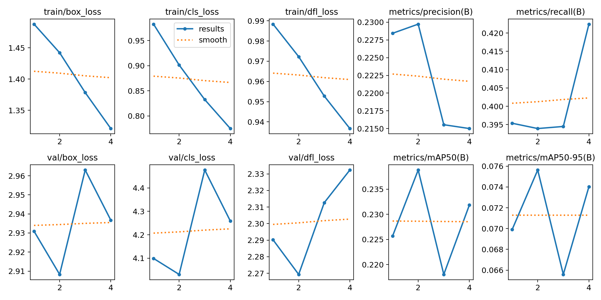
- **Gubitak na trening skupu**: Sve tri komponente gubitka (`train/box_loss`, `train/cls_loss`, `train/dfl_loss`) pokazuju konzistentan pad tijekom 4 epohe. Na primjer, `train/box_loss` pada s 1.48 na 1.32. Ovo potvrđuje da model i dalje uči iz trening podataka.
- **Gubitak na validacijskom skupu**: Kao i u prethodnom pokušaju, vrijednosti gubitka na validacijskom skupu (`val/box_loss` ~2.9, `val/cls_loss` ~4.2) su vrlo visoke i ne pokazuju trend opadanja. Veliki jaz između trening i validacijskog gubitka i dalje je prisutan, što je snažan pokazatelj prekomjernog prilagođavanja (overfitting).

##### 7.2.2.2. Preciznost (Precision)

Metrika `metrics/precision(B)` ostaje niska i stagnira oko vrijednosti `0.22` tijekom cijelog treniranja. To znači da je od svih detekcija koje model napravi, samo oko 22% njih ispravno. Povećanje rezolucije slike nije donijelo poboljšanje u ovom segmentu.

##### 7.2.2.3. Odziv (Recall)

Metrika `metrics/recall(B)` pokazuje blagu nestabilnost, krećući se oko vrijednosti `0.40`. To znači da model uspijeva pronaći otprilike 40% svih stvarnih objekata na slikama. Iako je to malo bolje nego u prvom treniranju, model i dalje propušta većinu objekata.

##### 7.2.2.4. Srednja prosječna preciznost (mAP)

- **`metrics/mAP50(B)`**: Vrijednost ove metrike doseže vrhunac od `0.238` u drugoj epohi, nakon čega pada i stagnira. Ovo sugerira da model ima vrlo ograničenu sposobnost ispravnog lociranja objekata čak i pri nižem pragu preklapanja (IoU=50%).
- **`metrics/mAP50-95(B)`**: Ključna metrika performansi, `mAP50-95(B)`, također doseže svoj maksimum u drugoj epohi s vrijednošću od `0.0756`, nakon čega pada. Niska vrijednost (ispod 0.1) potvrđuje da model nije precizan u određivanju granica objekata (bounding box). Upravo je pad ove metrike u 3. i 4. epohi aktivirao mehanizam ranog zaustavljanja.

#### 7.2.3. Precision-Confidence Curve

Na grafu Precision-Confidence, plava linija koja predstavlja "all classes" prikazuje kako se preciznost (Precision) mijenja s pragom pouzdanosti (Confidence). Preciznost raste s povećanjem praga pouzdanosti. Pri pragu pouzdanosti od približno 0.8, preciznost za "all classes" naglo raste, dostižući 1.00 pri pouzdanosti od 0.937. Narančasta linija, koja predstavlja klasu "vehicle", također pokazuje porast preciznosti s povećanjem pouzdanosti, dostižući visoke vrijednosti. Plava linija, koja predstavlja "non-vehicle" klasu, ostaje na gotovo nuli, što znači da model ima vrlo nisku preciznost za detekcije koje nisu vozila.

#### 7.2.4. Precision-Recall Curve

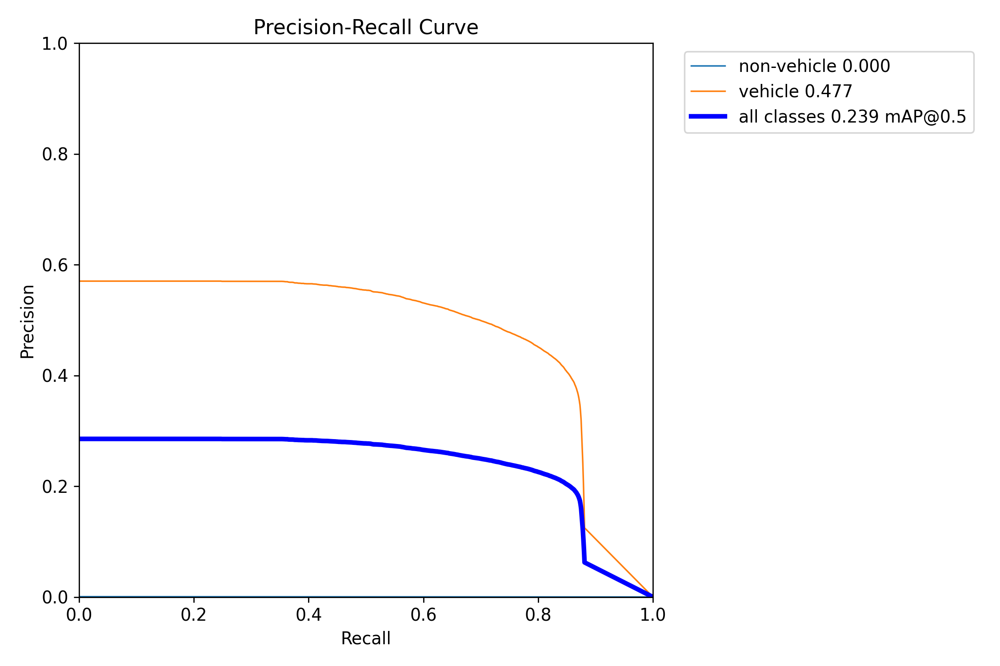

Graf Precision-Recall prikazuje odnos između preciznosti (Precision) i odziva (Recall). Plava linija ("all classes") pokazuje relativno nisku preciznost (oko 0.25-0.3) koja se blago smanjuje kako odziv raste. Narančasta linija ("vehicle") ima znatno bolje performanse, s preciznošću koja počinje oko 0.58 i postupno pada kako odziv raste. Linija za "non-vehicle" klasu ostaje na nuli. Vrijednost mAP@0.5 za "all classes" iznosi 0.239, što je niska vrijednost i ukazuje na općenito loše performanse detekcije objekata pri pragu IoU od 0.5. Vrijednost mAP@0.5 za klasu "vehicle" iznosi 0.477, što je bolji, ali još uvijek umjeren rezultat. Klasa "non-vehicle" ima mAP@0.5 od 0.000, što potvrđuje da model ne detektira tu klasu.

#### 7.2.5. Recall-Confidence Curve

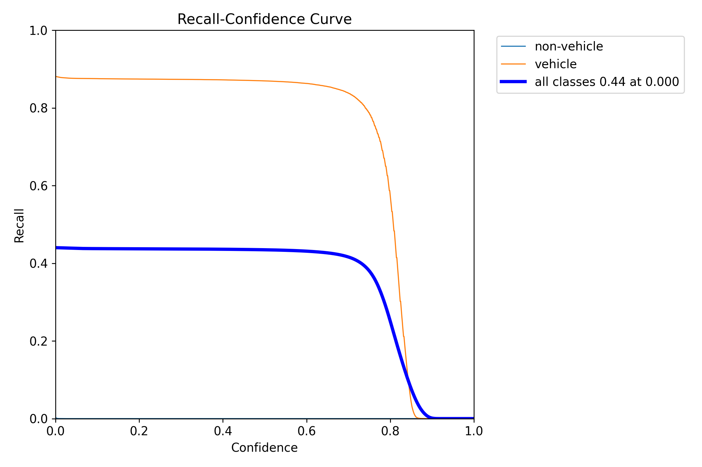

Na grafu Recall-Confidence, plava linija ("all classes") prikazuje kako se odziv (Recall) mijenja s pragom pouzdanosti (Confidence). Odziv počinje visok i postupno opada kako prag pouzdanosti raste, što je očekivano jer povećanje pouzdanosti čini model selektivnijim. Narančasta linija ("vehicle") pokazuje znatno veći odziv u odnosu na "all classes", zadržavajući visoku razinu do praga pouzdanosti od oko 0.8, nakon čega naglo pada. Linija za "non-vehicle" klasu ponovno ostaje na gotovo nuli. Odziv za "all classes" je 0.44 pri pragu pouzdanosti od 0.000, što je točka gdje je model najmanje selektivan.

#### 7.2.6. F1-Confidence Curve

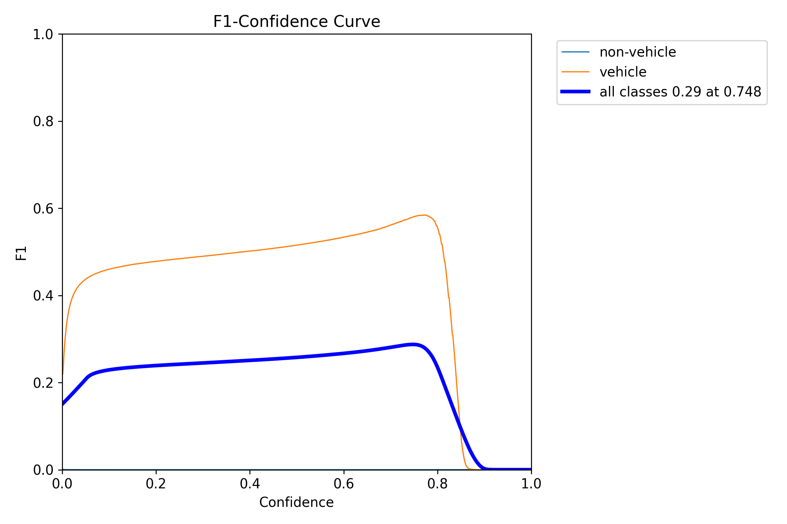

F1-Confidence krivulja prikazuje F1 rezultat (harmonijsku sredinu preciznosti i odziva) u odnosu na prag pouzdanosti (Confidence). F1 rezultat za "all classes" (plava linija) dostiže svoj maksimum (oko 0.29) pri pragu pouzdanosti od približno 0.748. Nakon toga, F1 rezultat naglo opada. Narančasta linija ("vehicle") dostiže znatno viši F1 rezultat (oko 0.58-0.6) pri sličnom pragu pouzdanosti, što ukazuje na bolje balansirane performanse za tu klasu. Linija za "non-vehicle" klasu ostaje na nuli.

#### 7.2.7. Interpretacija matrica konfuzije

Normalizirana matrica konfuzije za drugi trening modela pruži uvid u performanse klasifikacije. Model je klasificirao objekte u tri kategorije: "non-vehicle", "vehicle" i "background".

**Normalizirana matrica konfuzije:**
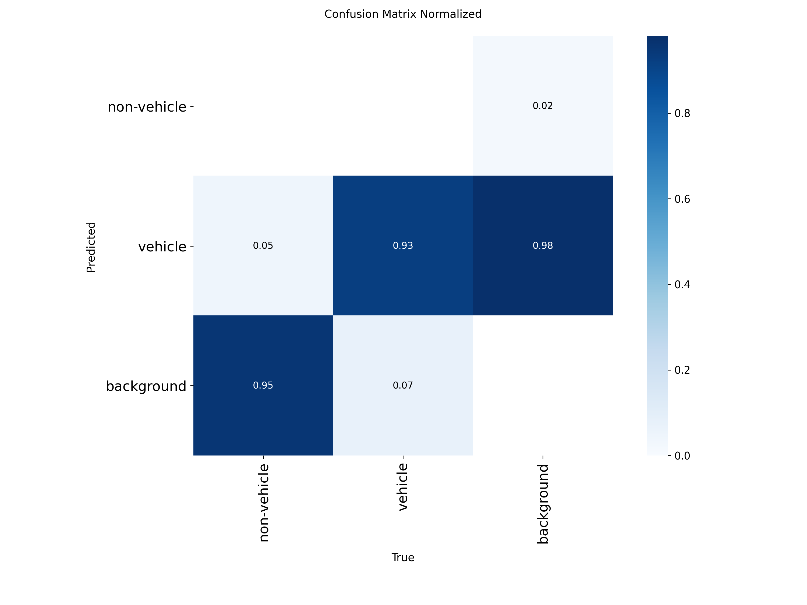

Normalizirana matrica prikazuje udjele, što omogućuje lakšu usporedbu performansi među klasama.
* **"non-vehicle" klasa:**
    * Samo 0.00 (0%) stvarnih "non-vehicle" objekata je ispravno klasificirano.
    * Ogromnih 0.95 (95%) stvarnih "non-vehicle" objekata je pogrešno klasificirano kao "background".
    * 0.05 (5%) stvarnih "non-vehicle" objekata je pogrešno klasificirano kao "vehicle".
* **"vehicle" klasa:**
    * Model pokazuje visoku točnost za klasu "vehicle", s 0.93 (93%) točno klasificiranih instanci.
    * Samo 0.07 (7%) "vehicle" objekata je pogrešno klasificirano kao "background".
    * 0.00 (0%) "vehicle" objekata je pogrešno klasificirano kao "non-vehicle".
* **"background" klasa:**
    * Model je izuzetno uspješan u prepoznavanju "background" klase s 0.98 (98%) točnih detekcija.
    * Samo 0.02 (2%) "background" objekata je pogrešno klasificirano kao "non-vehicle".
    * 0.00 (0%) "background" objekata je pogrešno klasificirano kao "vehicle".

**Zaključak iz matrica konfuzije:**
Analiza matrica konfuzije za drugi trening potvrđuje probleme u detekciji "non-vehicle" klase. Model gotovo u potpunosti ignorira ovu klasu, klasificirajući veliku većinu stvarnih "non-vehicle" objekata kao "background". S druge strane, performanse za klasu "vehicle" i "background" su vrlo dobre, s visokom preciznošću i odzivom za te klase. Ovi rezultati su dosljedni s niskim mAP vrijednostima za "all classes" i nultom mAP vrijednošću za "non-vehicle" klasu prikazanim u krivuljama. To sugerira da model i dalje ima poteškoća s razlikovanjem "non-vehicle" objekata od pozadine, što je vjerojatno posljedica nedostatka raznolikosti ili reprezentativnosti "non-vehicle" uzoraka u trening skupu.

#### 7.2.8. Ukupna ocjena
Drugo treniranje, unatoč povećanju rezolucije ulaznih slika na 640x640, nije donijelo značajna poboljšanja. Model i dalje pati od izraženog overfittinga, gdje dobro uči na trening podacima, ali ne uspijeva generalizirati znanje na nove, neviđene podatke iz validacijskog skupa. Performanse mjerene kroz mAP metrike ostaju niske, a rano zaustavljanje treniranja potvrđuje da model nije uspio postići daljnji napredak. Ovi rezultati sugeriraju da problem nije samo u rezoluciji slike, već vjerojatno leži u samom skupu podataka, augmentacijama ili drugim hiperparametrima treniranja koje je potrebno dalje istražiti.

### 7.3. Treće treniranje - Yolo11 large
#### 7.3.1. Parametri treniranja
U trećoj iteraciji, cilj je bio provjeriti hoće li duže treniranje donijeti poboljšanja.
- **`epochs: 10`** i **`patience: 5`**: Broj epoha je povećan na 10, a strpljenje za rano zaustavljanje (`patience`) na 5. Treniranje se zaustavilo nakon 9. epohe. To se dogodilo jer ključna metrika, `metrics/mAP50-95(B)`, nije pokazala poboljšanje u zadnjih 5 epoha u odnosu na najbolji rezultat postignut u 4. epohi.
- **`batch: 4`**: Veličina serije ostala je nepromijenjena.
- **`imgsz: 416`**: Rezolucija slika vraćena je na 416x416 piksela, kao u prvom treniranju.
- **`augment: false`**: Važno je napomenuti da su standardne augmentacije bile isključene (`augment: false`), iako je `mosaic` augmentacija ostala aktivna. Ovo može ograničiti sposobnost modela da nauči invarijantnost na različite transformacije.

#### 7.3.2. Interpretacija metrika
Rezultati iz `results.csv` za treće treniranje pokazuju da duže treniranje nije riješilo temeljne probleme.

##### 7.3.2.1. Funkcije gubitka (Loss Functions)

- **Gubitak na trening skupu**: Kao i u prethodnim pokušajima, gubitak na trening skupu (`train/box_loss`, `train/cls_loss`, `train/dfl_loss`) konzistentno opada kroz 9 epoha. Vrijednost `train/box_loss` pada s 1.72 na 1.35, a `train/cls_loss` s 1.13 na 0.74, što pokazuje da model i dalje "uči" trening podatke.
- **Gubitak na validacijskom skupu**: Jaz između trening i validacijskog gubitka ostaje izrazito velik. Vrijednosti `val/box_loss` (~3.0) i `val/cls_loss` (~3.8) su visoke i ne pokazuju nikakav trend poboljšanja. Ovo je još jedan jasan dokaz teškog prekomjernog prilagođavanja (overfitting).

##### 7.3.2.2. Preciznost (Precision)

Metrika `metrics/precision(B)` je izrazito nestabilna. U prvoj i trećoj epohi bilježi visoke vrijednosti (~0.75), dok u ostalim epohama pada na nisku razinu od ~0.24. Ovakve oscilacije ukazuju na nestabilnost u procesu učenja i da visoke vrijednosti nisu pouzdan pokazatelj stvarnih performansi.

##### 7.3.2.3. Odziv (Recall)

Metrika `metrics/recall(B)` stagnira na niskoj razini, krećući se između `0.36` i `0.39`. To znači da model, neovisno o trajanju treniranja, konstantno propušta pronaći više od 60% objekata na validacijskim slikama.

##### 7.3.2.4. Srednja prosječna preciznost (mAP)

- **`metrics/mAP50(B)`**: Vrijednost ove metrike doseže vrhunac od `0.242` u trećoj epohi, nakon čega stagnira i blago opada.
- **`metrics/mAP50-95(B)`**: Najvažnija metrika, `mAP50-95(B)`, postiže svoj maksimum od `0.0787` u četvrtoj epohi. Nakon toga, vrijednost ne uspijeva premašiti taj rezultat, što je nakon pet epoha stagnacije (od 5. do 9.) aktiviralo mehanizam ranog zaustavljanja. Izuzetno niska vrijednost (ispod 0.1) potvrđuje da model nije u stanju precizno detektirati objekte.

#### 7.3.3. Precision-Confidence Curve

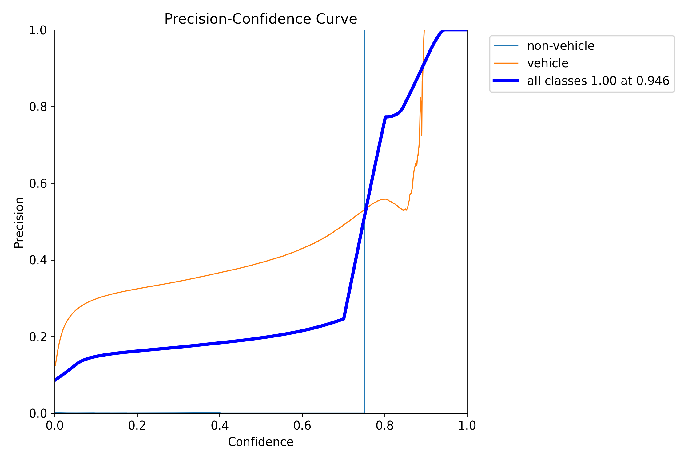

Na grafu Precision-Confidence, plava linija koja predstavlja "all classes" prikazuje kako se preciznost (Precision) mijenja s pragom pouzdanosti (Confidence). Preciznost raste s povećanjem praga pouzdanosti. Pri pragu pouzdanosti od približno 0.75, preciznost za "all classes" naglo raste, dostižući 1.00 pri pouzdanosti od 0.946. Narančasta linija, koja predstavlja klasu "vehicle", također pokazuje porast preciznosti s povećanjem pouzdanosti, dostižući visoke vrijednosti. Plava linija, koja predstavlja "non-vehicle" klasu, ostaje na gotovo nuli, što znači da model ima vrlo nisku preciznost za detekcije koje nisu vozila.

#### 7.3.4. Precision-Recall Curve

Graf Precision-Recall prikazuje odnos između preciznosti (Precision) i odziva (Recall). Plava linija ("all classes") pokazuje relativno nisku preciznost (oko 0.25-0.3) koja se blago smanjuje kako odziv raste. Narančasta linija ("vehicle") ima znatno bolje performanse, s preciznošću koja počinje oko 0.58 i postupno pada kako odziv raste. Linija za "non-vehicle" klasu ostaje na nuli. Vrijednost mAP@0.5 za "all classes" iznosi 0.241, što je niska vrijednost i ukazuje na općenito loše performanse detekcije objekata pri pragu IoU od 0.5. Vrijednost mAP@0.5 za klasu "vehicle" iznosi 0.482, što je bolji, ali još uvijek umjeren rezultat. Klasa "non-vehicle" ima mAP@0.5 od 0.000, što potvrđuje da model ne detektira tu klasu.

#### 7.3.5. Recall-Confidence Curve

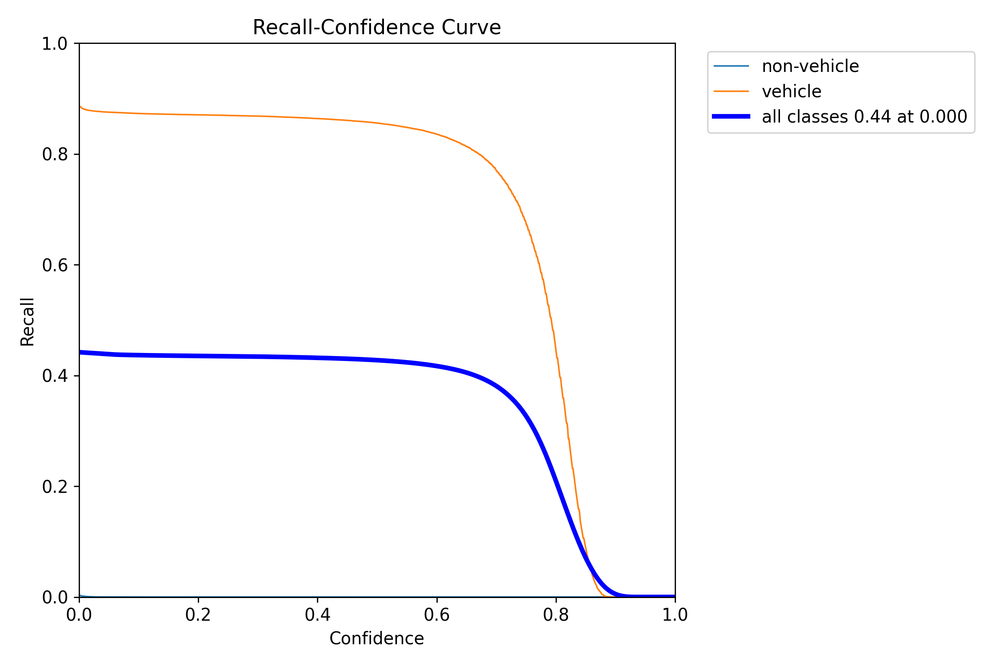

Na grafu Recall-Confidence, plava linija ("all classes") prikazuje kako se odziv (Recall) mijenja s pragom pouzdanosti (Confidence). Odziv počinje visok i postupno opada kako prag pouzdanosti raste, što je očekivano jer povećanje pouzdanosti čini model selektivnijim. Narančasta linija ("vehicle") pokazuje znatno veći odziv u odnosu na "all classes", zadržavajući visoku razinu do praga pouzdanosti od oko 0.8, nakon čega naglo pada. Linija za "non-vehicle" klasu ponovno ostaje na gotovo nuli. Odziv za "all classes" je 0.44 pri pragu pouzdanosti od 0.000, što je točka gdje je model najmanje selektivan.

#### 7.3.6. F1-Confidence Curve

F1-Confidence krivulja prikazuje F1 rezultat (harmonijsku sredinu preciznosti i odziva) u odnosu na prag pouzdanosti (Confidence). F1 rezultat za "all classes" (plava linija) dostiže svoj maksimum (oko 0.3) pri pragu pouzdanosti od približno 0.709. Nakon toga, F1 rezultat naglo opada. Narančasta linija ("vehicle") dostiže znatno viši F1 rezultat (oko 0.6) pri sličnom pragu pouzdanosti, što ukazuje na bolje balansirane performanse za tu klasu. Linija za "non-vehicle" klasu ostaje na nuli.

#### 7.3.7. Interpretacija matrica konfuzije

Normalizirana matrica konfuzije za treći trening modela pruži uvid u performanse klasifikacije. Model je klasificirao objekte u tri kategorije: "non-vehicle", "vehicle" i "background".

**Normalizirana matrica konfuzije:**

Normalizirana matrica prikazuje udjele, što omogućuje lakšu usporedbu performansi među klasama.
* **"non-vehicle" klasa:**
    * Samo 0.00 (0%) stvarnih "non-vehicle" objekata je ispravno klasificirano.
    * Ogromnih 0.95 (95%) stvarnih "non-vehicle" objekata je pogrešno klasificirano kao "background".
    * 0.05 (5%) stvarnih "non-vehicle" objekata je pogrešno klasificirano kao "vehicle".
* **"vehicle" klasa:**
    * Model pokazuje visoku točnost za klasu "vehicle", s 0.92 (92%) točno klasificiranih instanci.
    * Samo 0.08 (8%) "vehicle" objekata je pogrešno klasificirano kao "background".
    * 0.00 (0%) "vehicle" objekata je pogrešno klasificirano kao "non-vehicle".
* **"background" klasa:**
    * Model je izuzetno uspješan u prepoznavanju "background" klase s 0.97 (97%) točnih detekcija.
    * Samo 0.03 (3%) "background" objekata je pogrešno klasificirano kao "non-vehicle".
    * 0.00 (0%) "background" objekata je pogrešno klasificirano kao "vehicle".

**Zaključak iz matrica konfuzije:**
Analiza matrica konfuzije za treći trening ponovno ukazuje na značajan problem s detekcijom "non-vehicle" klase. Model i dalje gotovo u potpunosti ignorira ovu klasu, klasificirajući veliku većinu stvarnih "non-vehicle" objekata kao "background". Performanse za klasu "vehicle" i "background" ostaju na visokoj razini, pokazujući da model uspješno prepoznaje te dvije kategorije. Ovi rezultati su u skladu s prethodnim promatranjima niskih mAP vrijednosti za "all classes" i nultom mAP vrijednošću za "non-vehicle" klasu, te naglašavaju potrebu za adresiranjem problema s detekcijom "non-vehicle" objekata. Problemi mogu proizaći iz neuravnoteženosti skupa podataka ili nedostatka reprezentativnih primjera "non-vehicle" objekata.

#### 7.3.8. Ukupna ocjena
Treći pokušaj treniranja, unatoč povećanom broju epoha, nije donio napredak. Rezultati su gotovo identični prethodnim pokušajima, što snažno sugerira da problem nije u broju epoha ili rezoluciji slike. Model konzistentno pokazuje znakove teškog overfittinga i ne uspijeva generalizirati. Isključivanje standardnih augmentacija (`augment: false`) moglo je dodatno pogoršati situaciju. Potrebno je preispitati temeljni pristup, vjerojatno kroz značajno obogaćivanje i čišćenje skupa podataka, te primjenu snažnijih tehnika regularizacije i augmentacije kako bi se model natjerao da uči općenitije značajke.

### 7.4. Četvrto treniranje - Yolo11 large
#### 7.4.1. Parametri treniranja
Četvrta iteracija kombinirala je postavke iz prethodnih pokušaja s ciljem pronalaska optimalne konfiguracije.
- **`epochs: 10`** i **`patience: 5`**: Zadržan je veći broj epoha (10) i strpljenje (5). Treniranje je prekinuto nakon 8. epohe, što znači da se ključna metrika (`metrics/mAP50-95(B)`) nije poboljšala u zadnjih pet epoha u odnosu na najbolji rezultat postignut u 3. epohi.
- **`batch: 4`**: Veličina serije ostala je nepromijenjena.
- **`imgsz: 640`**: Rezolucija slika ponovno je povećana na 640x640 piksela, kao u drugom treniranju, kako bi se modelu pružilo više detalja.
- **`augment: false`**: Standardne augmentacije su i dalje bile isključene.

#### 7.4.2. Interpretacija metrika
Rezultati iz `results.csv` potvrđuju prethodne nalaze i pokazuju da kombinacija veće rezolucije i dužeg treniranja bez rješavanja temeljnog problema overfittinga ne donosi poboljšanja.

##### 7.4.2.1. Funkcije gubitka (Loss Functions)

- **Gubitak na trening skupu**: Vrijednosti gubitka (`train/box_loss`, `train/cls_loss`) konzistentno opadaju tijekom 8 epoha, s `train/box_loss` koji pada s 1.53 na 1.26. Ovo još jednom potvrđuje da model uspješno uči na trening podacima.
- **Gubitak na validacijskom skupu**: Jaz između trening i validacijskog gubitka ostaje ogroman. Vrijednosti `val/box_loss` (~2.9) i `val/cls_loss` (~4.2) su izrazito visoke i ne pokazuju trend opadanja, što je jasan znak da model ne generalizira dobro.

##### 7.4.2.2. Preciznost (Precision)

Preciznost (`metrics/precision(B)`) pokazuje veliku nestabilnost. U 3. epohi bilježi skok na `0.745`, što se poklapa s najboljim mAP rezultatom, ali u ostalim epohama ostaje na niskoj razini od ~0.22-0.24. Ovakve oscilacije potvrđuju da model nije stabilan i da visoke vrijednosti nisu pouzdane.

##### 7.4.2.3. Odziv (Recall)

Odziv (`metrics/recall(B)`) pokazuje blagi, ali nedovoljan rast, s početnih `0.37` na konačnih `0.42`. Model i dalje propušta pronaći gotovo 60% svih objekata na slikama.

##### 7.4.2.4. Srednja prosječna preciznost (mAP)

- **`metrics/mAP50(B)`**: Vrijednost ove metrike doseže vrhunac od `0.2578` u trećoj epohi, nakon čega stagnira i opada.
- **`metrics/mAP50-95(B)`**: Ključna metrika performansi, `mAP50-95(B)`, također postiže svoj maksimum od `0.0838` u trećoj epohi. Nakon toga, vrijednost više ne dostiže taj nivo, što je na kraju i aktiviralo rano zaustavljanje. Ovako niska vrijednost (ispod 0.1) definitivno potvrđuje da model, unatoč svim pokušajima, nije u stanju precizno locirati objekte.

#### 7.4.3. Precision-Confidence Curve

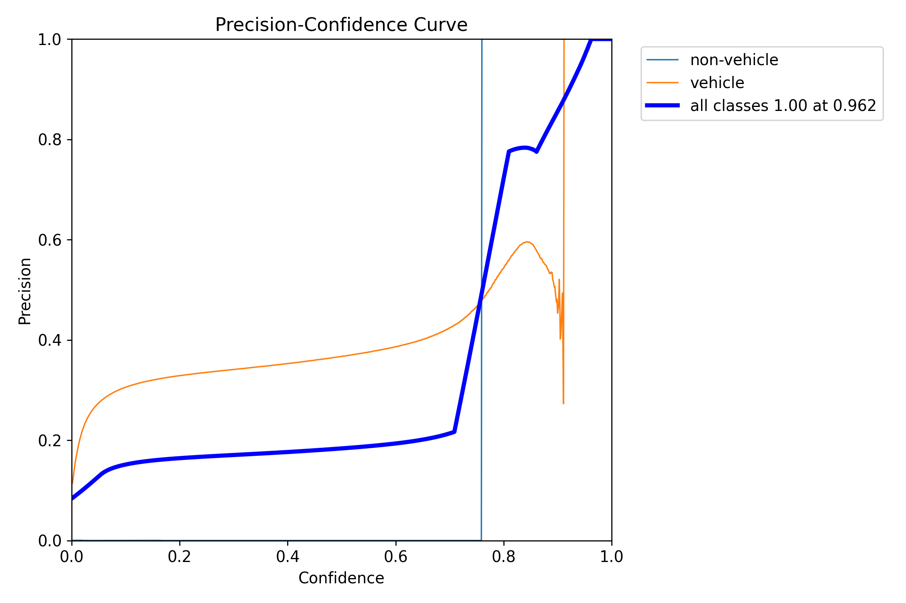

Na grafu Precision-Confidence, plava linija koja predstavlja "all classes" prikazuje kako se preciznost (Precision) mijenja s pragom pouzdanosti (Confidence). Preciznost raste s povećanjem praga pouzdanosti. Pri pragu pouzdanosti od približno 0.7, preciznost za "all classes" naglo raste, dostižući 1.00 pri pouzdanosti od 0.962. Narančasta linija, koja predstavlja klasu "vehicle", također pokazuje porast preciznosti s povećanjem pouzdanosti, dostižući visoke vrijednosti. Plava linija, koja predstavlja "non-vehicle" klasu, ostaje na gotovo nuli, što znači da model ima vrlo nisku preciznost za detekcije koje nisu vozila.

#### 7.4.4. Precision-Recall Curve

Graf Precision-Recall prikazuje odnos između preciznosti (Precision) i odziva (Recall). Plava linija ("all classes") pokazuje relativno nisku preciznost (oko 0.25-0.3) koja se blago smanjuje kako odziv raste. Narančasta linija ("vehicle") ima znatno bolje performanse, s preciznošću koja počinje oko 0.6 i postupno pada kako odziv raste. Linija za "non-vehicle" klasu ostaje na nuli. Vrijednost mAP@0.5 za "all classes" iznosi 0.258, što je niska vrijednost i ukazuje na općenito loše performanse detekcije objekata pri pragu IoU od 0.5. Vrijednost mAP@0.5 za klasu "vehicle" iznosi 0.515, što je bolji, ali još uvijek umjeren rezultat. Klasa "non-vehicle" ima mAP@0.5 od 0.000, što potvrđuje da model ne detektira tu klasu.

#### 7.4.5. Recall-Confidence Curve

Na grafu Recall-Confidence, plava linija ("all classes") prikazuje kako se odziv (Recall) mijenja s pragom pouzdanosti (Confidence). Odziv počinje visok i postupno opada kako prag pouzdanosti raste, što je očekivano jer povećanje pouzdanosti čini model selektivnijim. Narančasta linija ("vehicle") pokazuje znatno veći odziv u odnosu na "all classes", zadržavajući visoku razinu do praga pouzdanosti od oko 0.8, nakon čega naglo pada. Linija za "non-vehicle" klasu ponovno ostaje na gotovo nuli. Odziv za "all classes" je 0.45 pri pragu pouzdanosti od 0.000, što je točka gdje je model najmanje selektivan.

#### 7.4.6. F1-Confidence Curve

F1-Confidence krivulja prikazuje F1 rezultat (harmonijsku sredinu preciznosti i odziva) u odnosu na prag pouzdanosti (Confidence). F1 rezultat za "all classes" (plava linija) dostiže svoj maksimum (oko 0.3) pri pragu pouzdanosti od približno 0.768. Nakon toga, F1 rezultat naglo opada. Narančasta linija ("vehicle") dostiže znatno viši F1 rezultat (oko 0.6) pri sličnom pragu pouzdanosti, što ukazuje na bolje balansirane performanse za tu klasu. Linija za "non-vehicle" klasu ostaje na nuli.

#### 7.4.7. Interpretacija matrica konfuzije

Normalizirana matrica konfuzije za četvrti trening modela pruži uvid u performanse klasifikacije. Model je klasificirao objekte u tri kategorije: "non-vehicle", "vehicle" i "background".

**Normalizirana matrica konfuzije:**

Normalizirana matrica prikazuje udjele, što omogućuje lakšu usporedbu performansi među klasama.
* **"non-vehicle" klasa:**
    * Samo 0.00 (0%) stvarnih "non-vehicle" objekata je ispravno klasificirano.
    * Ogromnih 0.95 (95%) stvarnih "non-vehicle" objekata je pogrešno klasificirano kao "background".
    * 0.05 (5%) stvarnih "non-vehicle" objekata je pogrešno klasificirano kao "vehicle".
* **"vehicle" klasa:**
    * Model pokazuje visoku točnost za klasu "vehicle", s 0.93 (93%) točno klasificiranih instanci.
    * Samo 0.07 (7%) "vehicle" objekata je pogrešno klasificirano kao "background".
    * 0.00 (0%) "vehicle" objekata je pogrešno klasificirano kao "non-vehicle".
* **"background" klasa:**
    * Model je izuzetno uspješan u prepoznavanju "background" klase s 0.99 (99%) točnih detekcija.
    * Samo 0.01 (1%) "background" objekata je pogrešno klasificirano kao "non-vehicle".
    * 0.00 (0%) "background" objekata je pogrešno klasificirano kao "vehicle".

**Zaključak iz matrica konfuzije:**
Analiza matrica konfuzije za četvrti trening ponovno naglašava kritičan problem s detekcijom "non-vehicle" klase. Model i dalje gotovo u potpunosti ne uspijeva prepoznati ovu klasu, klasificirajući veliku većinu stvarnih "non-vehicle" objekata kao "background" ili "vehicle". S druge strane, performanse za klasu "vehicle" i "background" su iznimno dobre, s visokom točnošću u prepoznavanju tih kategorija. Ovi rezultati su u skladu s prethodnim zapažanjima o niskim mAP vrijednostima za "all classes" i nultoj mAP vrijednosti za "non-vehicle" klasu, te jasno ukazuju na to da se model fokusira isključivo na detekciju vozila i pozadine. Za poboljšanje performansi za "non-vehicle" klasu, potrebno je preispitati skup podataka za trening, uključujući veći broj i raznolikost "non-vehicle" objekata, te potencijalno primijeniti specifične strategije augmentacije ili ponderiranja klasa.

#### 7.4.8. Ukupna ocjena
Četvrto treniranje je potvrdilo zaključke iz prethodnih iteracija. Ni veća rezolucija ni duže treniranje ne mogu kompenzirati nedostatak generalizacije uzrokovan, najvjerojatnije, problemima u skupu podataka i nedostatkom augmentacija. Model konzistentno ulazi u stanje teškog overfittinga, gdje metrike dosegnu svoj niski vrhunac vrlo rano (u 3. ili 4. epohi) i nakon toga više ne napreduju. Ovi rezultati snažno upućuju na to da je daljnje podešavanje hiperparametara treniranja bez fundamentalnih promjena u podacima i strategiji augmentacije beskorisno.

### 7.5. Peto treniranje - Yolo11 large
#### 7.5.1. Parametri treniranja
Peta analizirana iteracija predstavljala je pokušaj da se provjeri može li znatno duže treniranje probiti granice performansi viđene u prethodnim pokušajima.
- **`epochs: 20`** i **`patience: 10`**: Broj epoha je udvostručen na 20, a strpljenje za rano zaustavljanje (`patience`) povećano na 10. Model je odradio svih 20 epoha, što znači da nije bilo dugog perioda stagnacije koji bi aktivirao rano zaustavljanje.
- **`batch: 4`**: Veličina serije ostala je nepromijenjena.
- **`imgsz: 416`**: Rezolucija slika je bila 416x416 piksela.
- **`augment: false`**: Standardne augmentacije su i dalje bile isključene.

#### 7.5.2. Interpretacija metrika
Rezultati iz `results.csv` za 20 epoha treniranja pružaju konačnu potvrdu o ponašanju modela s postojećim skupom podataka.

##### 7.5.2.1. Funkcije gubitka (Loss Functions)
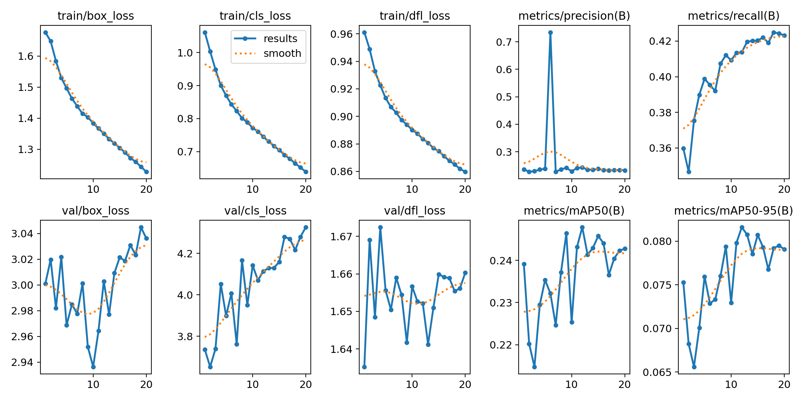
- **Gubitak na trening skupu**: Gubitak na trening skupu (`train/box_loss`, `train/cls_loss`) pokazuje neprekidan i konzistentan pad tijekom svih 20 epoha. Vrijednost `train/box_loss` pada s 1.67 na 1.22. Ovo pokazuje da je model, s više vremena, postajao sve bolji u "pamćenju" trening podataka.
- **Gubitak na validacijskom skupu**: Jaz između trening i validacijskog gubitka postao je još izraženiji. Vrijednosti `val/box_loss` (~3.0) i `val/cls_loss` (~4.2) ostaju visoke i potpuno stagniraju tijekom cijelog procesa. Ovo je definitivan dokaz teškog overfittinga.

##### 7.5.2.2. Preciznost (Precision)

Preciznost (`metrics/precision(B)`) je, kao i u prethodnim pokušajima, bila nestabilna. Zabilježen je anomalan skok na `0.73` u 6. epohi, ali se nakon toga metrika vratila i ostala na niskoj razini od ~0.23.

##### 7.5.2.3. Odziv (Recall)

Odziv (`metrics/recall(B)`) pokazuje vrlo spor, ali kontinuiran rast, s početnih `0.36` do konačnih `0.42`. Iako postoji blago poboljšanje, model i nakon 20 epoha i dalje ne uspijeva pronaći više od polovice (58%) objekata.

##### 7.5.2.4. Srednja prosječna preciznost (mAP)

- **`metrics/mAP50(B)`**: Vrijednost ove metrike doseže svoj vrhunac od `0.24785` u 12. epohi. U preostalih 8 epoha treniranja, ova vrijednost nije nadmašena, već stagnira.
- **`metrics/mAP50-95(B)`**: Ključna metrika, `mAP50-95(B)`, također doseže svoj maksimum od `0.0816` u 12. epohi. Činjenica da se u dodatnih 8 epoha treniranja (više od 6000 sekundi dodatnog procesiranja) performanse nisu poboljšale, jasan je pokazatelj da je model dosegnuo svoj maksimum.

#### 7.5.3. Precision-Confidence Curve

Na grafu Precision-Confidence, plava linija koja predstavlja "all classes" prikazuje kako se preciznost (Precision) mijenja s pragom pouzdanosti (Confidence). Preciznost raste s povećanjem praga pouzdanosti. Pri pragu pouzdanosti od približno 0.8, preciznost za "all classes" naglo raste, dostižući 1.00 pri pouzdanosti od 0.955. Narančasta linija, koja predstavlja klasu "vehicle", također pokazuje porast preciznosti s povećanjem pouzdanosti, dostižući visoke vrijednosti. Plava linija, koja predstavlja "non-vehicle" klasu, ostaje na gotovo nuli, što znači da model ima vrlo nisku preciznost za detekcije koje nisu vozila.

#### 7.5.4. Precision-Recall Curve

Graf Precision-Recall prikazuje odnos između preciznosti (Precision) i odziva (Recall). Plava linija ("all classes") pokazuje relativno nisku preciznost (oko 0.25-0.3) koja se blago smanjuje kako odziv raste. Narančasta linija ("vehicle") ima znatno bolje performanse, s preciznošću koja počinje oko 0.58 i postupno pada kako odziv raste. Linija za "non-vehicle" klasu ostaje na nuli. Vrijednost mAP@0.5 za "all classes" iznosi 0.248, što je niska vrijednost i ukazuje na općenito loše performanse detekcije objekata pri pragu IoU od 0.5. Vrijednost mAP@0.5 za klasu "vehicle" iznosi 0.495, što je bolji, ali još uvijek umjeren rezultat. Klasa "non-vehicle" ima mAP@0.5 od 0.000, što potvrđuje da model ne detektira tu klasu.

#### 7.5.5. Recall-Confidence Curve

Na grafu Recall-Confidence, plava linija ("all classes") prikazuje kako se odziv (Recall) mijenja s pragom pouzdanosti (Confidence). Odziv počinje visok i postupno opada kako prag pouzdanosti raste, što je očekivano jer povećanje pouzdanosti čini model selektivnijim. Narančasta linija ("vehicle") pokazuje znatno veći odziv u odnosu na "all classes", zadržavajući visoku razinu do praga pouzdanosti od oko 0.8, nakon čega naglo pada. Linija za "non-vehicle" klasu ponovno ostaje na gotovo nuli. Odziv za "all classes" je 0.45 pri pragu pouzdanosti od 0.000, što je točka gdje je model najmanje selektivan.

#### 7.5.6. F1-Confidence Curve

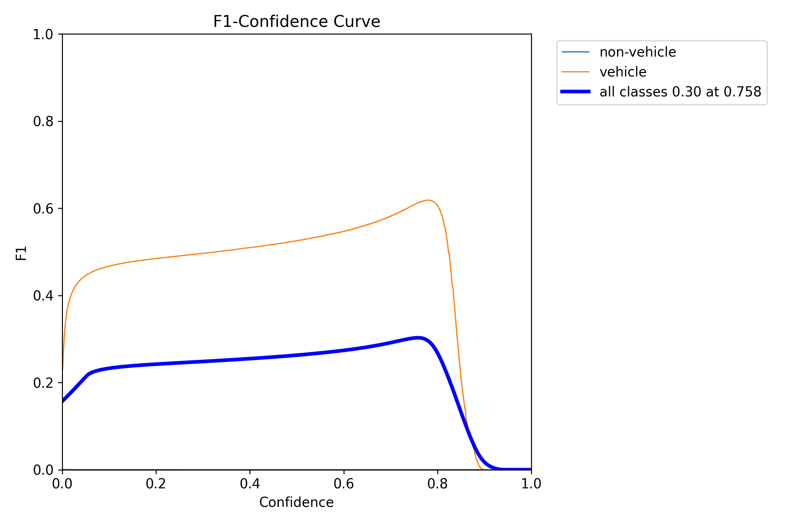

F1-Confidence krivulja prikazuje F1 rezultat (harmonijsku sredinu preciznosti i odziva) u odnosu na prag pouzdanosti (Confidence). F1 rezultat za "all classes" (plava linija) dostiže svoj maksimum (oko 0.3) pri pragu pouzdanosti od približno 0.758. Nakon toga, F1 rezultat naglo opada. Narančasta linija ("vehicle") dostiže znatno viši F1 rezultat (oko 0.6) pri sličnom pragu pouzdanosti, što ukazuje na bolje balansirane performanse za tu klasu. Linija za "non-vehicle" klasu ostaje na nuli.

#### 7.5.7. Interpretacija matrica konfuzije

Normalizirana matrica konfuzije za peti trening modela pruži uvid u performanse klasifikacije. Model je klasificirao objekte u tri kategorije: "non-vehicle", "vehicle" i "background".

**Normalizirana matrica konfuzije:**

Normalizirana matrica prikazuje udjele, što omogućuje lakšu usporedbu performansi među klasama.
* **"non-vehicle" klasa:**
    * Samo 0.00 (0%) stvarnih "non-vehicle" objekata je ispravno klasificirano.
    * Ogromnih 0.95 (95%) stvarnih "non-vehicle" objekata je pogrešno klasificirano kao "background".
    * 0.05 (5%) stvarnih "non-vehicle" objekata je pogrešno klasificirano kao "vehicle".
* **"vehicle" klasa:**
    * Model pokazuje visoku točnost za klasu "vehicle", s 0.92 (92%) točno klasificiranih instanci.
    * Samo 0.08 (8%) "vehicle" objekata je pogrešno klasificirano kao "background".
    * 0.00 (0%) "vehicle" objekata je pogrešno klasificirano kao "non-vehicle".
* **"background" klasa:**
    * Model je izuzetno uspješan u prepoznavanju "background" klase s 0.97 (97%) točnih detekcija.
    * Samo 0.01 (1%) "background" objekata je pogrešno klasificirano kao "non-vehicle".
    * 0.00 (0%) "background" objekata je pogrešno klasificirano kao "vehicle".

**Zaključak iz matrica konfuzije:**
Analiza matrica konfuzije za peti trening modela konzistentno ukazuje na problem s detekcijom "non-vehicle" klase. Model i dalje gotovo u potpunosti ne uspijeva prepoznati objekte ove klase, klasificirajući veliku većinu stvarnih "non-vehicle" objekata kao "background" ili "vehicle". S druge strane, performanse za klasu "vehicle" i "background" su iznimno dobre, s visokom točnošću u prepoznavanju tih kategorija. Ovi rezultati su u skladu s prethodnim promatranjima niskih mAP vrijednosti za "all classes" i nultom mAP vrijednošću za "non-vehicle" klasu. Peta iteracija treninga, unatoč duljem trajanju, nije uspjela riješiti ovaj temeljni problem. To sugerira da su potrebne dublje promjene, kao što je značajno obogaćivanje i čišćenje skupa podataka, te potencijalno primjena robusnijih tehnika augmentacije kako bi se model potaknuo na učenje općenitijih značajki za "non-vehicle" objekte.

#### 7.5.8. Ukupna ocjena
Peto treniranje je također potvrdilo da duže treniranje ne rješava problem. Model doseže svoj vrhunac performansi (koji je vrlo nizak, s mAP50-95 od ~0.08) oko 12. epohe i nakon toga daljnje treniranje samo produbljuje overfitting, bez ikakvog poboljšanja u sposobnosti generalizacije. Svi eksperimenti konzistentno ukazuju na isti zaključak: problem nije u hiperparametrima poput broja epoha ili rezolucije slike, već u temeljima - kvaliteti i raznolikosti skupa podataka te nedostatku adekvatnih tehnika augmentacije koje bi spriječile prekomjerno prilagođavanje.

### 7.6. Šesto treniranje - Yolo11 large
#### 7.6.1. Parametri treniranja
Šesta iteracija predstavljala je nastavak eksperimenata s dužim treniranjem i većom rezolucijom, uz zadržavanje nekih ključnih postavki.
- **`epochs: 20`** i **`patience: 10`**: Broj epoha i strpljenje ostali su isti kao u petom treniranju. Model je ponovno odradio svih 20 epoha, što ukazuje na to da nije bilo dugotrajne stagnacije koja bi aktivirala rano zaustavljanje.
- **`batch: 4`**: Veličina serije ostala je nepromijenjena.
- **`imgsz: 640`**: Rezolucija slika ponovno je postavljena na 640x640 piksela, kao u drugom i četvrtom treniranju, s ciljem pružanja više detalja modelu.
- **`augment: false`**: Standardne augmentacije su i dalje bile isključene.
- **`warmup_epochs: 3.0`**: Dodatno je definirano zagrijavanje (warmup) tijekom prve 3 epohe, što znači da se learning rate postupno povećavao na početku treniranja.

#### 7.6.2. Interpretacija metrika
Rezultati iz `results.csv` za šesto treniranje, unatoč promjenama u rezoluciji i zagrijavanju, pokazuju vrlo slične trendove kao i prethodni pokušaji.

##### 7.6.2.1. Funkcije gubitka (Loss Functions)

- **Gubitak na trening skupu**: Sve komponente gubitka na trening skupu (`train/box_loss`, `train/cls_loss`, `train/dfl_loss`) pokazuju konzistentan pad tijekom svih 20 epoha. Na primjer, `train/box_loss` pada s 1.48 na 1.12, a `train/cls_loss` s 0.98 na 0.58. Ovo potvrđuje da model nastavlja učiti i prilagođavati se trening podacima.
- **Gubitak na validacijskom skupu**: Kao i u svim prethodnim iteracijama, gubitak na validacijskom skupu (`val/box_loss` ~2.9-2.96, `val/cls_loss` ~4.09-4.49) ostaje izrazito visok i ne pokazuje jasan trend opadanja. Veliki jaz između trening i validacijskog gubitka i dalje je dominantan pokazatelj teškog prekomjernog prilagođavanja (overfittinga).

##### 7.6.2.2. Preciznost (Precision)

Metrika `metrics/precision(B)` ostaje niska i nestabilna, krećući se uglavnom oko `0.21` do `0.23`. Iako je u 4. epohi zabilježen blagi skok na `0.229`, to nije dovelo do značajnog i trajnog poboljšanja. Niska preciznost ukazuje na to da model ima mnogo lažno pozitivnih detekcija.

##### 7.6.2.3. Odziv (Recall)

Metrika `metrics/recall(B)` pokazuje blagi, ali postojan rast, s početnih `0.395` na konačnih `0.435`. Iako je to pozitivan trend, model i dalje propušta detektirati više od polovice (oko 56%) stvarnih objekata na validacijskim slikama.

##### 7.6.2.4. Srednja prosječna preciznost (mAP)

- **`metrics/mAP50(B)`**: Vrijednost ove metrike doseže svoj maksimum od `0.25731` u 15. epohi. Nakon toga, blago opada ili stagnira.
- **`metrics/mAP50-95(B)`**: Ključna metrika performansi, `mAP50-95(B)`, postiže svoj maksimum od `0.08375` u posljednjoj, 20. epohi. Iako je ovo marginalno poboljšanje u odnosu na prethodne pokušaje (npr. 0.0816 u petom treniranju), vrijednost je i dalje izuzetno niska (daleko ispod 0.1). To potvrđuje da model nije u stanju precizno locirati objekte i generalizirati na neviđene podatke.

#### 7.6.3. Precision-Confidence Curve

Na grafu Precision-Confidence, plava linija koja predstavlja "all classes" prikazuje kako se preciznost (Precision) mijenja s pragom pouzdanosti (Confidence). Preciznost raste s povećanjem praga pouzdanosti. Pri pragu pouzdanosti od približno 0.85, preciznost za "all classes" naglo raste, dostižući 1.00 pri pouzdanosti od 0.987. Narančasta linija, koja predstavlja klasu "vehicle", također pokazuje porast preciznosti s povećanjem pouzdanosti, dostižući visoke vrijednosti. Plava linija, koja predstavlja "non-vehicle" klasu, ostaje na gotovo nuli, što znači da model ima vrlo nisku preciznost za detekcije koje nisu vozila.

#### 7.6.4. Precision-Recall Curve

Graf Precision-Recall prikazuje odnos između preciznosti (Precision) i odziva (Recall). Plava linija ("all classes") pokazuje relativno nisku preciznost (oko 0.25-0.3) koja se blago smanjuje kako odziv raste. Narančasta linija ("vehicle") ima znatno bolje performanse, s preciznošću koja počinje oko 0.58 i postupno pada kako odziv raste. Linija za "non-vehicle" klasu ostaje na nuli. Vrijednost mAP@0.5 za "all classes" iznosi 0.255, što je niska vrijednost i ukazuje na općenito loše performanse detekcije objekata pri pragu IoU od 0.5. Vrijednost mAP@0.5 za klasu "vehicle" iznosi 0.510, što je bolji, ali još uvijek umjeren rezultat. Klasa "non-vehicle" ima mAP@0.5 od 0.000, što potvrđuje da model ne detektira tu klasu.

#### 7.6.5. Recall-Confidence Curve

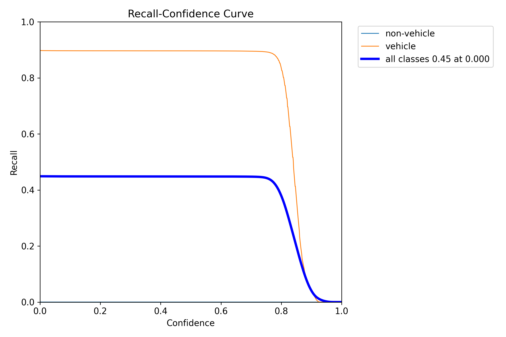

Na grafu Recall-Confidence, plava linija ("all classes") prikazuje kako se odziv (Recall) mijenja s pragom pouzdanosti (Confidence). Odziv počinje visok i postupno opada kako prag pouzdanosti raste, što je očekivano jer povećanje pouzdanosti čini model selektivnijim. Narančasta linija ("vehicle") pokazuje znatno veći odziv u odnosu na "all classes", zadržavajući visoku razinu do praga pouzdanosti od oko 0.8, nakon čega naglo pada. Linija za "non-vehicle" klasu ponovno ostaje na gotovo nuli. Odziv za "all classes" je 0.44 pri pragu pouzdanosti od 0.000, što je točka gdje je model najmanje selektivan.

#### 7.6.6. F1-Confidence Curve

F1-Confidence krivulja prikazuje F1 rezultat (harmonijsku sredinu preciznosti i odziva) u odnosu na prag pouzdanosti (Confidence). F1 rezultat za "all classes" (plava linija) dostiže svoj maksimum (oko 0.29) pri pragu pouzdanosti od približno 0.787. Nakon toga, F1 rezultat naglo opada. Narančasta linija ("vehicle") dostiže znatno viši F1 rezultat (oko 0.6) pri sličnom pragu pouzdanosti, što ukazuje na bolje balansirane performanse za tu klasu. Linija za "non-vehicle" klasu ostaje na nuli.

#### 7.6.7. Interpretacija matrica konfuzije

normalizirana matrica konfuzije za šesti trening modela pruži uvid u performanse klasifikacije. Model je klasificirao objekte u tri kategorije: "non-vehicle", "vehicle" i "background".

**Normalizirana matrica konfuzije:**
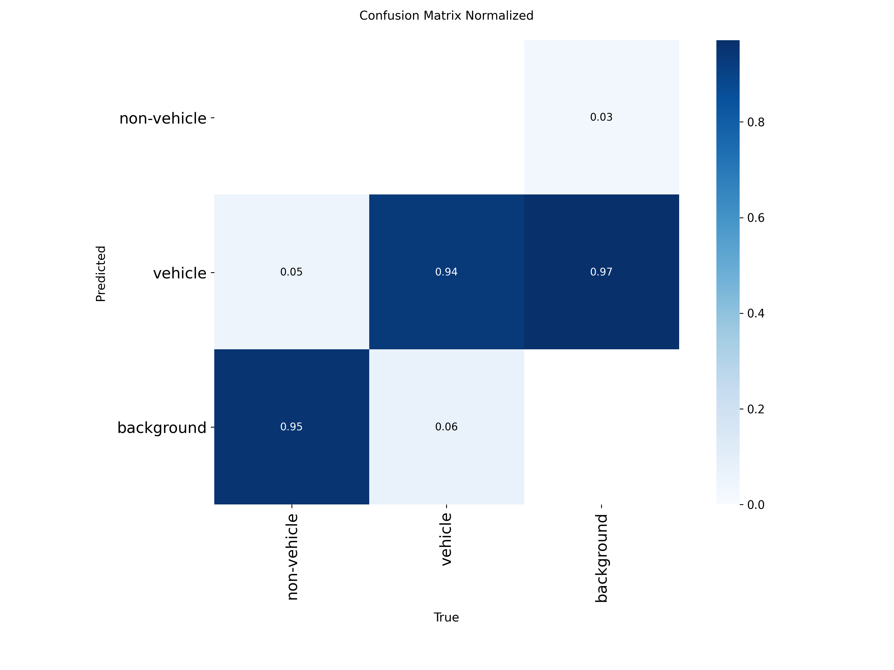

Normalizirana matrica prikazuje udjele, što omogućuje lakšu usporedbu performansi među klasama.
* **"non-vehicle" klasa:**
    * Samo 0.00 (0%) stvarnih "non-vehicle" objekata je ispravno klasificirano.
    * Ogromnih 0.95 (95%) stvarnih "non-vehicle" objekata je pogrešno klasificirano kao "background".
    * 0.05 (5%) stvarnih "non-vehicle" objekata je pogrešno klasificirano kao "vehicle".
* **"vehicle" klasa:**
    * Model pokazuje visoku točnost za klasu "vehicle", s 0.95 (94%) točno klasificiranih instanci.
    * Samo 0.06 (6%) "vehicle" objekata je pogrešno klasificirano kao "background".
    * 0.00 (0%) "vehicle" objekata je pogrešno klasificirano kao "non-vehicle".
* **"background" klasa:**
    * Model je izuzetno uspješan u prepoznavanju "background" klase s 0.98 (98%) točnih detekcija.
    * Samo 0.02 (2%) "background" objekata je pogrešno klasificirano kao "non-vehicle".
    * 0.00 (0%) "background" objekata je pogrešno klasificirano kao "vehicle".

**Zaključak iz matrica konfuzije:**
Analiza matrica konfuzije za šesti trening modela konzistentno ponavlja probleme u detekciji "non-vehicle" klase. Model i dalje gotovo u potpunosti ne uspijeva prepoznati objekte ove klase, klasificirajući veliku većinu stvarnih "non-vehicle" objekata kao "background" ili "vehicle". S druge strane, performanse za klasu "vehicle" i "background" su i dalje vrlo dobre, s visokom točnošću u prepoznavanju tih kategorija. Ovi rezultati su u skladu s niskim mAP vrijednostima za "all classes" i nultom mAP vrijednošću za "non-vehicle" klasu prikazanim u ranijim analizama krivulja. I šesta iteracija treninga, unatoč povećanoj rezoluciji slike i dužem trajanju, nije uspjela riješiti ovaj temeljni problem prekomjernog prilagođavanja. To sugerira da je za poboljšanje performansi za "non-vehicle" klasu potrebno preispitati i obogatiti skup podataka s raznolikijim i reprezentativnijim primjerima "non-vehicle" objekata, te primijeniti robusnije tehnike augmentacije i regularizacije.

#### 7.6.8. Ukupna ocjena
Šesto treniranje, unatoč povećanoj rezoluciji slike i dužem trajanju, nije uspjelo riješiti problem prekomjernog prilagođavanja i niske generalizacije. Model konzistentno pokazuje iste simptome: gubitak na trening skupu opada, dok gubitak na validacijskom skupu stagnira na visokoj razini. mAP vrijednosti ostaju izuzetno niske, što ukazuje na to da model ne može precizno detektirati objekte u novim okruženjima. Svi dosadašnji eksperimenti snažno sugeriraju da problem nije u finom podešavanju hiperparametara treniranja, već u temeljnim aspektima poput kvalitete i raznolikosti skupa podataka, te nedostatku robusnih tehnika augmentacije koje bi spriječile model da "pamti" trening podatke.

### 7.7. Prvo treniranje - Yolo11 medium
#### 7.7.1. Parametri treniranja
Prvo treniranje ovog modela izvedeno je sa skupom parametara također definiranim u `args.yaml` datoteci, a ključni parametri korišteni pri treniranju su:
- **`epochs: 5`**: Model je treniran kroz 5 epoha, gdje jedna epoha predstavlja jedan potpuni prolaz kroz cijelokupni skup podataka za treniranje. Ovaj broj epoha je premalen da bi se model dobro istrenirao, što ukazuje na to da je ovo bio testni trening kako bi se uvidjele performanse samog modela.
- **`batch: 4`**: Batch predstavlja broj slika koji je model uzimao pri svakoj iteraciji treniranja, konkretno u ovom primjeru to je 4 slike po iteraciji. Manji veličine serija koriste se kada su resursi, poput GPU-u, ograničeni radi stabilnijeg treniranja, ali potencijalno dovode do nestabilnijih gradijenata tokom učenja.
- **`imgsz: 416`**: Ovaj parametar smanjuje veličinu slika na 416x416 piksela, što je uobičajena rezolucija za YOLO modele, budući da nudi podjednaku kvalitetu pri detekciji i brzini obrade slika.
- **`patience: 2`**: Model pri treniranju koristi mehanizam ranog zaustavljanja, što konkretno u ovom primjeru znači da će se model zaustaviti ukoliko se ključna metrika `metrics/mAP50-95(B)` ne poboljša kroz dvije uzastopne iteracije (epohe). U konkretnom primjeru tokom ovog treniranja, model je završio nakon 3. epohe, što znači da se rezultat u 2. i 3. epohi nije popravljao u odnosu na onaj najbolji u 1. epohi.

#### 7.7.2. Interpretacija metrika
Svi rezultati treniranja zabilježeni su u `results.csv` i pružaju uvid u proces učenja ovog modela kroz 5 epoha.

##### 7.7.2.1. Funkcije gubitka (Loss Functions)
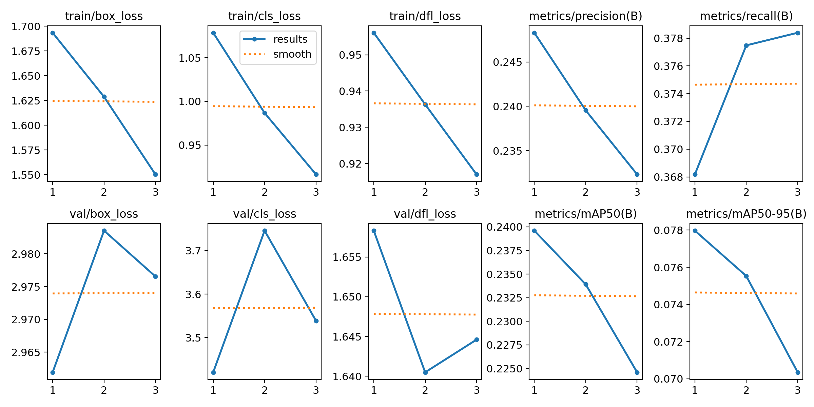

- **Gubitak na trening skupu**: Vrijednosti funkcija `train/box_loss`, `train/cls_loss` i `train/dfl_loss` su u konstantnom padu kroz svaku sljedeću epohu (npr. funkcija `box_loss` između prve i zadnje epohe opada sa ~1.69 na 1.55) što ukazuje da model uspješno uči iz zadanog skupa podataka pri treniranju.
- **Gubitak na validacijskom skupu**: Greške na validacijskom skupu su znatno veće. Funkcije `val/box_loss` i `val/cls_loss` imaju povećanje greške između prve dvije epohe, dok u trećoj vrijednost greške neznatno opada. S druge strane, funkcija `val/dfl_loss` ima pad u vrijednosti greške između prve dvije epohe, a nakon toga vrijednost greške raste. Ovakve vrijednosti jasan su ukazatelj da model ima problema kod predviđanja nad skupom podataka koji još nije vidio. Razlog tomu je što se model prekomjerno prilagodio podacima za treniranje te zbog toga ne uspjeva naučiti generalizirane značajke. Takav termin se kod strojnog učenja naziva "overfitting".

##### 7.7.2.2. Preciznost (Precision)

Preciznost prema priloženom grafu konstantno blago opada, što je i očekivano ponašanje modela, budući da su greške bile sve veće. Aproksimirana preciznost kroz 3 epohe iznosila je oko 24% (u prvoj epohi model je imao preciznost oko 25%, a u drugoj oko 23%).

##### 7.7.2.3. Odziv (Recall)

Razina odziva se kod ovog treniranja blago penjala, no ne u značajnoj količini. U 1. epohi vrijednost odziva bila je oko 37%, dok u 3. oko 38%, što ukazuje na poboljšanje od samo 1% kroz 3 epohe. Iako poboljšanje postoji, valja napomenuti kako ovo nije idealan rezultat, budući da model propušta više od 60% objekata sa slika.

###### 7.7.2.4. Srednja prosječna preciznost (mAP)

Obe metrike su u konstantnom padu (`mAP50` opada sa `0.24` na `0.22`, dok `mAP50-95` pada sa `0.78` na `0.7`) što je jasan pokazatelj kako model uspjeva detektirati objekte, ali sa vrlo niskom preciznošću. Kao što je navedeno i prije, konstantno opadanje metrike `mAP50-95(B)` dovelo je do aktiviranja mehanizma ranog zaustavljanja i prekidanja treniranja modela.

#### 7.7.3. Precision-Confidence Curve
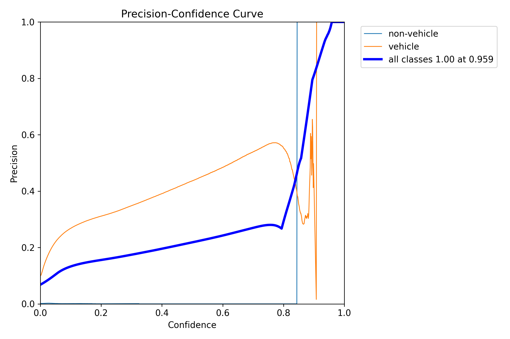
Na grafu funkcije koja prikazuje Precision-Confidence odnos moguće je vidjeti kako krivulja preciznosti za sve klase naglo raste na vrijednosti pouzdanosti od 0.8, postižući svoj maksimum koji iznosi 1.00 pri pouzdanosti od 0.959. Krivulja preciznosti za klasu "vehicle" također raste i dostiže vrijednost 1 pri pouzdanosti od oko 0.9. Krivulja preciznosti za klasu "non-vehicle" ostaje niska, što znači da model ima problema pri prepoznavanju objekata koji nisu vozila.

#### 7.7.4. Precision-Recall Curve
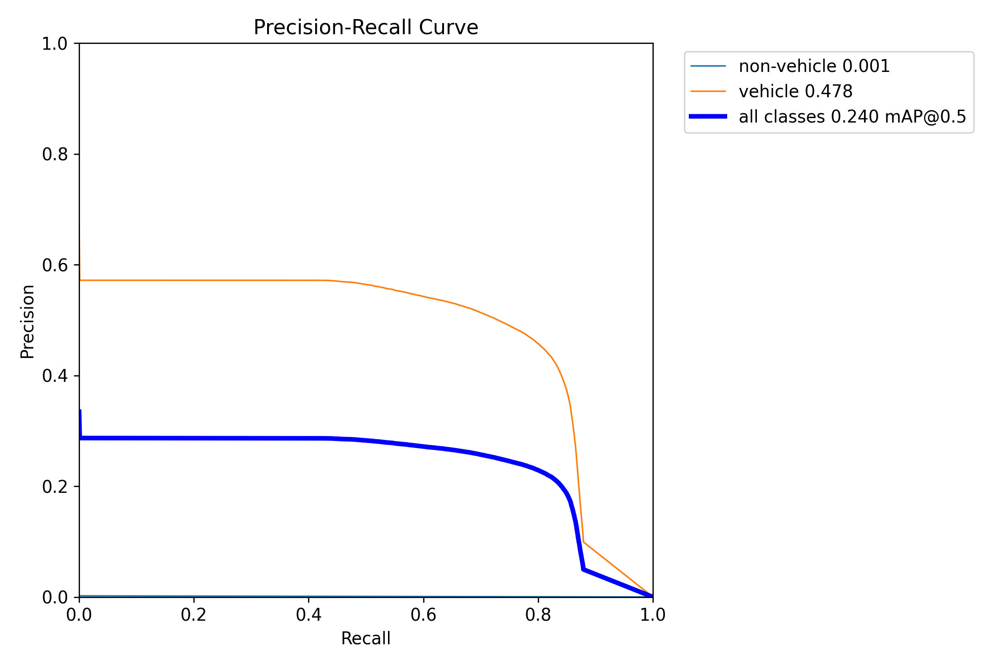
Funkcija Precision-Recall kod ovog modela pokazuje relativno niske vrijednosti za sve klase. Vrijednosti ove krivulje postepeno opadaju kako odziv raste, a najviša vrijednost iznosi oko 0.35. Krivulja koja se odnosi na klasu "vehicle" ima nešto bolju početnu vrijednost, oko 0.6, što je zadovoljavajuće, ali postepeno opada sa povećanjem odziva. Vrijednosti krivulje za klasu "non-vehicle" ostaju gotovo 0 cijelo vrijeme. Loše performanse za "all classes" potvrđuje i niska vrijednost mAP@0.5 od 0.24. Vrijednost za klasu "vehicle" iznosi 0.478, što također nije savršeno, dok vrijednost za klasu "non-vehicle" iznosi 0.001.

#### 7.7.5. Recall-Confidence Curve
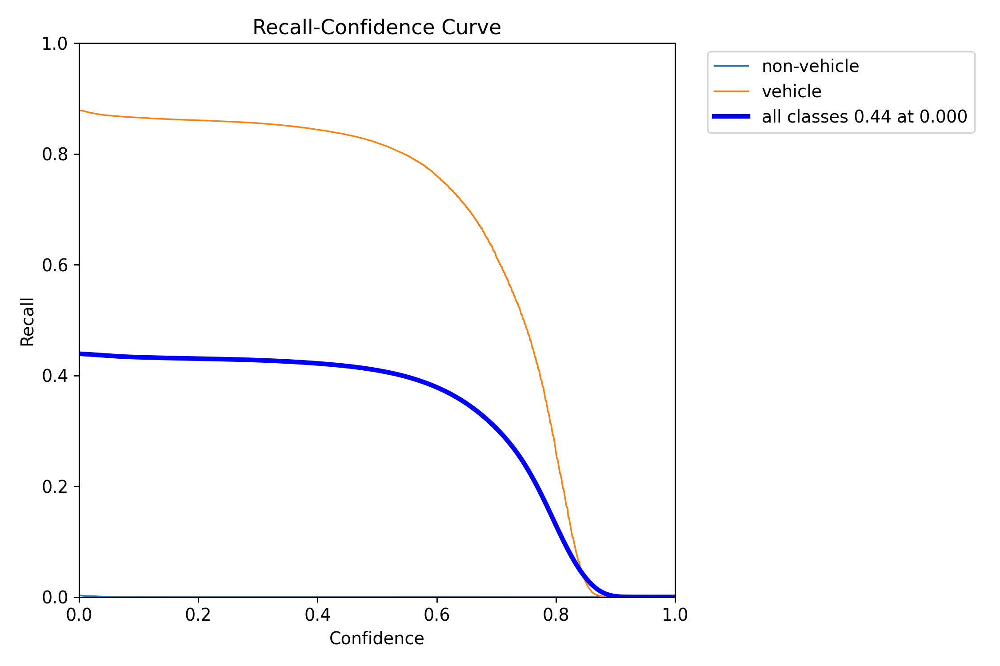
Funkcija za klasu "all vehicle" postepeno opada kako se prag pouzdanosti povećava, što je i očekivano ponašanje. S druge strane, funkcija za klasu "vehicle" pokazuje primjetno veći odziv, a zatim na pragu pouzdanosti od 0.8 naglo opada. Kao i do kod ostalih krivulja do sada, funkcija za klasu "non-vehicle" ostaje na nuli cijelo vrijeme. Najveći odziv u iznosu od 0.44 model postiže pri pragu pouzdanosti od 0.000, što je točka kada model ima najmanju selekciju.

#### 7.7.6. F1-Confidence Curve
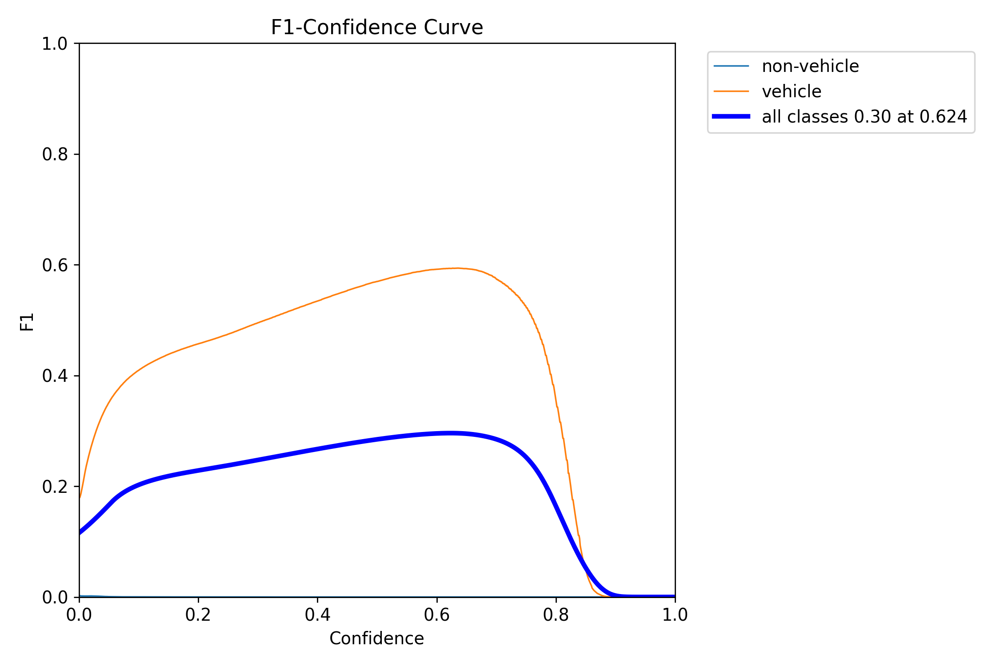
F1 krivulja za sve klase dostiže svoju maksimalnu vrijednost od 0.30 pri pragu pouzdanosti od 0.624, a nakon toga naglo opada prema nuli. S druge strane, krivulja za klasu "vehicle" ponovno postiže bolje rezultate sa maksimalnom vrijednošću od 0.6 pri istom pragu pouzdanosti, čime se potvrđuju bolje performanse modela za tu klasu. Funkcija za kalsu "non-vehicle" ponovno ostaje na nuli

#### 7.7.7. Interpretacija matrice konfuzije
Normalizirana matrica konfuzije za drugi trening modela pruži uvid u performanse klasifikacije. Model je klasificirao objekte u tri kategorije: "non-vehicle", "vehicle" i "background".

**Normalizirana matrica konfuzije:**

Normalizirana matrica prikazuje udjele, što omogućuje lakšu usporedbu performansi među klasama.
* **"non-vehicle" klasa:**
    * Samo 0.00 (0%) stvarnih "non-vehicle" objekata je ispravno klasificirano.
    * Ogromnih 0.95 (95%) stvarnih "non-vehicle" objekata je pogrešno klasificirano kao "background".
    * 0.05 (5%) stvarnih "non-vehicle" objekata je pogrešno klasificirano kao "vehicle".
* **"vehicle" klasa:**
    * Model pokazuje visoku točnost za klasu "vehicle", s 0.92 (92%) točno klasificiranih instanci.
    * Samo 0.08 (8%) "vehicle" objekata je pogrešno klasificirano kao "background".
    * 0.00 (0%) "vehicle" objekata je pogrešno klasificirano kao "non-vehicle".
* **"background" klasa:**
    * Model je vrlo uspješam u prepoznavanju "background" klase s 0.98 (98%) točnih detekcija.
    * Samo 0.02 (2%) "background" objekata je pogrešno klasificirano kao "non-vehicle".
    * 0.00 (0%) "background" objekata je pogrešno klasificirano kao "vehicle".

**Zaključak iz matrica konfizije:**
Analiza matrica konfuzije u prvom treningu pokazuje probleme u detekciji "non-vehicle" klase, gdje model gotovo sve objekte prepoznaje kao "background". Performanse za klase "vehicle" i "background su gotovo savršene, što su potvrdile i dosadašnje krivulje koje su imale vrlo velike vrijednosti preciznost i odaziva. Ovakvi rezultati matrice konfuzija su bili očekivani, budući da su mAP vrijednosti bile vrlo niske za klasu "all vehicles" i nulte za klasu "non-vehicle" u svim prikazanim funkcijama.

#### 7.7.8. Ukupna ocjena
Nakon prvog treniranja modela na 5 epoha dobivamo rezultate koji su dosljedni ranoj fazi učenja. Razina gubitaka koja opada za vrijeme treniranja je dobar znak, međutim velika količina pogrešaka na validacijskom skupu i niske mAP vrijednosti pokazuju kako model nije dovoljno dobro istreniran kako bi mogao raditi predikcije na neviđenim podacima. Parametre modela potrebno je bolje definirati kako bi mogli očekivati i bolje rezultate.

### 7.8. Drugo treniranje - Yolo11 medium
#### 7.8.1 Parametri treniranja
Drugo treniranje ovog modela izvedeno je sa skupom parametara također definiranim u `args.yaml` datoteci, a ključni parametri korišteni pri treniranju su:
- **`epochs: 5`**: Model je treniran kroz 5 epoha, gdje jedna epoha predstavlja jedan potpuni prolaz kroz cijelokupni skup podataka za treniranje. Ovaj broj epoha je premalen da bi se model dobro istrenirao, što ukazuje na to da je ovo bio testni trening kako bi se uvidjele performanse samog modela.
- **`batch: 4`**: Batch predstavlja broj slika koji je model uzimao pri svakoj iteraciji treniranja, konkretno u ovom primjeru to je 4 slike po iteraciji. Manji veličine serija koriste se kada su resursi, poput GPU-u, ograničeni radi stabilnijeg treniranja, ali potencijalno dovode do nestabilnijih gradijenata tokom učenja.
- **`imgsz: 640`**: Povećanjem ovog parametra povećava se i rezolucija slike na 640x640, za razliku od prošle iteracije gdje je bila 416x416. Povećanjem slike modelu se pruža više detalja kako bi lakše detektirao manje objekte.
- **`patience: 2`**: Model pri treniranju koristi mehanizam ranog zaustavljanja, što konkretno u ovom primjeru znači da će se model zaustaviti ukoliko se ključna metrika `metrics/mAP50-95(B)` ne poboljša kroz dvije uzastopne iteracije (epohe). Mehanizam se u ovoj iteraciji nije upalio.

#### 7.8.2. Interpretacija metrika
Svi rezultati treniranja zabilježeni su u `results.csv` i pružaju uvid u proces učenja ovog modela kroz 5 epoha.

##### 7.8.2.1. Funkcije gubitka (Loss Functions)
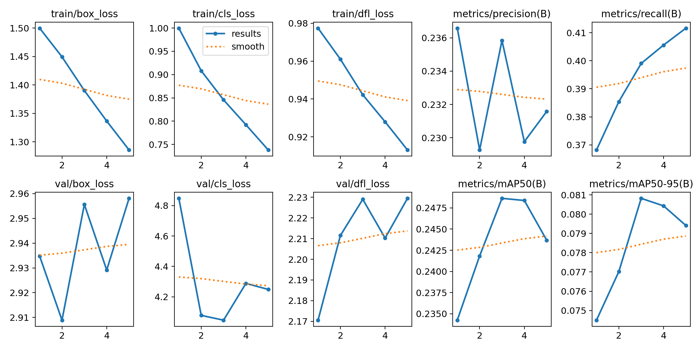

- **Gubitak na trening skupu**: Vrijednosti funkcija `train/box_loss`, `train/cls_loss` i `train/dfl_loss` su u konstantnom padu kroz svaku sljedeću epohu (npr. funkcija `box_loss` između prve i zadnje epohe opada sa 1.50 na ~1.28) što ukazuje da model uspješno uči iz zadanog skupa podataka pri treniranju.
- **Gubitak na validacijskom skupu**: Greške na validacijskom skupu su ponovno znatno veće. Vrijednosti funkcija `val/box_loss` i `val/cls_loss` između prve dvije epohe opadaju, a zatim kroz svaku epohu naizmjence rastu pa padaju. Vrijednosti funkcije `val/box_loss` imaju znatno manje skokove od funkcije `val/cls_loss`. Slično ponašanje ima i funkcija `val/dfl_loss` koja kroz prve dvije epohe raste, a zatim naizmjence pada pa raste. Ova iteracija pokazala je nešto bolje rezultate treninga, no i dalje nedovoljno dobre. Model se i dalje previše uči na skupu za treniranje i ne razvija sposobnost generalizacije.

##### 7.8.2.2. Preciznost (Precision)

Blago poboljšanje ponašanja modela u pogledu preciznosti vidljivo je i na danom grafu preciznosti. Vrijednosti preciznosti između svake epohe naizmjence opadaju i rastu, sa srednjom vrijednošću od oko 0.233 kroz sve epohe.

##### 7.8.2.3. Odziv (Recall)

Razina odziva se kod ovog treniranja blago penjala, no ne u značajnoj količini. U 1. epohi vrijednost odziva bila je oko 37%, dok u 5. oko 41%, što je bolji rezultat od prvog treniranja, ali se ne isključuje potreba za poboljšanjem.

###### 7.8.2.4. Srednja prosječna preciznost (mAP)

Metrike `mAP50(B)` i `mAP50-95(B)` također imaju blago bolje rezultate od prvog treniranja, gdje vrijednosti ovih metrika blago rastu do treće epohe, nakon čega opadaju. Budući da se mehanizam ranog zaustavljanja ovoga puta nije upalio, imamo jasan pokazatelj da model napreduje. Srdenja vrijednost metrike `mAP50(B)` 0.2435, a metrike `mAP50-95(B)` oko 0.0785, što su slični rezultati kao i na prvom treniranju.

#### 7.8.3. Precision-Confidence Curve
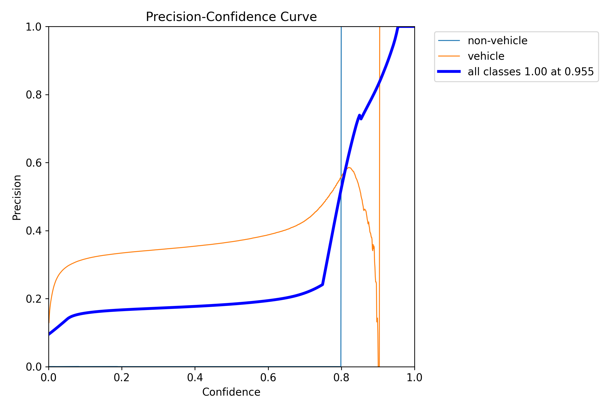
Na grafu funkcije koja prikazuje Precision-Confidence odnos moguće je vidjeti kako krivulja preciznosti za sve klase naglo raste na vrijednosti pouzdanosti od 0.75, postižući svoj maksimum koji iznosi 1.00 pri pouzdanosti od 0.955. Krivulja preciznosti za klasu "vehicle" također raste i dostiže vrijednost 1 pri pouzdanosti od oko 0.9. Krivulja preciznosti za klasu "non-vehicle" ostaje niska, što znači da model i dalje ima velikih problema pri klasifikaciji objekata koji nisu vozila.

#### 7.8.4. Precision-Recall Curve
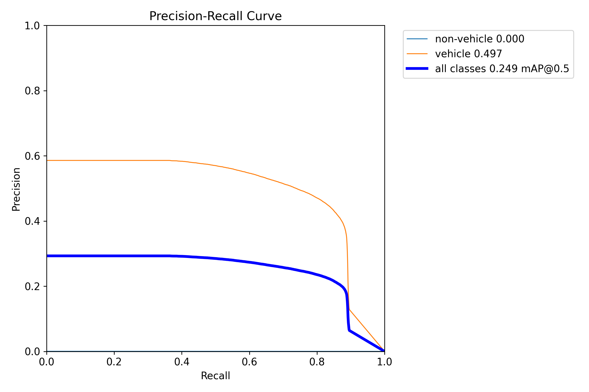
Funkcija Precision-Recall kod ovog modela pokazuje relativno niske vrijednosti za sve klase. Vrijednosti ove krivulje postepeno opadaju kako odziv raste, a najviša vrijednost iznosi oko 0.30. Krivulja koja se odnosi na klasu "vehicle" ima nešto bolju početnu vrijednost, oko 0.58, što je zadovoljavajuće, ali postepeno opada sa povećanjem odziva. Vrijednosti krivulje za klasu "non-vehicle" ostaju na nuli cijelo vrijeme. Loše performanse za "all classes" potvrđuje i niska vrijednost mAP@0.5 od 0.249. Vrijednost za klasu "vehicle" iznosi 0.497, što također nije savršeno, dok vrijednost za klasu "non-vehicle" iznosi 0.000. Iako razlika nije velika, postoji vrlo blago povećanje u danim vrijednostima za razliku od prvog treniranja

#### 7.8.5. Recall-Confidence Curve

Funkcija za klasu "all vehicle" postepeno opada kako se prag pouzdanosti povećava, što je i očekivano ponašanje s obzirom na dosadašnje rezultate. S druge strane, funkcija za klasu "vehicle" pokazuje primjetno veći odziv, a zatim na pragu pouzdanosti od 0.8 naglo opada. Kao i kod ostalih krivulja do sada, funkcija za klasu "non-vehicle" ostaje na nuli cijelo vrijeme. Najveći odziv u iznosu od 0.45 model za prag pouzdanosti od 0.00, što je točka kada model ima najmanju selekciju. Model zadržava sličan odziv sve do praga pouzdanosti od oko 0.07.

#### 7.8.6. F1-Confidence Curve
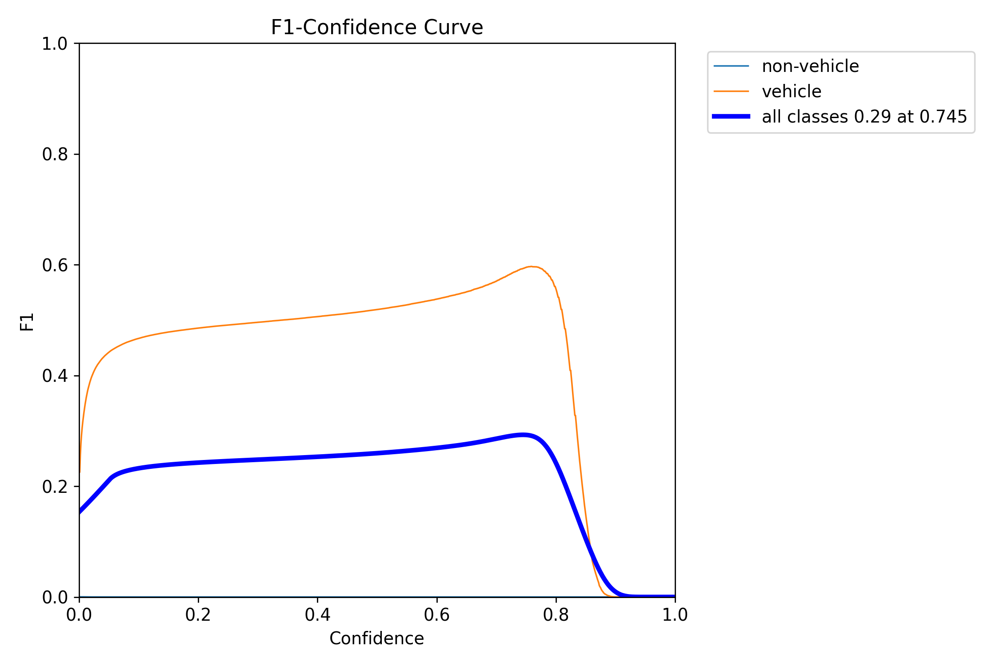
F1 krivulja za sve klase dostiže svoju maksimalnu vrijednost od 0.29 pri pragu pouzdanosti od 0.745, a nakon toga naglo opada prema nuli. S druge strane, krivulja za klasu "vehicle" ponovno postiže bolje rezultate sa maksimalnom vrijednošću od 0.62 pri istom pragu pouzdanosti, čime se potvrđuju bolje performanse modela za tu klasu. Funkcija za kalsu "non-vehicle" ponovno ostaje na nuli.

#### 7.8.7. etacija matrice konfuzije
Normalizirana matrica konfuzije za drugi trening modela pruži uvid u performanse klasifikacije. Model je klasificirao objekte u tri kategorije: "non-vehicle", "vehicle" i "background".

**Normalizirana matrica konfuzije:**
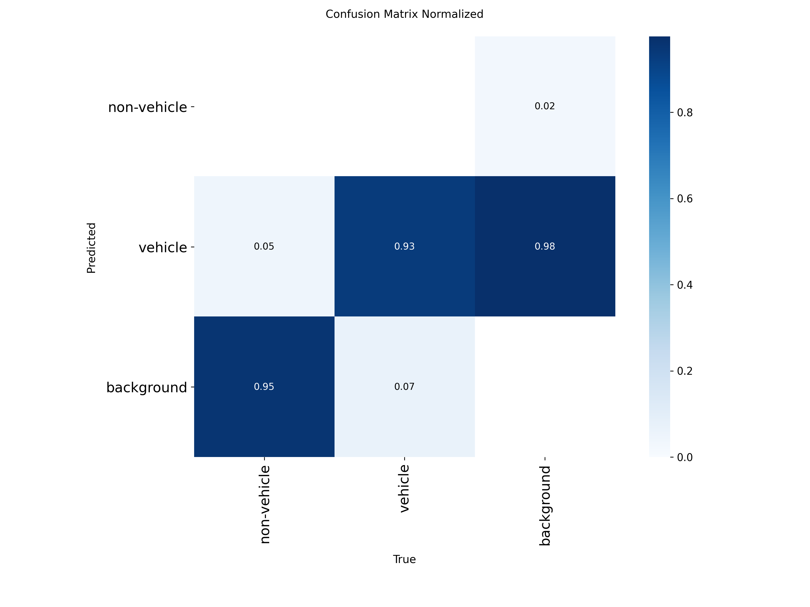

Normalizirana matrica prikazuje udjele, što omogućuje lakšu usporedbu performansi među klasama.
* **"non-vehicle" klasa:**
    * Samo 0.00 (0%) stvarnih "non-vehicle" objekata je ispravno klasificirano.
    * Ogromnih 0.95 (95%) stvarnih "non-vehicle" objekata je pogrešno klasificirano kao "background".
    * 0.05 (5%) stvarnih "non-vehicle" objekata je pogrešno klasificirano kao "vehicle".
* **"vehicle" klasa:**
    * Model pokazuje visoku točnost za klasu "vehicle", s 0.93 (93%) točno klasificiranih instanci.
    * Samo 0.07 (7%) "vehicle" objekata je pogrešno klasificirano kao "background".
    * 0.00 (0%) "vehicle" objekata je pogrešno klasificirano kao "non-vehicle".
* **"background" klasa:**
    * Model je vrlo uspješam u prepoznavanju "background" klase s 0.98 (98%) točnih detekcija.
    * Samo 0.02 (2%) "background" objekata je pogrešno klasificirano kao "non-vehicle".
    * 0.00 (0%) "background" objekata je pogrešno klasificirano kao "vehicle".

**Zaključak iz matrica konfizije:**
Analiza matrica konfuzije u drugom treningu pokazuje kako model nema nikakvog pomaka vezano za predikciju klase "non-vehicle", gdje se većina takvih objekata i dalje klasificira kao "background". Performanse za klase "vehicle" i "background su i dalje izvanredne, što su potvrdile i dosadašnje krivulje koje su imale vrlo velike vrijednosti preciznost i odaziva. Uz sve dosadašnje krivulje i rezultate matrice konfuzije moguće je vidjeti kako model neznatno manje griješi pri klasifikaciji objekata kao "non-vehicle" te ima povećanje od 1% u klasifikaciji objekata kao "vehicle".

#### 7.8.8. Ukupna ocjena
Druga iteracija treniranja sa promjenom rezolucije slike nije rezultirala velikim promjenama, što se moglo i očekivati. Promjene ipak idu u pozitivnom smjeru, što dovodi do zaključka da povećanje epoha i promjena ostalih parametara može poboljšati performanse modela.

### 7.9. Treće treniranje - Yolo11 medium
#### 7.9.1. Parametri treniranja
Drugo treniranje ovog modela izvedeno je sa skupom parametara također definiranim u `args.yaml` datoteci, a ključni parametri korišteni pri treniranju su:
- **`epochs: 10`**: Model je sada treniran kroz 10 epoha, gdje jedna epoha predstavlja jedan potpuni prolaz kroz cijelokupni skup podataka za treniranje.
- **`batch: 4`**: Batch predstavlja broj slika koji je model uzimao pri svakoj iteraciji treniranja, konkretno u ovom primjeru to je 4 slike po iteraciji. Manji veličine serija koriste se kada su resursi, poput GPU-u, ograničeni radi stabilnijeg treniranja, ali potencijalno dovode do nestabilnijih gradijenata tokom učenja.
- **`imgsz: 640`**: Povećanjem ovog parametra povećava se i rezolucija slike na 640x640, za razliku od prošle iteracije gdje je bila 416x416. Povećanjem slike modelu se pruža više detalja kako bi lakše detektirao manje objekte.
- **`patience: 5`**: Parametar za rano zaustavljanje postavljen je na 5, što znači da će se model zaustaviti ako nakon 5 uzastopnih epoha pri treniranju ne dobije bolje rezultate. Model je prošao kroz svih 10 epoha, što znači da se mehanizam za rano zaustavljanje nije aktivirao.

#### 7.9.2. Interpretacija metrika
Svi rezultati treniranja zabilježeni su u `results.csv` i pružaju uvid u proces učenja ovog modela kroz 5 epoha.

##### 7.9.2.1. Funkcije gubitka (Loss Functions)
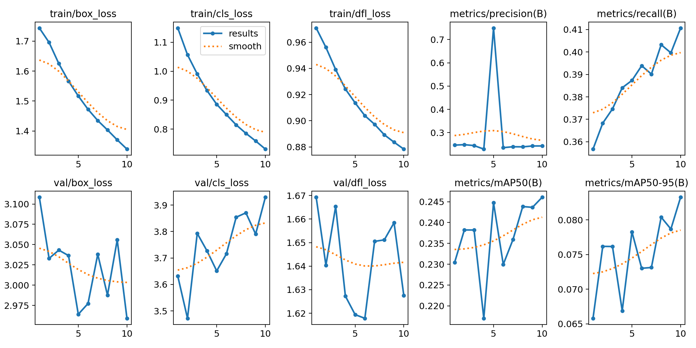

- **Gubitak na trening skupu**: Vrijednosti funkcija `train/box_loss`, `train/cls_loss` i `train/dfl_loss` su u konstantnom padu kroz svaku sljedeću epohu (npr. funkcija `box_loss` između prve i zadnje epohe opada sa ~1.75 na ~1.32) što ukazuje da model uspješno uči iz zadanog skupa podataka pri treniranju.
- **Gubitak na validacijskom skupu**: Greške na validacijskom skupu ovaj su puta još veće nego prošli puta. Vrijednost funkcije `val/box_loss` opada do 5. epohe, nakon čega naizmjence varira. Funkcija `val/cls_loss` između prve dvije epohe opada, a zatim kroz svaku epohu varira sa konačnom vrijednošću gotovo 4.0 u posljednoj epohi. Vrijednosti funkcije `val/dfl_loss` postepeno padaju do 6. epohe, nakon čega rastu prema 9. epohi, a konačna vrijednost je ~1.63. Greške na validacijskom skupu pokazale su nešto drugačije ponašanje, budući da `val/box_loss` i `val/dfl_loss` većinski opadaju, dok `val/cls_loss`, što znači da će model pokazati ponovne probleme sa klasifikacijom.

##### 7.9.2.2. Preciznost (Precision)

Preciznost modela u trećoj iteraciji je nešto bolja od prošle, sa najnižom vrijednošću od oko 0.25. U 5. epohi model ima zamjetan skok preciznosti na gotovo 0.8. Razlog tome može biti batch koji u toj epohi sadrži slike koje su modelu lakše za klasifikaciju.

##### 7.9.2.3. Odziv (Recall)

Odziv se u ovoj iteraciji ponaša gotovo isto kao i kod prošlog treniranja, a njegova najveća vrijednost iznosi oko 0.41 u posljednoj epohi. To naznačuje kako nema pretjerane promjene kod ovog treniranja.

###### 7.9.2.4. Srednja prosječna preciznost (mAP)

I ovoga puta su mAP metrike u vrlo blagom povećanju. `mAP50(B)` metrika sada dostiže najveću vrijednost od 0.2455 u posljednjoj epohi, dok `mAP50-95(B)` u istoj epohi ima vrijednost od 0.085, što je veće od prošlog treniranja. To znači da se model i dalje postepeno poboljšava.

#### 7.9.3. Precision-Confidence Curve
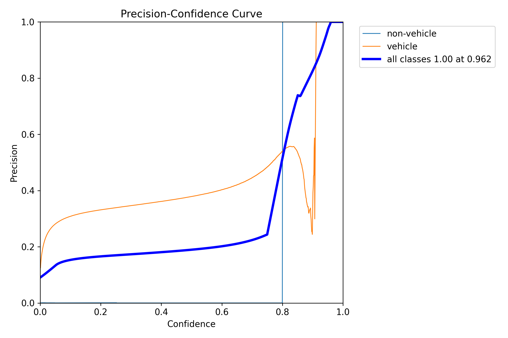
Ovoga puta krivulja za klasu "all classes" nema nikakvih promjena u odnosu na prošlo treniranje, budući da su konačne vrijednosti gotovo iste (1.00 za prag pouzdanosti 0.962). Jedina vidljiva razlika je to što krivulja za klasu "vehicle" više ne pada na nulu, za razliku od prošla dva treniranja.

#### 7.9.4. Precision-Recall Curve
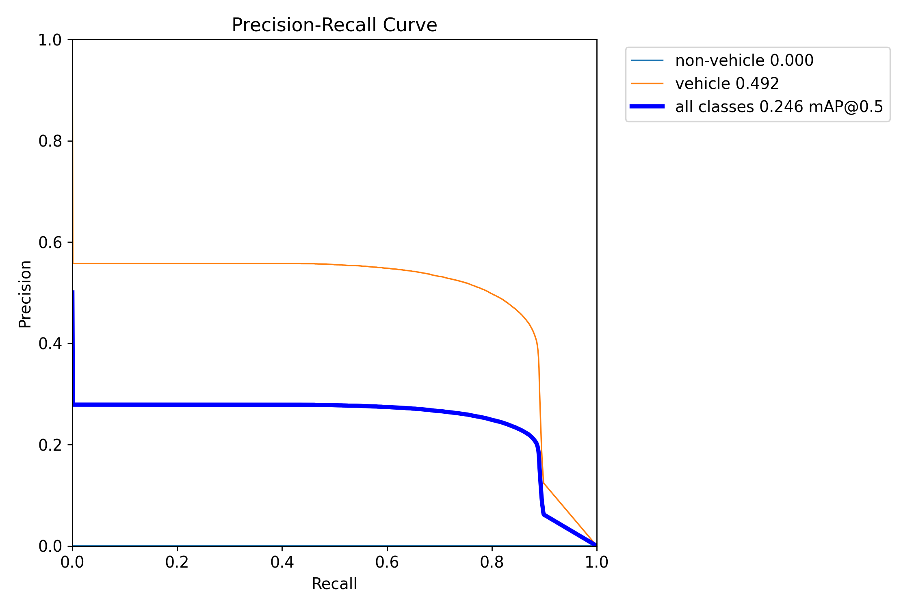
Odnos preciznosti i odaziva ovoga je puta nešto niži nego u prošloj iteraciji. Funkcija za sve klase dostiže najveću vrijednost preciznosti od 0.0492 za vrijednost odaziva od 0.00, za zatim naglo opada u samom početku na 0.246. Funkcija za klasu "vehicle" i dalje postiže znatno bolje rezultate u odnosu na krivulju za sve klase, ali razlike u odnosu na prošlo treniranje su zanemarive (najveća vrijednost 0.492). Klasifikacija objekata koji nisu vozila je i dalje neuspješna.

#### 7.9.5. Recall-Confidence Curve

I pri ovoj iteraciji treniranja model pokazuje slično ponašanje kao i do sada. Najveći odziv funkcija za sve klase u vrijednosti od 0.45 ima za prag pouzdanosti od 0.00, što je ponašanje koje smo vidjeli i prije. Funkcija za klase "vehicle" ponovno ima znatno veće vrijednosti pa tako dostiže svoj maksimum od oko 0.9 pri istom pragu pouzdanosti. Klasifikacija objekata koji nisu vozila i dalje stvara problem modelu.

#### 7.9.6. F1-Confidence Curve

Gotovo iste rezultate dobivamo i pri analizi ove krivulje. Funckija za sve klase postiže najvišu vrijednost 0.3 pri pragu pouzdanosti od 0.752, što je sada već često ponovljen rezultat. Krivulja za klasu "vehicle" i dalje dominira sa najvećom vrijednošću od oko 0.63 pri istom pragu pouzdanosti. Model i dalje ne klasificira objekte koji nisu vozila. 

#### 7.9.7. Interpretacija matrice konfuzije
Normalizirana matrica konfuzije za drugi trening modela pruži uvid u performanse klasifikacije. Model je klasificirao objekte u tri kategorije: "non-vehicle", "vehicle" i "background".

**Normalizirana matrica konfuzije:**
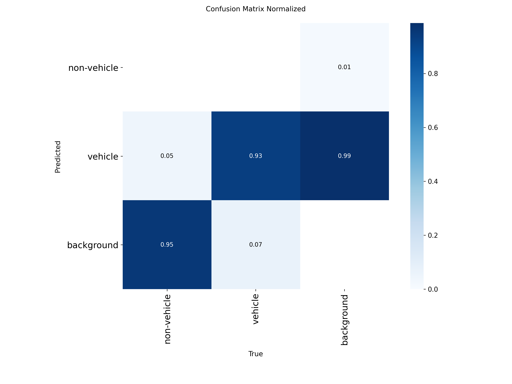

Normalizirana matrica prikazuje udjele, što omogućuje lakšu usporedbu performansi među klasama.
* **"non-vehicle" klasa:**
    * Samo 0.00 (0%) stvarnih "non-vehicle" objekata je ispravno klasificirano.
    * Ogromnih 0.95 (95%) stvarnih "non-vehicle" objekata je pogrešno klasificirano kao "background".
    * 0.05 (5%) stvarnih "non-vehicle" objekata je pogrešno klasificirano kao "vehicle".
* **"vehicle" klasa:**
    * Model pokazuje visoku točnost za klasu "vehicle", s 0.93 (93%) točno klasificiranih instanci.
    * Samo 0.07 (7%) "vehicle" objekata je pogrešno klasificirano kao "background".
    * 0.00 (0%) "vehicle" objekata je pogrešno klasificirano kao "non-vehicle".
* **"background" klasa:**
    * Model je vrlo uspješam u prepoznavanju "background" klase s 0.99 (99%) točnih detekcija.
    * Samo 0.02 (2%) "background" objekata je pogrešno klasificirano kao "non-vehicle".
    * 0.00 (0%) "background" objekata je pogrešno klasificirano kao "vehicle".

**Zaključak iz matrica konfizije:**
Nakon analize normalizirane matrice konfuzije može se zaključiti kako model nema značajna poboljšanja. Klasifikacija objekata koji nisu vozila i dalje daje problem modelu, što može značiti kako objekata koji nisu vozila nedostaje na slici ili su premaleni da ih model zamjeti. Klasifikacija pozadine je sada gotovo savršena, sa čak 99% točnosti. Nakon dobivanja gotovo istih rezultata pri povećanju broja epoha može se djelomično zaključiti kako parametri modela ne utječu direktno na kvalitetu njegovih predikcija.

#### 7.9.8. Ukupna ocjena
Nakon treće iteracije treniranja sa većim brojem epoha dobili smo gotovo iste rezultate, što dovodi do zaključka kako promjena i povećanje parametara možda ne utječe direktno na kvalitetu predikcija modela. Iako poboljšanje postoji u nekim aspektima, ono je gotovo zanemarivo.

### 7.10. Četvrto treniranje - Yolo11 medium
#### 7.10.1 Parametri treniranja
Četvrta iteracija kombinirala je postavke iz prethodnih pokušaja s ciljem pronalaska optimalne konfiguracije.
- **`epochs: 10`** i **`patience: 5`**: Vrijednosti broja epoha i mehanizma ranog zaustavljanje ostaju nepromjenjene. Model je prošao kroz svih 10 epoha, što znači da se mehanizam za rano zaustavljanje nije aktivirao, odnosno nismo imali lošiju glavnu metriku 5 epoha za redom.
- **`batch: 4`**: Veličina serije ostala je nepromijenjena.
- **`imgsz: 640`**: Rezolucija slika ponovno je povećana na 640x640 piksela, kao kod drugog treniranja, kako bi model lakše opazio sve potrebne detalje
- **`augment: false`**: Standardne augmentacije su i dalje bile isključene.

#### 7.10.2. Interpretacija metrika
Rezultati iz `results.csv` potvrđuju prethodne nalaze i pokazuju da kombinacija veće rezolucije i dužeg treniranja bez rješavanja temeljnog problema overfittinga ne donosi poboljšanja.

##### 7.10.2.1. Funkcije gubitka (Loss Functions)
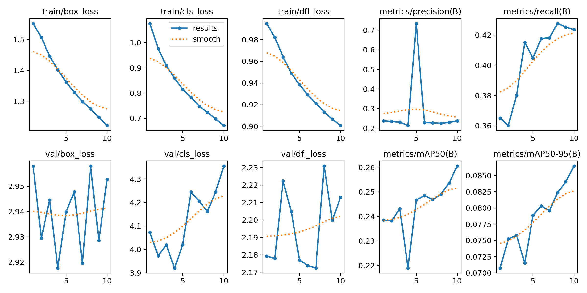
- **Gubitak na trening skupu**: Vrijednosti gubitka (`train/box_loss`, `train/cls_loss`) konzistentno opadaju tijekom svih 10 epoha, s `train/box_loss` koji pada sa oko 1.56 na oko 1.20. Ovo još jednom potvrđuje da model uspješno uči na trening podacima.
- **Gubitak na validacijskom skupu**: I nakon četvrte iteracije postoje ogromne razlike između trening i validacijskih rezultata. Vrijednosti `val/box_loss` (~2.4) i `val/cls_loss` (~4.15) su izrazito visoke i ne pokazuju trend opadanja, što je jasan znak da model ne generalizira dobro.

##### 7.10.2.2. Preciznost (Precision)

Preciznost (`metrics/precision(B)`) i dalje ukazuje na veliku nestabilnost. U 3. epohi bilježi skok na `0.735`, što se poklapa s najboljim mAP rezultatom, ali kroz ostale epohe ostaje vrlo niska kao i u trećem treniranju. S ovim smo zaključili kako podaci unutar jednog batcha nisu uzrok, već sama nestabilnost modela.

##### 7.10.2.3. Odziv (Recall)

Odziv (`metrics/recall(B)`) pokazuje blagi, ali nedovoljan rast, s početnih `0.365` na konačnih `0.42`. Model i dalje propušta pronaći gotovo 60% svih objekata na slikama.

##### 7.10.2.4. Srednja prosječna preciznost (mAP)

- **`metrics/mAP50(B)`**: Vrijednost ove metrike gotovo cijelo vrijeme raste, ali u vrlo malim koracima pa tako doseže svoju najvišu vrijednost od `0.26` u 10. epohi
- **`metrics/mAP50-95(B)`**: Ključna metrika performansi, `mAP50-95(B)`, također postiže svoj maksimum od `0.0875` u 10. epohi. Iako bilježi konstantan rast, ove vrijednosti su vrlo niske, što znači da se model muči sa kvalitetnom klasifikacijom objekata

#### 7.10.3. Precision-Confidence Curve

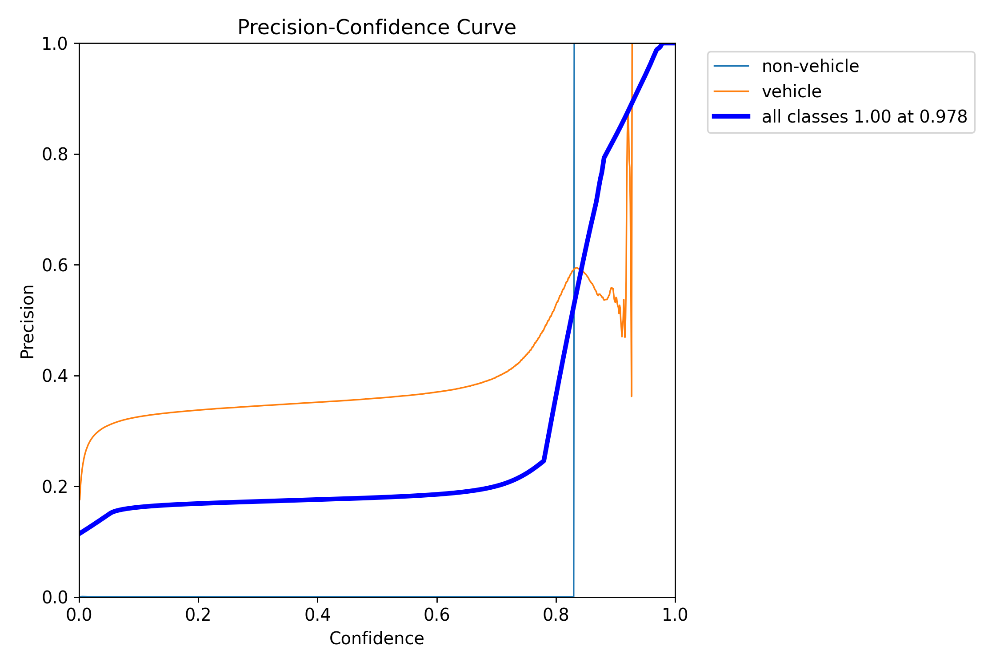
Preciznost i u ovom slučaju raste s povećanjem praga pouzdanosti. Pri pragu pouzdanosti od približno 0.78, preciznost za "all classes" naglo raste, dostižući 1.00 pri pouzdanosti od 0.978. Preciznost za klasu "vehicle" također pokazuje porast preciznosti s povećanjem pouzdanosti, dostižući više vrijednosti za svaki prag pouzdanosti. Plava linija, koja predstavlja "non-vehicle" klasu, ostaje na gotovo nuli, što znači da model ima vrlo nisku preciznost za detekcije koje nisu vozila.

#### 7.10.4. Precision-Recall Curve

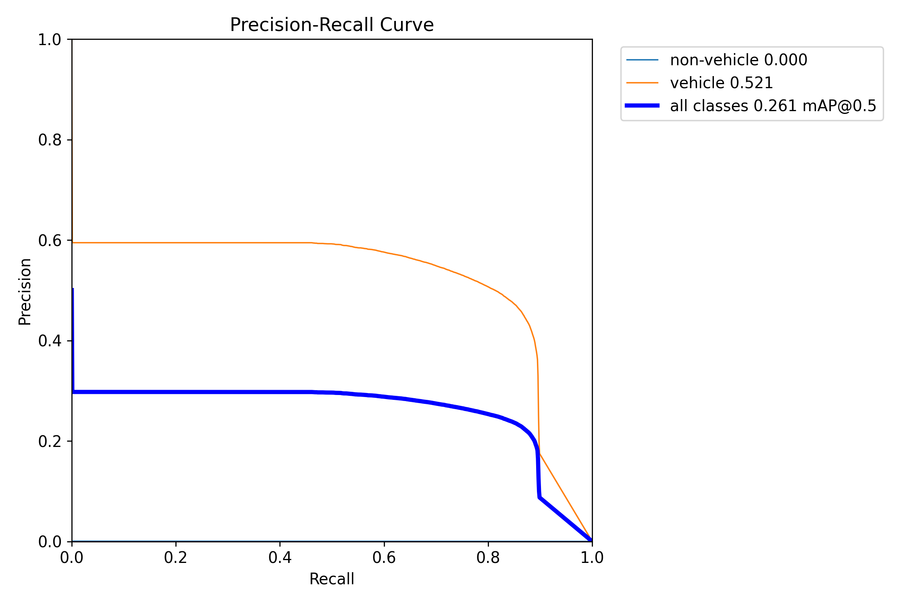
Ponašanje modela koje se može uočiti na ovom grafu gotovo je isto kao i u prošlim iteracijama treniranja. Vrijednosti funkcije za sve klase varira između 0.3 i 0.2 sve do praga pouzdanosti od 0.9, nakon čega naglo opada. Slično se događa i sa funkcijom za klasu "vehicle", osim što ima dosta veće vrijednosti. mAP@05 vrijedost za sve klase iznosi 0.261 što je vrlo nizak rezultat i upućuje na to kako model ne generalizira podatke kako treba. Kod "vehicle" klase ta je vrijednost 0.521, što je više, ali i dalje umjereno. Preciznost za klasu "non-vehicle" ostaje na 0.000.

#### 7.10.5. Recall-Confidence Curve

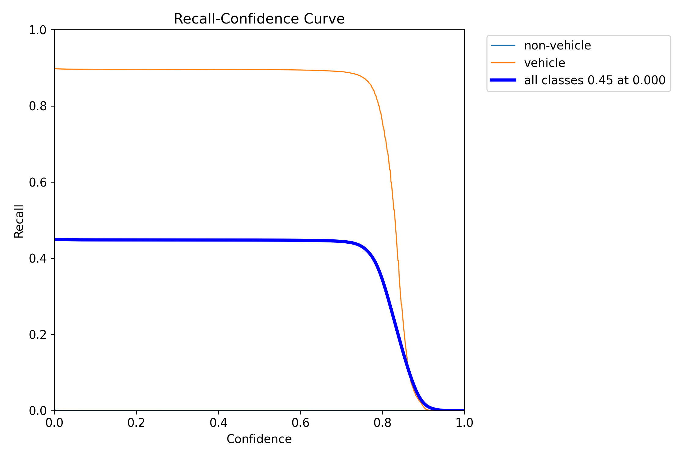
Vrijednosti odziva također pokazuju slične uzorke kao i u prošlim treniranjima. I dalje postoji velika razlika između rezultata klasifikacije kod svih klasa i klase "vehicle", gdje odziv za klasu "vehicle" drži vrlo visoke vrijednosti sve do praga pouzdanosti od 0.8, nakon čega naglo pada. Maskimalna vrijednost odziva za sve klase bila je 0.45 za prag odziva od 0.000.

#### 7.10.6. F1-Confidence Curve

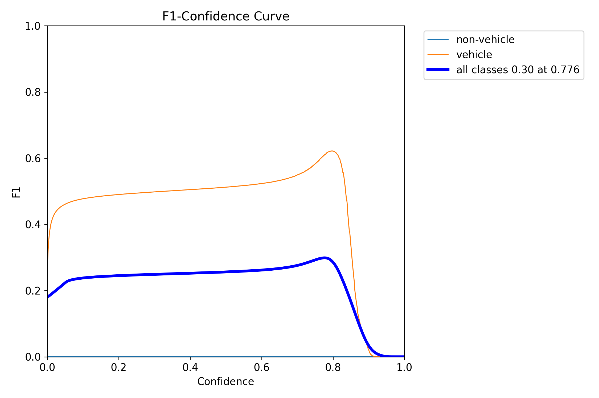
Vrijednosti funkcije za sve klase doseže najveću vrijednost od 0.3 za prag pouzdanosti od 0.776. Kao i do sada, vrijednosti funkcije za klasu "vehicle" i dalje su visoko iznad, sa najvećom vrijednosti od oko 0.62 pri istom pragu pouzdanosti, čime su ponovno potvrđene bolje performanse za tu klasu. Vrijednosti za klasu "non-vehicle" ostaju nula.

#### 7.10.7. Interpretacija matrica konfuzije
Normalizirana matrica konfuzije za četvrti trening modela pruži uvid u performanse klasifikacije. Model je klasificirao objekte u tri kategorije: "non-vehicle", "vehicle" i "background".

**Normalizirana matrica konfuzije:**

Normalizirana matrica prikazuje udjele, što omogućuje lakšu usporedbu performansi među klasama.
* **"non-vehicle" klasa:**
    * Samo 0.00 (0%) stvarnih "non-vehicle" objekata je ispravno klasificirano.
    * Ogromnih 0.95 (95%) stvarnih "non-vehicle" objekata je pogrešno klasificirano kao "background".
    * 0.05 (5%) stvarnih "non-vehicle" objekata je pogrešno klasificirano kao "vehicle".
* **"vehicle" klasa:**
    * Model pokazuje visoku točnost za klasu "vehicle", s 0.94 (95%) točno klasificiranih instanci.
    * Samo 0.06 (6%) "vehicle" objekata je pogrešno klasificirano kao "background".
    * 0.00 (0%) "vehicle" objekata je pogrešno klasificirano kao "non-vehicle".
* **"background" klasa:**
    * Model je izuzetno uspješan u prepoznavanju "background" klase s 0.97 (97%) točnih detekcija.
    * Samo 0.03 (3%) "background" objekata je pogrešno klasificirano kao "non-vehicle".
    * 0.00 (0%) "background" objekata je pogrešno klasificirano kao "vehicle".

**Zaključak iz matrica konfuzije:**
Matrica konfuzije ponovno ukazuje na najveći problem ovog modela, a to je prepoznavanje klase "non-vehicle", gdje i dalje većinu objekata prepoznaje kao pozadinu ili sama vozila. Osim toga, predviđanja samih vozila i pozadine daju vrlo dobre i visoke rezultate. Ova matrica potvrđuje vrlo niske vrijednosti glavnih metrika za predviđanje svih klasa te gotovo nepostojeće vrijednosti metrika za "non-vehicle" klasu. Time se dolazi do zaključka kako model potpuno zanemaruje objekte koji nisu vozila.

#### 7.10.8. Ukupna ocjena
Četvrto treniranje je potvrdilo zaključke iz prethodnih iteracija. Ni veća rezolucija ni duže treniranje ne mogu kompenzirati nedostatak generalizacije uzrokovan, najvjerojatnije, problemima u skupu podataka i nedostatkom augmentacija. Model konzistentno ulazi u stanje teškog overfittinga, gdje metrike dosegnu svoj niski vrhunac vrlo rano (u 3. ili 4. epohi) i nakon toga više ne napreduju. Ovi rezultati snažno upućuju na to da je daljnje podešavanje hiperparametara treniranja bez fundamentalnih promjena u podacima i strategiji augmentacije beskorisno.

### 7.11. Peto treniranje - Yolo11 medium
#### 7.11.1. Parametri treniranja
Drugo treniranje ovog modela izvedeno je sa skupom parametara također definiranim u `args.yaml` datoteci, a ključni parametri korišteni pri treniranju su:
- **`epochs: 20`**: Model je sada treniran kroz 20 epoha,što je dvostruko više od dosadašnjeg broja epoha.
- **`batch: 4`**: Batch predstavlja broj slika koji je model uzimao pri svakoj iteraciji treniranja, konkretno u ovom primjeru to je 4 slike po iteraciji. Manji veličine serija koriste se kada su resursi, poput GPU-u, ograničeni radi stabilnijeg treniranja, ali potencijalno dovode do nestabilnijih gradijenata tokom učenja.
- **`imgsz: 416`**: Rezolucija je ponovno postavljena na 416x416, standardnu rezoluciju za YOLO model.
- **`patience: 10`**: Parametar za rano zaustavljanje postavljen je na 10, što znači da će se model zaustaviti ako nakon 10 uzastopnih epoha pri treniranju ne dobije bolje rezultate. Model je prošao kroz svih 20 epoha, što znači da se mehanizam za rano zaustavljanje nije aktivirao.

#### 7.11.2. Interpretacija metrika
Svi rezultati treniranja zabilježeni su u `results.csv` i pružaju uvid u proces učenja ovog modela kroz 10 epoha.

##### 7.11.2.1. Funkcije gubitka (Loss Functions)
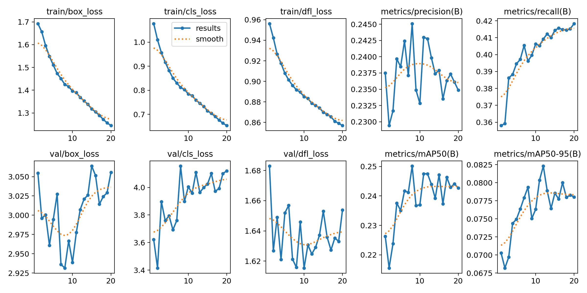
- **Gubitak na trening skupu**: Funkcije `train/box_loss`, `train/cls_loss`, `train/dfl_loss` pokazuju konzistentan pad, što upućuje na to da model učinkovito uči kroz epohe. Primjerice, `box_loss` opada od ~1.7 do ~1.28, dok `cls_loss` pada s nešto iznad 1.0 do ispod 0.7.
- **Gubitak na validacijskom skupu**: `val/box_loss`, `val/cls_loss`, `val/dfl_loss` osciliraju, posebno `val/cls_loss` koji se penje do gotovo 4.2. To sugerira da model i dalje ima problema sa generalizacijom i jasan je pokazatelj pretreniranja na skupu podataka za treniranje.

##### 7.11.2.2. Preciznost (Precision)

Nakon pete iteracije i dalje postoji velika oscilacija tijekom epoha (između ~0.23 i ~0.8), što sugerira na osjetljivost modela na strukturu batch-eva. Funkcija ne pokazuje stabilni rast, što može ukazivati na neuravnotežene klase u podacima.

##### 7.11.2.3. Odziv (Recall)

Odziv pokazuje stabilan rast u petoj iteraciji (od ~0.36 do ~0.42), ali i dalje nizak, što znači da model i dalje propušta velik broj objekata. Funkcija za klasu "vehicle" i dalje ima primjetno veće vrijednosti u odnosu na sve klase.

###### 7.11.2.4. Srednja prosječna preciznost (mAP)

I ovoga puta su mAP metrike u vrlo blagom povećanju. `mAP50(B)` metrika sada dostiže najveću vrijednost od 0.25, dok `mAP50-95(B)` poprima navjeću vrijednost od ~0.082. Ove metrike ne sugeriraju na poboljšanje modela i pokazuju na vrlo ograničenu sposobnost modela za generalizaciju.

#### 7.11.3. Precision-Confidence Curve
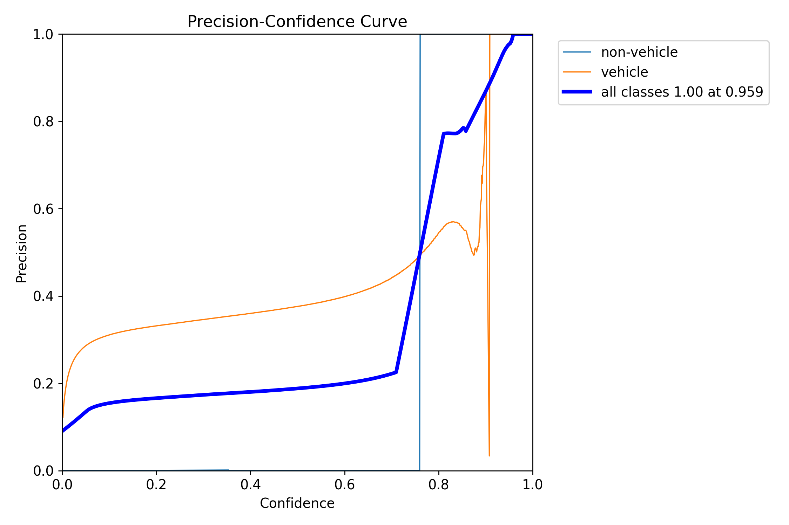
Za sve klase, model dostiže preciznost od 1.0 pri visokom pragu pouzdanosti (~0.96), što znači da samo predikcije sa visokom sigurnošću daju točne rezultate. "Vehicle" klasa zadržava relativno stabilnu preciznost, ali i dalje ispod 60% većinu vremena. Model ima visoku preciznost pri visokim pragovima, ali to znači da zanemaruje slabije, ali valjane predikcije.

#### 7.11.4. Precision-Recall Curve
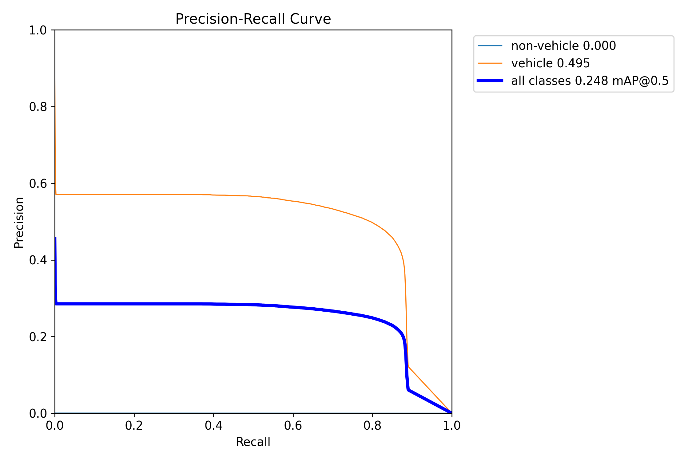
Funkcija za sve klase za mAP@0.5 doseže vrijednost 0.248, dok je za funkciju za klasu "vehicle" ta vrijednost nešto veća, točnije 0.495. Model i dalje ne prepoznaje "non-vehicle" klasu. Ponovno dobivamo potvrdu kako model ima vrlo visoku razinu bias-a, što znači da se fokusira samo na jednu klasu, dok druge ignorira.

#### 7.11.5. Recall-Confidence Curve

Recall za sve klase maksimalno doseže vrijednost od oko 0.44 pri pragu pouzdanosti od 0.0, ali vrlo brzo opada. "Vehicle" recall je vrlo dobar (~0.9), dok je recall za "non-vehicle" praktički nepostojeći. Model identificira samo ono što dobro poznaje, a slab recall za "non-vehicle" navodi na zaključak da su takvi objekti slabo zastupljni u skupu ili nisu dobro označeni.

#### 7.11.6. F1-Confidence Curve

Maksimalna F1 vrijednost za sve klase iznosi oko 0.3 pri pragu pouzdanosti od 0.75, što je relativno nisko. F1 vrijednost "vehicle" klase doseže ~0.63, što pokazuje da model puno bolje prepoznaje ovu klasu u odnosu na druge. Niska F1 vrijednost za sve klase navodi na to da model ima slabiju sposobnost balansiranja između preciznosti i odziva, posebno za "non-vehicle" klasu.

#### 7.11.7. Interpretacija matrice konfuzije
Normalizirana matrica konfuzije za drugi trening modela pruži uvid u performanse klasifikacije. Model je klasificirao objekte u tri kategorije: "non-vehicle", "vehicle" i "background".

**Normalizirana matrica konfuzije:**

Normalizirana matrica prikazuje udjele, što omogućuje lakšu usporedbu performansi među klasama.
* **"non-vehicle" klasa:**
    * Samo 0.00 (0%) stvarnih "non-vehicle" objekata je ispravno klasificirano.
    * Ogromnih 0.95 (95%) stvarnih "non-vehicle" objekata je pogrešno klasificirano kao "background".
    * 0.05 (5%) stvarnih "non-vehicle" objekata je pogrešno klasificirano kao "vehicle".
* **"vehicle" klasa:**
    * Model pokazuje visoku točnost za klasu "vehicle", s 0.93 (93%) točno klasificiranih instanci.
    * Samo 0.07 (7%) "vehicle" objekata je pogrešno klasificirano kao "background".
    * 0.00 (0%) "vehicle" objekata je pogrešno klasificirano kao "non-vehicle".
* **"background" klasa:**
    * Model je vrlo uspješam u prepoznavanju "background" klase s 0.99 (99%) točnih detekcija.
    * Samo 0.01 (1%) "background" objekata je pogrešno klasificirano kao "non-vehicle".
    * 0.00 (0%) "background" objekata je pogrešno klasificirano kao "vehicle".

**Zaključak iz matrica konfizije:**
Iz matrice konfuzije može se izvući zaključak da se model značajno oslanja na dominantne klase ("vehicle" i "background"), dok zanemaruje "non-vehicle" objekte. Vrlo jasno se može zaključiti kako je skup za treniranje neuravnotežen ili nedostaju jasne karakteristike tih objekata.

#### 7.11.8. Ukupna ocjena
Model i dalje pokazuje odlične performanse za klasu "vehicle", ali još uvijek ignorira klasu "non-vehicle". Model također ima vrlo nestabilne validacijske gubitke, što upućuje na potrebu za boljim balansiranjem podataka. Potpuno je jasno kako čista izmjena parametara koji se prosljeđuju modelu neće gotovo uopće promjeniti rezultate učenja.

### 7.12. Šesto treniranje - Yolo11 medium
#### 7.12.1. Parametri treniranja
Drugo treniranje ovog modela izvedeno je sa skupom parametara također definiranim u `args.yaml` datoteci, a ključni parametri korišteni pri treniranju su:
- **`epochs: 20`**: Model je sada treniran kroz 20 epoha,što je dvostruko više od dosadašnjeg broja epoha.
- **`batch: 4`**: Batch predstavlja broj slika koji je model uzimao pri svakoj iteraciji treniranja, konkretno u ovom primjeru to je 4 slike po iteraciji. Manji veličine serija koriste se kada su resursi, poput GPU-u, ograničeni radi stabilnijeg treniranja, ali potencijalno dovode do nestabilnijih gradijenata tokom učenja.
- **`imgsz: 640`**: Rezolucija je ponovno postavljena na 640x640, čime bi model trebao imati jasniji pregled detalja na skupu za učenje i validaciju.
- **`patience: 10`**: Parametar za rano zaustavljanje postavljen je na 10, što znači da će se model zaustaviti ako nakon 10 uzastopnih epoha pri treniranju ne dobije bolje rezultate. Model se zaustavio nakon 13. epohe, što znači da u posljednjih 10 epoha nije pokazao poboljšanje u glavnoj metrici (`mAP50-95(B)`)

#### 7.12.2. Interpretacija metrika
Svi rezultati treniranja zabilježeni su u `results.csv` i pružaju uvid u proces učenja ovog modela kroz 10 epoha.

##### 7.12.2.1. Funkcije gubitka (Loss Functions)
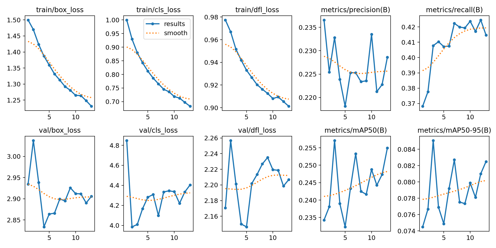
- **Gubitak na trening skupu**: Trening gubici, uključujući `train/box_loss`, `train/cls_loss` i `train/dfl_loss` pokazuju stabilan i konstantan pad kroz sve epohe, što je naznaka da model nastavlja učiti strukturu i klasifikaciju objekata iz podataka. 
- **Gubitak na validacijskom skupu**: Gubici na validacijskom skupu znatno su viši, `val/cls_loss` i `val/dfl_loss` su posebno izraženi i variraju kroz epohe. Takvo ponašanje sugerira da iako model poboljšava performanse na trening podacima, njegova sposobnost generalizacije na neviđene primjere ostaje ograničena. Ova razlika također ponovno ukazuje na pretreniranje i osjetljivost na distribuciju validacijskog skupa.

##### 7.12.2.2. Preciznost (Precision)

Preciznost modela (`metrics/precision(B)`) pokazuje veliku nestabilnost kroz epohe, što može biti razlog neuravnoteženosti ulaznih podataka. Preciznost za klasu "vehicle" i dalje dominantna nad svim ostalim klasama. 

##### 7.12.2.3. Odziv (Recall)

Vrijednosti odziva stabilno rastu i dostižu maksimum od oko 0.425, što je pozitivan znak da model prepoznaje sve više objekata.

###### 7.12.2.4. Srednja prosječna preciznost (mAP)

Srednje prosječne preciznosti (`mAP50` i `mAP50-95`) nastavljaju lagano rasti, s vrijednostima koje na kraju dosežu oko 0.257 i 0.084. Iako su ove vrijednosti niske, konstantan porast mAP metrika ukazuje na postepeno, ali sporo poboljšanje u sveukupnoj točnosti lokalizacije objekata.

#### 7.12.3. Precision-Confidence Curve
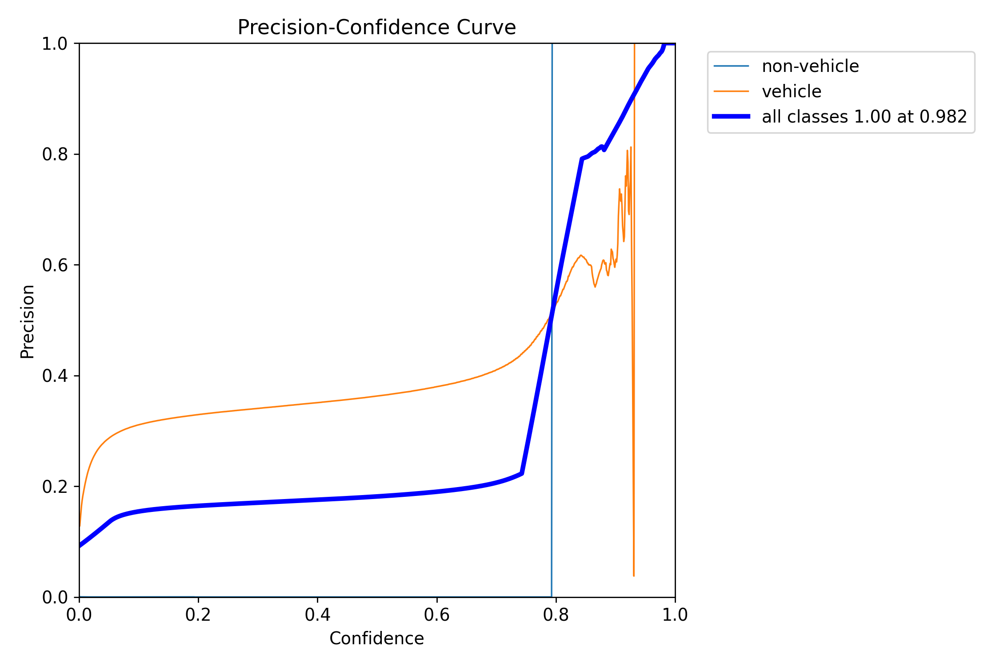
Krivulja preciznosti u odnosu na prag pouzdanosti pokazuje da model za sve klase postiže 1.00 preciznost pri vrlo visokom prau od 0.982. Klasa "vehicle" ima relativno stabilnu preciznost, ali bez značajnog poboljšanja u nižim regijama pouzdanosti, dok je krivulja "non-vehicle" praktički neaktivna. Takvo ponašanje modela može biti koristno ako je cilj imati vrlo precizne predikcije bez lažno pozitivnih rezultata, no uz cijenu brojnih propuštanja objekata. Model je očito treniran s težinom ka minimiziranju grešaka za dominantnu klasu, odbacujući gotovo sve druge.

#### 7.12.4. Precision-Recall Curve
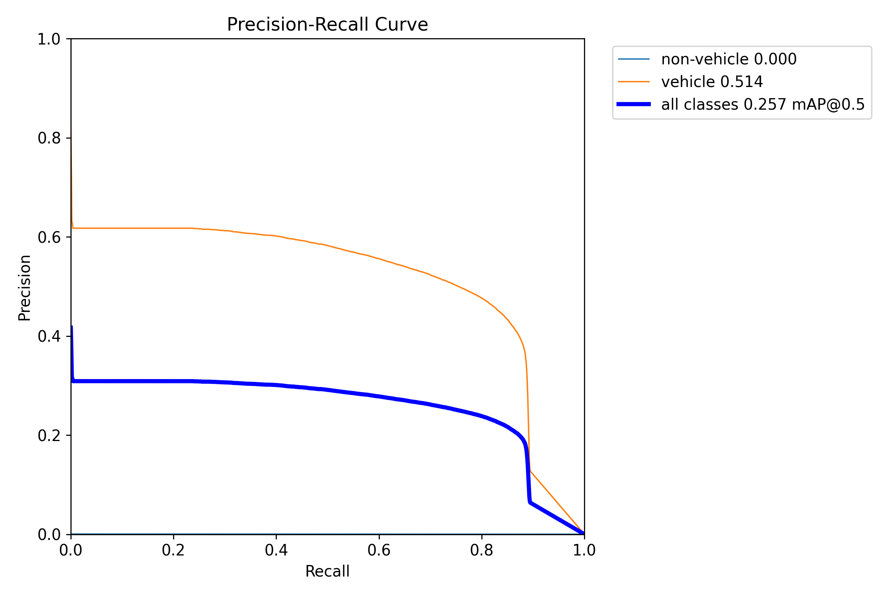
Precision-Recall krivulja potvrđuje već uočene probleme. Model uspješno detektira vozila, s mAP@0.5 vrijednošću od 0.514, dok je mAP za "non-vehicle" klasu i dalje 0.000. Za sve klase kombinirano, model doseže mAP@0.5 od 0.257, što predstavlja neznatno poboljšanje u odnosu na prethodne iteracije. Krivulja za sve klase je poprilično ravna i niska, što sugerira da je ukupna preciznost konstantno kompomitirana zbog neravnoteže između klasa. Ova analiza dodatno potvrđuje potrebu za boljim balansiranjem skupa podataka i eventualnim uvođenjem drugih strategija, kao na primjer "class-weight"-inga.

#### 7.12.5. Recall-Confidence Curve
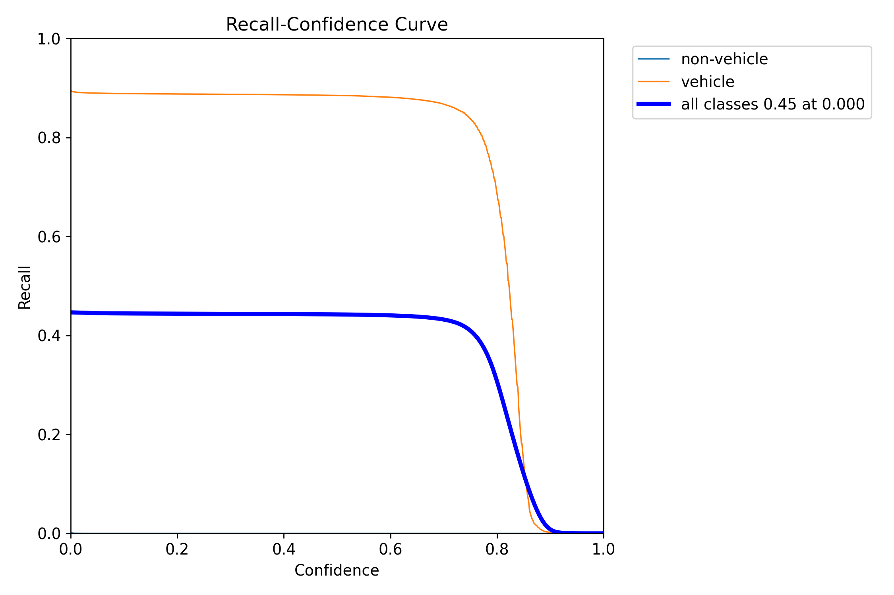
Recall-Confidence krivulja pokazuje da model za sve klase postiže maksimani recall od 0.45 pri najnižem pragu pouzdanosti, ali ta vrijednost brzo opada s povećanjem praga. Klasa "vehicle" ponovno se ističe s gotovo stalnim odzivom od 0.9, dok je odziv za "non-vehicle" zanemariv. Ovakav rezultat jasno ukazuje da model ima visoku osjetljivost za poznatu klasu, ali vrlo lošu za sve ostale. Strategije poput fine-tuninga samo na "non-vehicle" podacima ili generiranje dodatnih primjera iz te kategorije mogle bi pomoći u uravnotežavanju.

#### 7.12.6. F1-Confidence Curve

F1-Confidence krivulja pokazuje da model doseže maksimalnu F1 vrijednost od 0.29 za sve klase pri pragu pouzdanosti od 0.766, što ukazuje na slab ukupni balans između preciznosti i odziva. Ipak, klasa "vehicle" zadržava znatno bolje F1 performanse ,dosežući vrijednost od oko 0.6, dok je F1 za klasu "non-vehicle" 0. Krivulja se naglo ruši za više vrijednosti pouzdanosti, što ponovno ukazuje na osjetljivost modela kada je potrebno održati konzistentnu točnost pri visokom pragu. Ovakva slika govori u prilog ideji da model dobro prepoznaje jednu klasi, ali i dalje nije sposoban pravilno klasificirati rijeđe ili kompleksnije kategorije.

#### 7.12.7. Interpretacija matrice konfuzije
Normalizirana matrica konfuzije za drugi trening modela pruži uvid u performanse klasifikacije. Model je klasificirao objekte u tri kategorije: "non-vehicle", "vehicle" i "background".

**Normalizirana matrica konfuzije:**

Normalizirana matrica prikazuje udjele, što omogućuje lakšu usporedbu performansi među klasama.
* **"non-vehicle" klasa:**
    * Samo 0.00 (0%) stvarnih "non-vehicle" objekata je ispravno klasificirano.
    * Ogromnih 0.95 (95%) stvarnih "non-vehicle" objekata je pogrešno klasificirano kao "background".
    * 0.05 (5%) stvarnih "non-vehicle" objekata je pogrešno klasificirano kao "vehicle".
* **"vehicle" klasa:**
    * Model pokazuje visoku točnost za klasu "vehicle", s 0.93 (93%) točno klasificiranih instanci.
    * Samo 0.07 (7%) "vehicle" objekata je pogrešno klasificirano kao "background".
    * 0.00 (0%) "vehicle" objekata je pogrešno klasificirano kao "non-vehicle".
* **"background" klasa:**
    * Model je vrlo uspješam u prepoznavanju "background" klase s 0.97 (97%) točnih detekcija.
    * Samo 0.03 (3%) "background" objekata je pogrešno klasificirano kao "non-vehicle".
    * 0.00 (0%) "background" objekata je pogrešno klasificirano kao "vehicle".

**Zaključak iz matrica konfizije:**
Model u finalnoj iteraciji treniranja i dalje ima probleme s klasom "non-vehicle" gdje je gotovo svaki objekt iz te klase krivo klasificiran kao "background". Klasa "vehicle" je i dalje dominantno prepoznata, sa vrlo visokom točnošću. Klasa "background" je ponovno najpreciznija sa gotovo svim ispravnim detekcijama. Ovakva distribucija ukazuje na snažnu pristranost modela prema dominantnim klasama ("vehicle") te sugerira da su "non-vehicle" objekti vjerojatno nedovoljno zastupljeni ili slabo obilježeni.

#### 7.12.8. Ukupna ocjena
Model pokazuje stabilan napredak u detekciji i klasifikaciji objekata klase "vehicle", ali njegova ukupna učinkovitost ostaje ograničena zbog izrazito lošeg prepoznavanja klase "non-vehicle". Iako su metrika poput mAP@0.5 i recall-a za "vehicle" blago poboljšane, ukupni F1 i mAP rezultati su niski i ukazuju na neuravnoteženo ponašanje modela. Trening gubici opadaju konzistentno, no validacijski ostaju visoki, što sugerira mogući overfitting. Zaključno, model je funkcionalan za prepoznavanje vozila, ali zahtijeva dodatne optimizacije i balansiranje podataka za širu primjenjivost.

## 8. Zaključak 
Kroz provedeni niz eksperimenata s treniranjem YOLOv11 modela, jasno se uočavaju ograničenja trenutnog pristupa, prvenstveno vezana uz nemogućnost modela da generalizira izvan naučenog skupa podataka. Unatoč različitim varijacijama u parametrima, poput broja epoha, veličine ulazne slike, i aktivacije ranog zaustavljanja, model konstantno pokazuje izražene znakove overfittinga. To se očituje u niskim mAP50-95 vrijednostima koje ne prelaze 0.08 te u vrlo lošim rezultatima za klasu "non-vehicle", koja je gotovo u potpunosti zanemarena u svim pokušajima. Suprotno tome, klasa "vehicle" pokazuje solidne performanse, a "background" gotovo savršene, što ukazuje na pristranost modela prema češćim i vizualno dominantnijim klasama u skupu podataka.

Eksperimenti su potvrdili da ni povećanje broja epoha, ni veća rezolucija slike, ni primjena warmup mehanizama ne mogu nadomjestiti temeljne nedostatke u strukturi i raznolikosti podataka. Također, isključivanje augmentacija dodatno je smanjilo sposobnost modela da nauči varijabilnost iz okoline. Svi rezultati dosljedno ukazuju da su problematični upravo podaci, nedostatna zastupljenost i raznolikost "non-vehicle" objekata te potencijalno loša kvaliteta anotacija. Za budući napredak bit će nužno obogatiti i uravnotežiti skup podataka, uključiti agresivnije augmentacijske tehnike te razmotriti alternativne arhitekture ili transfer learning pristupe koji su otporniji na male i neuravnotežene skupove.

Općenito, projekt je pokazao vrijednu metodološku strukturu, temeljito testiranje i dobru organizaciju evaluacije, no krajnji rezultati jasno upućuju na to da se daljnji rad treba usmjeriti na kvalitetu ulaza u sustav, a manje na fine-tuning parametara modela.

## 9. Literatura

[1] Almeida, P., Oliveira, L. S., Silva Jr, E., Britto Jr, A., Koerich, A., PKLot – A robust dataset for parking lot classification, Expert Systems with Applications, 42(11):4937-4949, 2015.

[2] Zhu, P., et al. "Detection and tracking meet drones challenge," in IEEE Transactions on Pattern Analysis and Machine Intelligence, vol. 44, no. 11, pp. 7380–7399, 2021.

## 10. Prilozi
[PKLOT skup podataka (Roboflow)](https://public.roboflow.com/object-detection/pklot)

[VisDrone skup podataka (GitHub)](https://github.com/VisDrone/VisDrone-Dataset)

[VisDrone skup podataka korišten za treniranje (UNIRI Sharepoint)](https://uniri-my.sharepoint.com/personal/benjamin_jakupovic_uniri_hr1/_layouts/15/onedrive.aspx?id=%2Fpersonal%2Fbenjamin%5Fjakupovic%5Funiri%5Fhr1%2FDocuments%2FDIPLOMSKI%2FSDU%2FZavrsni%2FVisDrone%2Dfull%2Ddataset%2Ezip&parent=%2Fpersonal%2Fbenjamin%5Fjakupovic%5Funiri%5Fhr1%2FDocuments%2FDIPLOMSKI%2FSDU%2FZavrsni&ga=1)