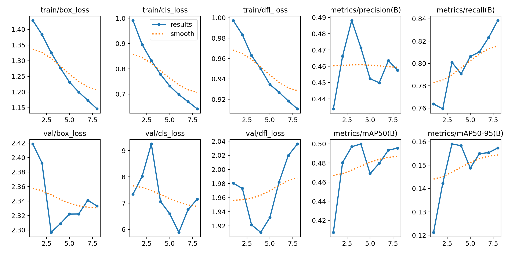
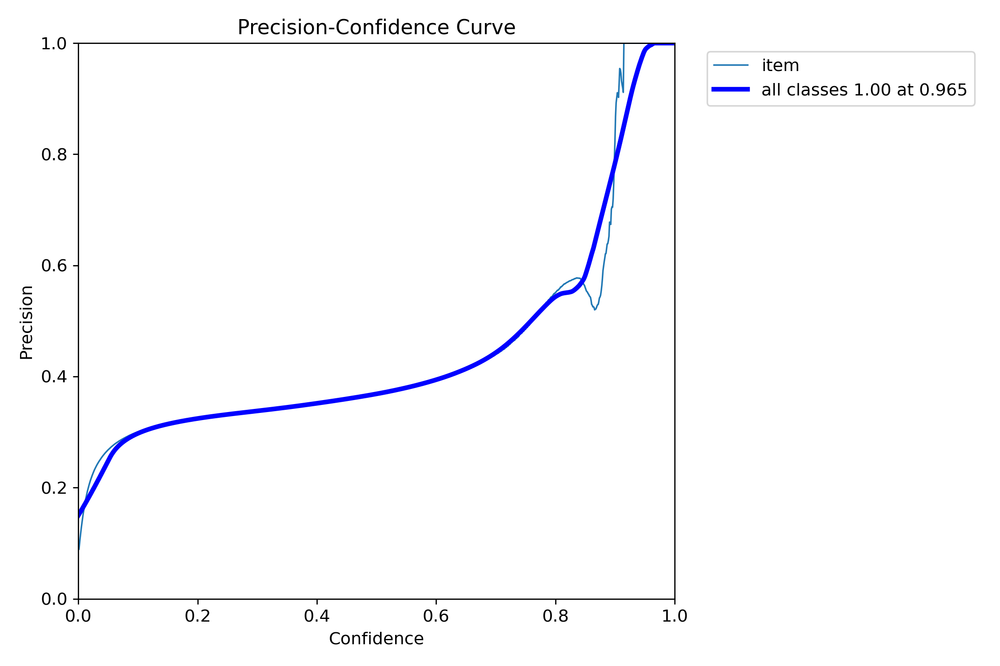
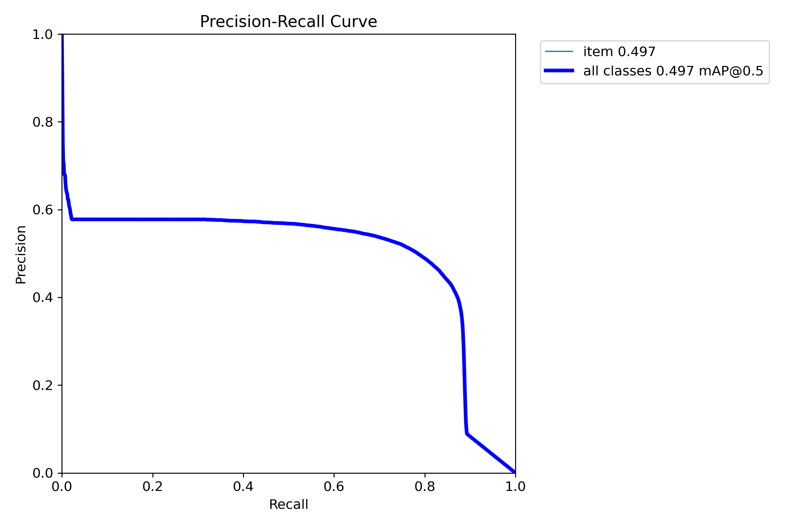
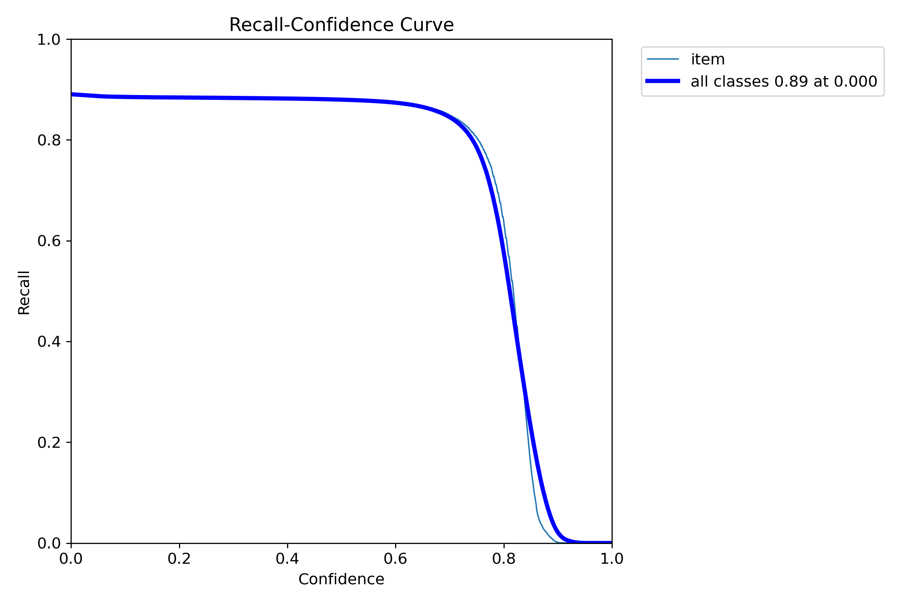
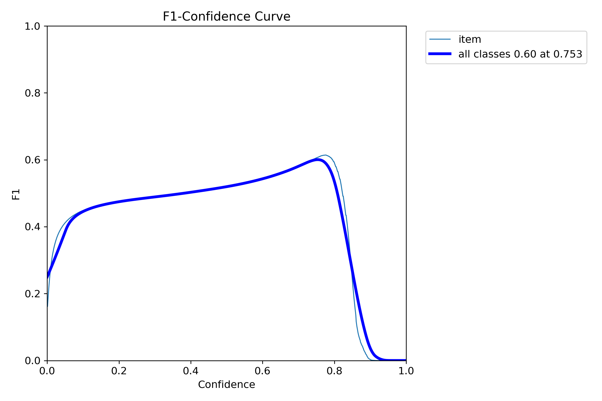
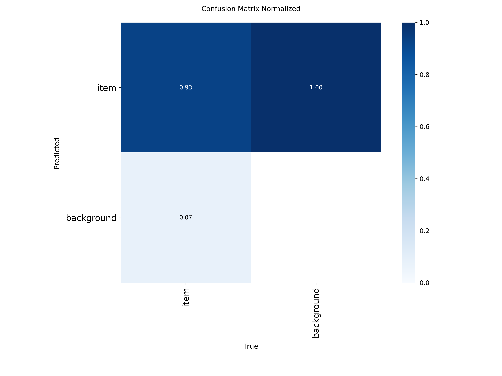

## Validacija i objašnjenje rezultata
### Ponovno treniranje nad jednom klasom - detekcija vozila
Kako bi se provjerio uzrok loših performansi modela te potencijalno poboljšale metrike, dorađen je skup podataka. Skup podataka sada sadrži samo zapise *vehicle* klasa te se model treniza za *single class* detekciju, budući da je jedini cilj detektirati vozila. Trenirao se *YOLO11m* model.
#### Parametri treniranja
Model je treniran s specifičnim skupom parametara definiranim u `args.yaml` datoteci. Ključni parametri za ovo izvođenje su:
- **`epochs: 10`**: Model je treniran kroz 10 epoha. 
- **`batch: 4`**: Veličina serije (batch size) postavljena je na 4. To znači da je model obrađivao 4 slike istovremeno tijekom svake iteracije treniranja. Batch size se nije povećavao zbog nedostatka memorijskih resurasa.
- **`imgsz: 640`**: Slike za treniranje i validaciju su smanjene na rezoluciju od 640x640 piksela.

#### Interpretacija metrika
Rezultati treniranja, zabilježeni u `results.csv`, pružaju uvid u proces učenja modela kroz 10 epoha. Analizom se može vidjeti kako je u treniranju izvedeno 8 epoha te je zbog early stoppinga zustavljeno treniranje modela, budući da se metrike performansi nisu poboljšavale.

##### Funkcije gubitka (Loss Functions)

Funkcije gubitka (`box_loss`, `cls_loss`, `dfl_loss`) pokazuju koliko model "griješi" prilikom predviđanja. Niža vrijednost označava bolje performanse.
- **Gubitak na trening skupu**: Vrijednosti `train/box_loss`, `train/cls_loss` i `train/dfl_loss` konzistentno opadaju tijekom epoha (npr. `train/box_loss` pada s otprilike 1.68 na 1.15). To je pozitivan znak koji pokazuje da model uspješno uči iz podataka na kojima se trenira.
- **Gubitak na validacijskom skupu**: Vrijednosti `val/box_loss`, `val/cls_loss` i `val/dfl_loss` su znatno veće od trening vrijednosti i ne pokazuju jasan trend opadanja. Primjerice, `val/box_loss` naglo opada s 2.42 na 2.30 prilikom prve 3 epohe te kreće rasti i varirati, što poručuje da bounding box detekcija tijekom treniranja modela se postepeno pogoršava. Visoka vrijednost `val/cls_loss` (gubitak klasifikacije, ~7) sugerira da se model muči s ispravnom klasifikacijom objekata na podacima koje prije nije vidio. Ova velika razlika između trening i validacijskog gubitka ukazuje na nestabilno učenje klasifikacije, što poručuje da bi bilo potrebno provjeriti kvalitetu skupa podataka.

##### Preciznost (Precision)

Preciznost mjeri udio točnih pozitivnih detekcija među svim detekcijama koje je model napravio. U zadnjoj epohi, metrika `metrics/precision(B)` iznosi 0.46 te je trekom treniranja preciznost varirala između 0.44 i 0.49. Što poručuje lošu preciznost u detekciji vozila.

#####  Odziv (Recall)

Odziv mjeri koliko je model uspješan u pronalaženju svih relevantnih objekata na slici. Metrika `metrics/recall(B)` pokazuje početno strm, ali stabilan rast s `0.76` na `0.84` kroz treniranje. To znači da model postupno postaje bolji u pronalaženju svih postojećih objekata, uz visoku relevantnost.

##### Srednja prosječna preciznost (mAP)

mAP (mean Average Precision) je ključna metrika za zadatke detekcije objekata jer kombinira preciznost i odziv u jednu vrijednost, čineći je najvažnijim pokazateljem ukupnih performansi modela.
- **`metrics/mAP50(B)`**: Ova metrika mjeri performanse pri pragu preklapanja (IoU - Intersection over Union) od 50%. Vrijednosti se kreću između `0.24` i `0.50`, što ukazuje na osnovnu sposobnost detekcije. Model može locirati objekte, ali ne s visokom preciznošću i dobro definiranim okvirima (*bounding box*).
- **`metrics/mAP50-95(B)`**: Ovo je stroža i standardna metrika koja usrednjava mAP preko različitih IoU pragova (od 50% do 95% u koracima od 5%). Rezultati su ovdje znatno niži (oko `0.155`). To potvrđuje da, iako model može grubo detektirati objekte (što pokazuje `mAP50`), pozicije i veličine predviđenih okvira (bounding boxes) nisu dovoljno precizne da bi zadovoljile više pragove preklapanja.

####  Precision-Confidence Curve

Na grafu Precision-Confidence, plava linija koja predstavlja "all classes" pokazuje preciznost (Precision) u odnosu na prag pouzdanosti (Confidence). Vidljivo je da preciznost raste s povećanjem praga pouzdanosti. Na primjer, pri pragu pouzdanosti od približno 0.96, preciznost naglo raste prema 1.0. Tanka plava linija, koja predstavlja klasu "vehicle", također pokazuje porast preciznosti s povećanjem pouzdanosti, dostižući visoke vrijednosti. Također je vidljivo da je preciznost za detekciju vozila iznad 0.5 za confidence of 0.8.

####  Precision-Recall Curve

Graf Precision-Recall prikazuje odnos između preciznosti (Precision) i odziva (Recall). Idealna krivulja bila bi blizu gornjeg desnog kuta, što znači visoku preciznost i visok odziv. Plava linija ("all classes") pokazuje da model postiže relativno nisku preciznost (oko 0.2) pri visokom odzivu (oko 0.8), koja zatim naglo opada kako odziv raste iznad 0.8. Na niže vrijednosti odziva (između 0.2 i 0.8), preciznost ostaje oko 0.6. Vrijednost mAP@0.5 za "all classes" iznosi 0.497, što ukazuje na općenito loše performanse detekcije objekata za sve klase pri pragu IoU od 0.5. 

####  Recall-Confidence Curve

Na grafu Recall-Confidence, plava linija ("all classes") prikazuje kako se odziv (Recall) mijenja s pragom pouzdanosti (Confidence). Odziv počinje visok i postupno opada kako prag pouzdanosti raste. To je očekivano, jer povećanje pouzdanosti znači da model postaje selektivniji i propušta više detekcija. Odziv je navjeći za pragove pouzdanosti ispod 0.8 te iznosi 0.89. Porastom pouzdanosti iznad 0.8, odziv naglo opada pada. Legenda pokazuje da je odziv za "all classes" 0.89 pri pragu pouzdanosti od 0.000, što je točka gdje je model najmanje selektivan i pokušava pronaći što više objekata.

####  F1-Confidence Curve

F1-Confidence krivulja prikazuje F1 rezultat (harmonijsku sredinu preciznosti i odziva) u odnosu na prag pouzdanosti (Confidence). F1 rezultat je mjera točnosti modela i traži balans između preciznosti i odziva. Plava linija ("all classes") pokazuje da F1 rezultat dostiže svoj maksimum (oko 0.6) pri pragu pouzdanosti od približno 0.7. Nakon toga, F1 rezultat naglo opada.
#### Interpretacija matrica konfuzije

Normalizirana matrica konfuzije pruži detaljan uvid u performanse klasifikacije modela za prvi trening. Model je klasificirao objekte u tri kategorije: "vehicle" i "background".

**Normalizirana matrica konfuzije:**

Normalizirana matrica prikazuje udjele, što omogućuje lakšu usporedbu performansi među klasama.
* **"vehicle" klasa:**
    * Model pokazuje visoku točnost za klasu "vehicle", s 0.93 (93%) točno klasificiranih instanci.
    * Samo 0.07 (7%) "vehicle" objekata je pogrešno klasificirano kao "background".
* **"background" klasa:**
    * Svi pozadinski objekti su krivo interpretirani kao "vehicle" objekti

**Zaključak iz matrica konfuzije:**
Analizom se može vidjeti kako model izvrsno detektira vozila, ali krivo klasificira background objekte kao vozila, što poručuje da model ima visok udio lažno pozitivnih instanci.
 

#### Ukupna ocjena
Nakon ponovnog treniranja modela sa samo jednom klasom ("vehicle"), uočava se jasan kompromis u performansama. Model postiže visok odziv (recall) od 0.84, što znači da uspješno pronalazi veliku većinu stvarnih vozila na slikama. Međutim, ovo poboljšanje dolazi uz cijenu izrazito niske preciznosti (oko 0.46) i visokog udjela lažno pozitivnih detekcija.

Ključni uvid pruža matrica konfuzije, koja pokazuje da model, iako ispravno klasificira 93% vozila, istovremeno sve pozadinske objekte pogrešno identificira kao vozila. To objašnjava zašto je odziv visok.

Niske vrijednosti mAP metrika, posebno `mAP50-95` (oko 0.155), potvrđuju da, unatoč pronalaženju objekata, njihovi predviđeni okviri nisu dovoljno precizni. Zaključno, pojednostavljivanje problema na jednu klasu nije riješilo temeljni problem slabe generalizacije na validacijskom skupu. Model i dalje pokazuje znakove prekomjernog prilagođavanja na trening podatke i ne uspijeva pouzdano raditi na novim podacima, što ukazuje na to da problem vjerojatno leži u fundamentalnim razlikama između trening (VisDrone) i validacijskog (PKLOT) skupa podataka.
