# Detekcija slobodnih i zauzetih mjesta na parkingu pomoću YOLO modela

## Motivacija

Cilj je bio doraditi YOLO model koji je napravljen za kolegij "Analitika podataka velikog obujma". Model je izrađen za distribuirani sustav ParkMan.
Jedna od funkcionalnosti ParkMan-a uključuje "brojanje" zauzetih mjesta na parkinzima, temeljem slike sigurnosne kamere na parkirnim mjestima. Kako bi se to implementiralo, korišten je YOLO model koji je treniran nad PKLOT skupom podataka. PKLOT skup podataka nastoji detektirati parkirna mjesta na parkinzima te ih klasificirati u "slobodno" i "zauzeto".

Inicijalni model je treniran sa 20 epoha nad PKLOT skupom podataka. Trenirani model je prikazivao visoke performanse detekcije, koje su vidljive na grafovima ispod.

#TODO: UBACI SLIKE REZULTATA S APVO-a.

Kao što se vidi na grafovima iznad, model je pretreniran te postiže savršene rezultate za parkinge iz PKLOT skupa. Budući da PKLOT sadržava iste parkinge sa različitim korištenostima u trening, validacijskom i test setu, model nije u mogućnosti generalizirati i prepoznati mjesta na novim parkinzima. Razlog proizlazi iz toga što je model učio detektirati parkirna mjesta te ih klasificirati u odgovarajuće kategorije (slobodno i zauzeto). Budući da različiti parkinzi imaju različit raspored mjesta, treniranje generaliziranog modela je zahtjevan proces koji uključuje doradu skupa podataka sa neviđenim parkinzima.

Kako bi se olakšao proces i poboljšala sposobnost generaliziranja, promijenjen je pristup klasifikaciji. Umjesto da se detektiraju parkirna mjesta i klasificiraju u slobodno i zauzeto, model detektira objekte na slici te ih klasificira u vozila (automobili, motorcikli, kamioni, busevi) i ostale objekte. Promjena pristupu klasifikaciji je olakšala sposobnost generalizacije modela uz zadržavanje funkcionalnosti potrebnih za ParkMan sustav - brojanje zauzetih mjesta na parkingu.

## Tim 
Treniranje modela je bilo implementirano u paru te su zadaci bili podijeljeni.

### Damjan Đekić
- Augmentacija i proširenje skupa podataka za treniranje pomoću dodatnih efekata na slici
- Treniranje YOLO11 medium modela sa različitim kombinacijama parametara

### Benjamin Jakupović
- Prilagodba skupa podataka za treniranje (usklađivanje klasa iz VisDrone skupa podataka kako bi se uskladilo za potrebe zadatka) 
- Prilagodba skupa podatka za validaciju i testiranje (usklađivanje klasa iz PKLOT skupa podataka kako bi se uskladilo sa train podacima)
- Treniranje YOLO11 large modela sa različitim kombinacijama parametara

## Pregled područja

#TODO: OPIŠI YOLO I RAČUNALNI VID

## Opis skupa podataka 

#TODO: opiši skup podataka i augmentiranje te baci licence na skup podataka

## Opis primijenjenih metoda

## Opis eksperimenta

## Validacija i objašnjenje rezultata
### Prvo treniranje - Yolo11 large
#### Parametri treniranja
Model je treniran s specifičnim skupom parametara definiranim u `args.yaml` datoteci. Ključni parametri za ovo izvođenje su:
- **`epochs: 5`**: Model je treniran kroz 5 epoha. Epoha predstavlja jedan potpuni prolazak kroz cjelokupni skup podataka za treniranje. Pet epoha je relativno malen broj, što ukazuje na to da je ovo vjerojatno bio početni ili eksplorativni trening kako bi se procijenile performanse modela i valjanost pristupa.
- **`batch: 4`**: Veličina serije (batch size) postavljena je na 4. To znači da je model obrađivao 4 slike istovremeno tijekom svake iteracije treniranja. Manja veličina serije često se koristi kada su resursi GPU-a ograničeni, ali može dovesti do nestabilnijeg gradijenta tijekom učenja.
- **`imgsz: 416`**: Slike za treniranje i validaciju su smanjene na rezoluciju od 416x416 piksela. Ovo je uobičajena rezolucija za YOLO modele koja nudi dobar kompromis između brzine obrade i točnosti detekcije.

#### Interpretacija metrika
Rezultati treniranja, zabilježeni u `results.csv`, pružaju uvid u proces učenja modela kroz 5 epoha.

##### Funkcije gubitka (Loss Functions)

Funkcije gubitka (`box_loss`, `cls_loss`, `dfl_loss`) pokazuju koliko model "griješi" prilikom predviđanja. Niža vrijednost označava bolje performanse.
- **Gubitak na trening skupu**: Vrijednosti `train/box_loss`, `train/cls_loss` i `train/dfl_loss` konzistentno opadaju tijekom epoha (npr. `train/box_loss` pada s 1.68 na 1.40). To je pozitivan znak koji pokazuje da model uspješno uči iz podataka na kojima se trenira.
- **Gubitak na validacijskom skupu**: Vrijednosti `val/box_loss`, `val/cls_loss` i `val/dfl_loss` su znatno veće od trening vrijednosti i ne pokazuju jasan trend opadanja. Primjerice, `val/box_loss` ostaje oko vrijednosti 3.0. Visoka vrijednost `val/cls_loss` (gubitak klasifikacije, ~3.8) posebno sugerira da se model muči s ispravnom klasifikacijom objekata na podacima koje prije nije vidio. Ova velika razlika između trening i validacijskog gubitka jasan je pokazatelj prekomjernog prilagođavanja (overfitting), gdje model "pamti" trening podatke umjesto da uči generalizirane značajke.

##### Preciznost (Precision)

Preciznost mjeri udio točnih pozitivnih detekcija među svim detekcijama koje je model napravio. Na primjer, ako model detektira 10 automobila, a 8 od njih su stvarno automobili, preciznost je 80%. U zadnjoj, petoj epohi, metrika `metrics/precision(B)` pokazuje značajan skok na `0.73785`. Iako ovo izgleda obećavajuće, treba biti oprezan jer je u prethodnim epohama vrijednost bila znatno niža (oko 0.21-0.25). Ovakav nagli skok može biti posljedica rasporeda učenja (learning rate schedule) i ne mora nužno predstavljati stabilno poboljšanje performansi.

##### Odziv (Recall)

Odziv mjeri koliko je model uspješan u pronalaženju svih relevantnih objekata na slici. Ako na slici ima 10 automobila, a model ih pronađe 7, odziv je 70%. Metrika `metrics/recall(B)` pokazuje blagi, ali stabilan rast s `0.348` na `0.400` kroz 5 epoha. To znači da model postupno postaje bolji u pronalaženju svih postojećih objekata, iako još uvijek propušta više od polovice (oko 60%).

##### Srednja prosječna preciznost (mAP)

mAP (mean Average Precision) je ključna metrika za zadatke detekcije objekata jer kombinira preciznost i odziv u jednu vrijednost, čineći je najvažnijim pokazateljem ukupnih performansi modela.
- **`metrics/mAP50(B)`**: Ova metrika mjeri performanse pri pragu preklapanja (IoU - Intersection over Union) od 50%. Vrijednosti se kreću oko `0.24`, što ukazuje na osnovnu sposobnost detekcije. Model može locirati objekte, ali ne s visokom preciznošću.
- **`metrics/mAP50-95(B)`**: Ovo je stroža i standardna metrika koja usrednjava mAP preko različitih IoU pragova (od 50% do 95% u koracima od 5%). Rezultati su ovdje znatno niži (oko `0.07-0.08`). To potvrđuje da, iako model može grubo detektirati objekte (što pokazuje `mAP50`), pozicije i veličine predviđenih okvira (bounding boxes) nisu dovoljno precizne da bi zadovoljile više pragove preklapanja.

#### Precision-Confidence Curve

Na grafu Precision-Confidence, plava linija koja predstavlja "all classes" pokazuje preciznost (Precision) u odnosu na prag pouzdanosti (Confidence). Vidljivo je da preciznost raste s povećanjem praga pouzdanosti. Na primjer, pri pragu pouzdanosti od približno 0.85, preciznost naglo raste prema 1.0. Narančasta linija, koja predstavlja klasu "vehicle", također pokazuje porast preciznosti s povećanjem pouzdanosti, dostižući visoke vrijednosti. Plava linija, koja predstavlja "non-vehicle" klasu, ostaje na gotovo nuli, što znači da model vrlo rijetko točno detektira objekte koji nisu vozila, odnosno ima vrlo nisku preciznost za tu klasu. Legenda također pokazuje da je ukupna preciznost za sve klase (all classes) 1.00 pri pragu pouzdanosti od 0.947, što je najvjerojatnije točka gdje model s visokom sigurnošću predviđa samo mali broj, ali vrlo točnih detekcija.

#### Precision-Recall Curve

Graf Precision-Recall prikazuje odnos između preciznosti (Precision) i odziva (Recall). Idealna krivulja bila bi blizu gornjeg desnog kuta, što znači visoku preciznost i visok odziv. Plava linija ("all classes") pokazuje da model postiže relativno nisku preciznost (oko 0.3) čak i pri visokom odzivu, koja se zatim blago smanjuje kako odziv raste. Narančasta linija ("vehicle") ima znatno bolje performanse, s preciznošću koja počinje oko 0.6 i postupno pada kako odziv raste. Linija za "non-vehicle" klasu ostaje na nuli. Vrijednost mAP@0.5 za "all classes" iznosi 0.250, što je niska vrijednost i ukazuje na općenito loše performanse detekcije objekata za sve klase pri pragu IoU od 0.5. Vrijednost mAP@0.5 za klasu "vehicle" iznosi 0.500, što je bolji, ali još uvijek umjeren rezultat. Klasa "non-vehicle" ima mAP@0.5 od 0.000, što potvrđuje da model ne detektira tu klasu.

#### Recall-Confidence Curve

Na grafu Recall-Confidence, plava linija ("all classes") prikazuje kako se odziv (Recall) mijenja s pragom pouzdanosti (Confidence). Odziv počinje visok i postupno opada kako prag pouzdanosti raste. To je očekivano, jer povećanje pouzdanosti znači da model postaje selektivniji i propušta više detekcija. Narančasta linija ("vehicle") pokazuje znatno veći odziv u odnosu na "all classes", zadržavajući visoku razinu do praga pouzdanosti od oko 0.8, nakon čega naglo pada. Linija za "non-vehicle" klasu ponovno ostaje na gotovo nuli. Legenda pokazuje da je odziv za "all classes" 0.44 pri pragu pouzdanosti od 0.000, što je točka gdje je model najmanje selektivan i pokušava pronaći što više objekata.

#### F1-Confidence Curve

F1-Confidence krivulja prikazuje F1 rezultat (harmonijsku sredinu preciznosti i odziva) u odnosu na prag pouzdanosti (Confidence). F1 rezultat je mjera točnosti modela i traži balans između preciznosti i odziva. Plava linija ("all classes") pokazuje da F1 rezultat dostiže svoj maksimum (oko 0.3) pri pragu pouzdanosti od približno 0.7. Nakon toga, F1 rezultat naglo opada. Narančasta linija ("vehicle") dostiže znatno viši F1 rezultat (oko 0.6) pri sličnom pragu pouzdanosti, što ukazuje na bolje balansirane performanse za tu klasu. Linija za "non-vehicle" klasu ostaje na nuli. Legenda pokazuje da je F1 za "all classes" 0.30 pri pragu pouzdanosti od 0.729, što predstavlja optimalnu točku za balans između preciznosti i odziva za sve klase.

#### Interpretacija matrica konfuzije

Normalizirana matrica konfuzije pruži detaljan uvid u performanse klasifikacije modela za prvi trening. Model je klasificirao objekte u tri kategorije: "non-vehicle", "vehicle" i "background".

**Normalizirana matrica konfuzije:**

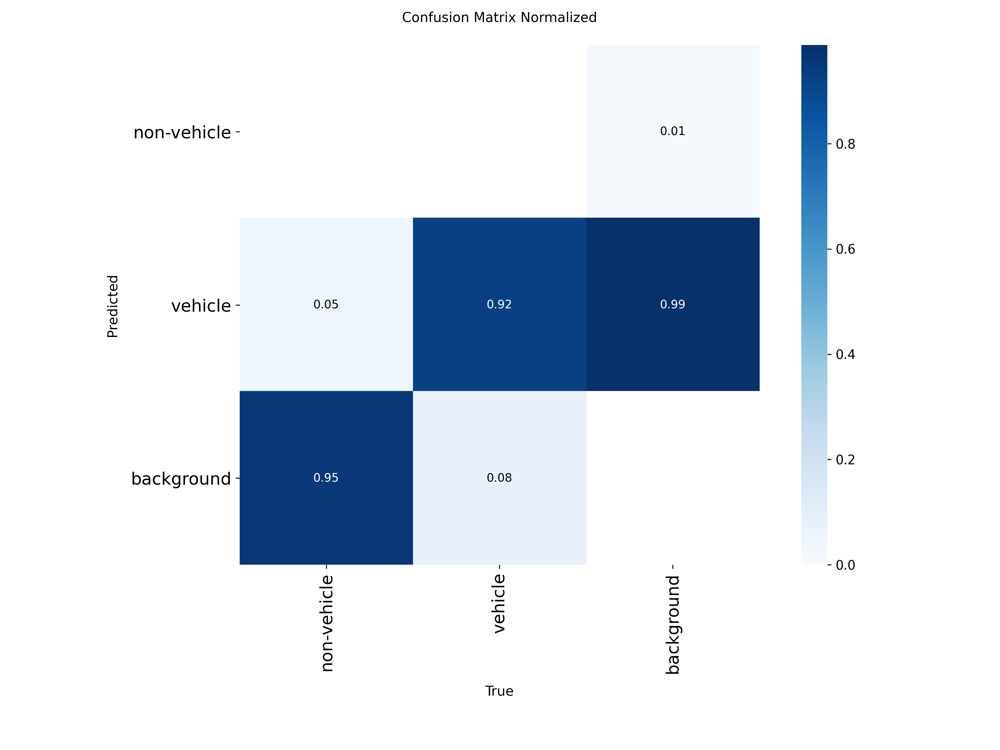

Normalizirana matrica prikazuje udjele, što omogućuje lakšu usporedbu performansi među klasama.
* **"non-vehicle" klasa:**
    * Samo 0.05 (5%) stvarnih "non-vehicle" objekata je ispravno klasificirano.
    * Ogromnih 0.95 (95%) stvarnih "non-vehicle" objekata je pogrešno klasificirano kao "background". Ovo je kritičan problem jer model gotovo u potpunosti ignorira ovu klasu.
* **"vehicle" klasa:**
    * Model pokazuje visoku točnost za klasu "vehicle", s 0.92 (92%) točno klasificiranih instanci.
    * Samo 0.08 (8%) "vehicle" objekata je pogrešno klasificirano kao "background".
* **"background" klasa:**
    * Model je izuzetno uspješan u prepoznavanju "background" klase s 0.99 (99%) točnih detekcija.
    * Samo 0.01 (1%) "background" objekata je pogrešno klasificirano kao "non-vehicle".

**Zaključak iz matrica konfuzije:**
Analiza matrica konfuzije jasno pokazuje da se model u prvom treningu gotovo isključivo fokusirao na prepoznavanje "vehicle" i "background" klasa. Performanse za klasu "non-vehicle" su izuzetno loše, s modelom koji gotovo sve stvarne "non-vehicle" objekte klasificira kao pozadinu. Ovo je u skladu s ranije primijećenim niskim vrijednostima mAP-a za "all classes" i nultim vrijednostima za "non-vehicle" klasu u Precision-Recall i drugim krivuljama. Modelu nedostaje sposobnost razlikovanja između "non-vehicle" objekata i pozadine, što sugerira da su "non-vehicle" objekti možda premali, nedovoljno zastupljeni u skupu podataka ili se previše preklapaju s pozadinom u smislu vizualnih značajki.

#### Ukupna ocjena
Na temelju 5 epoha treniranja, model pokazuje da je u ranoj fazi učenja. Opadajući gubitak na trening skupu je dobar znak, ali visoki validacijski gubitak i niske mAP vrijednosti (posebno mAP50-95) jasno ukazuju na to da model još nije sposoban za generalizaciju na nove podatke i pati od overfittinga. Potrebno je znatno duže treniranje (više epoha), potencijalno uz prilagodbu hiperparametara (npr. learning rate, augmentacije) kako bi se postigle bolje performanse i omogućilo modelu da nauči robusnije značajke za detekciju.

### Drugo treniranje - Yolo11 large
#### Parametri treniranja
U drugoj iteraciji, parametri su prilagođeni s ciljem poboljšanja performansi. Ključne promjene i postavke iz `args.yaml` su:
- **`epochs: 5`** i **`patience: 2`**: Iako je treniranje postavljeno na 5 epoha, uveden je mehanizam ranog zaustavljanja (`patience: 2`). To znači da će se treniranje prekinuti ako se ključna metrika (u ovom slučaju `metrics/mAP50-95(B)`) ne poboljša dvije epohe zaredom. Budući da je treniranje završilo nakon 4. epohe, to ukazuje da model nije pokazao napredak u 3. i 4. epohi u odnosu na vrhunac postignut u 2. epohi.
- **`batch: 4`**: Veličina serije ostala je ista, 4 slike po iteraciji.
- **`imgsz: 640`**: Rezolucija slika povećana je sa 416x416 na 640x640 piksela. Cilj ove promjene bio je pružiti modelu više detalja sa svake slike, što potencijalno može pomoći u detekciji manjih objekata i poboljšanju ukupne preciznosti.

#### Interpretacija metrika
Rezultati iz `results.csv` pokazuju slične trendove kao i u prvom treniranju, unatoč promjeni rezolucije slike.

##### Funkcije gubitka (Loss Functions)

- **Gubitak na trening skupu**: Sve tri komponente gubitka (`train/box_loss`, `train/cls_loss`, `train/dfl_loss`) pokazuju konzistentan pad tijekom 4 epohe. Na primjer, `train/box_loss` pada s 1.48 na 1.32. Ovo potvrđuje da model i dalje uči iz trening podataka.
- **Gubitak na validacijskom skupu**: Kao i u prethodnom pokušaju, vrijednosti gubitka na validacijskom skupu (`val/box_loss` ~2.9, `val/cls_loss` ~4.2) su vrlo visoke i ne pokazuju trend opadanja. Veliki jaz između trening i validacijskog gubitka i dalje je prisutan, što je snažan pokazatelj prekomjernog prilagođavanja (overfitting).

##### Preciznost (Precision)

Metrika `metrics/precision(B)` ostaje niska i stagnira oko vrijednosti `0.22` tijekom cijelog treniranja. To znači da je od svih detekcija koje model napravi, samo oko 22% njih ispravno. Povećanje rezolucije slike nije donijelo poboljšanje u ovom segmentu.

##### Odziv (Recall)

Metrika `metrics/recall(B)` pokazuje blagu nestabilnost, krećući se oko vrijednosti `0.40`. To znači da model uspijeva pronaći otprilike 40% svih stvarnih objekata na slikama. Iako je to malo bolje nego u prvom treniranju, model i dalje propušta većinu objekata.

##### Srednja prosječna preciznost (mAP)

- **`metrics/mAP50(B)`**: Vrijednost ove metrike doseže vrhunac od `0.238` u drugoj epohi, nakon čega pada i stagnira. Ovo sugerira da model ima vrlo ograničenu sposobnost ispravnog lociranja objekata čak i pri nižem pragu preklapanja (IoU=50%).
- **`metrics/mAP50-95(B)`**: Ključna metrika performansi, `mAP50-95(B)`, također doseže svoj maksimum u drugoj epohi s vrijednošću od `0.0756`, nakon čega pada. Niska vrijednost (ispod 0.1) potvrđuje da model nije precizan u određivanju granica objekata (bounding box). Upravo je pad ove metrike u 3. i 4. epohi aktivirao mehanizam ranog zaustavljanja.

#### Precision-Confidence Curve

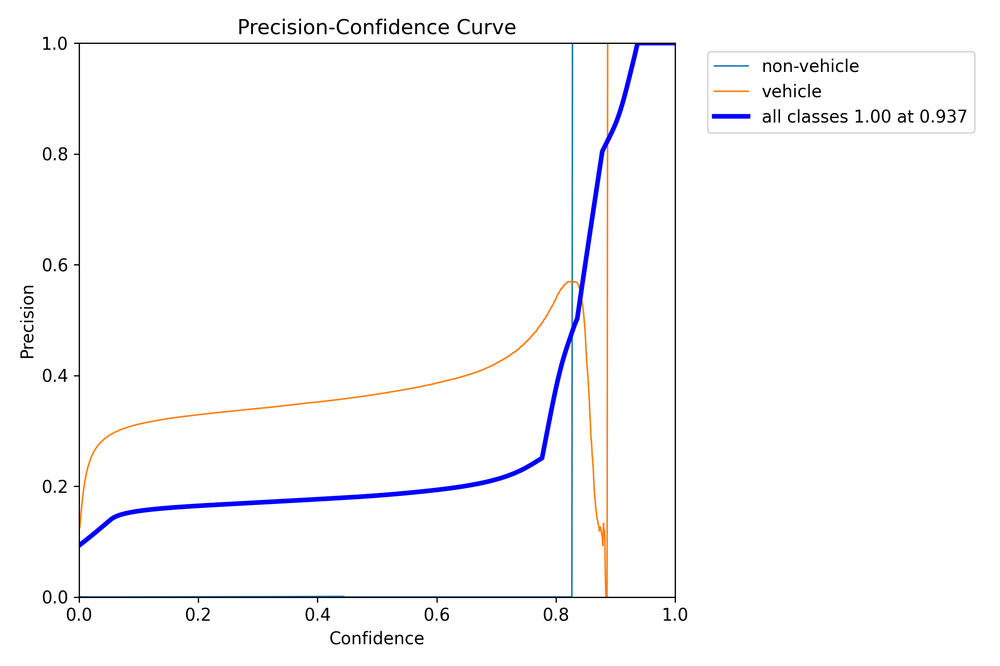

Na grafu Precision-Confidence, plava linija koja predstavlja "all classes" prikazuje kako se preciznost (Precision) mijenja s pragom pouzdanosti (Confidence). Preciznost raste s povećanjem praga pouzdanosti. Pri pragu pouzdanosti od približno 0.8, preciznost za "all classes" naglo raste, dostižući 1.00 pri pouzdanosti od 0.937. Narančasta linija, koja predstavlja klasu "vehicle", također pokazuje porast preciznosti s povećanjem pouzdanosti, dostižući visoke vrijednosti. Plava linija, koja predstavlja "non-vehicle" klasu, ostaje na gotovo nuli, što znači da model ima vrlo nisku preciznost za detekcije koje nisu vozila.

#### Precision-Recall Curve

Graf Precision-Recall prikazuje odnos između preciznosti (Precision) i odziva (Recall). Plava linija ("all classes") pokazuje relativno nisku preciznost (oko 0.25-0.3) koja se blago smanjuje kako odziv raste. Narančasta linija ("vehicle") ima znatno bolje performanse, s preciznošću koja počinje oko 0.58 i postupno pada kako odziv raste. Linija za "non-vehicle" klasu ostaje na nuli. Vrijednost mAP@0.5 za "all classes" iznosi 0.239, što je niska vrijednost i ukazuje na općenito loše performanse detekcije objekata pri pragu IoU od 0.5. Vrijednost mAP@0.5 za klasu "vehicle" iznosi 0.477, što je bolji, ali još uvijek umjeren rezultat. Klasa "non-vehicle" ima mAP@0.5 od 0.000, što potvrđuje da model ne detektira tu klasu.

#### Recall-Confidence Curve

Na grafu Recall-Confidence, plava linija ("all classes") prikazuje kako se odziv (Recall) mijenja s pragom pouzdanosti (Confidence). Odziv počinje visok i postupno opada kako prag pouzdanosti raste, što je očekivano jer povećanje pouzdanosti čini model selektivnijim. Narančasta linija ("vehicle") pokazuje znatno veći odziv u odnosu na "all classes", zadržavajući visoku razinu do praga pouzdanosti od oko 0.8, nakon čega naglo pada. Linija za "non-vehicle" klasu ponovno ostaje na gotovo nuli. Odziv za "all classes" je 0.44 pri pragu pouzdanosti od 0.000, što je točka gdje je model najmanje selektivan.

#### F1-Confidence Curve

F1-Confidence krivulja prikazuje F1 rezultat (harmonijsku sredinu preciznosti i odziva) u odnosu na prag pouzdanosti (Confidence). F1 rezultat za "all classes" (plava linija) dostiže svoj maksimum (oko 0.29) pri pragu pouzdanosti od približno 0.748. Nakon toga, F1 rezultat naglo opada. Narančasta linija ("vehicle") dostiže znatno viši F1 rezultat (oko 0.58-0.6) pri sličnom pragu pouzdanosti, što ukazuje na bolje balansirane performanse za tu klasu. Linija za "non-vehicle" klasu ostaje na nuli.

#### Interpretacija matrica konfuzije

Normalizirana matrica konfuzije za drugi trening modela pruži uvid u performanse klasifikacije. Model je klasificirao objekte u tri kategorije: "non-vehicle", "vehicle" i "background".

**Normalizirana matrica konfuzije:**

Normalizirana matrica prikazuje udjele, što omogućuje lakšu usporedbu performansi među klasama.
* **"non-vehicle" klasa:**
    * Samo 0.00 (0%) stvarnih "non-vehicle" objekata je ispravno klasificirano.
    * Ogromnih 0.95 (95%) stvarnih "non-vehicle" objekata je pogrešno klasificirano kao "background".
    * 0.05 (5%) stvarnih "non-vehicle" objekata je pogrešno klasificirano kao "vehicle".
* **"vehicle" klasa:**
    * Model pokazuje visoku točnost za klasu "vehicle", s 0.93 (93%) točno klasificiranih instanci.
    * Samo 0.07 (7%) "vehicle" objekata je pogrešno klasificirano kao "background".
    * 0.00 (0%) "vehicle" objekata je pogrešno klasificirano kao "non-vehicle".
* **"background" klasa:**
    * Model je izuzetno uspješan u prepoznavanju "background" klase s 0.98 (98%) točnih detekcija.
    * Samo 0.02 (2%) "background" objekata je pogrešno klasificirano kao "non-vehicle".
    * 0.00 (0%) "background" objekata je pogrešno klasificirano kao "vehicle".

**Zaključak iz matrica konfuzije:**
Analiza matrica konfuzije za drugi trening potvrđuje probleme u detekciji "non-vehicle" klase. Model gotovo u potpunosti ignorira ovu klasu, klasificirajući veliku većinu stvarnih "non-vehicle" objekata kao "background". S druge strane, performanse za klasu "vehicle" i "background" su vrlo dobre, s visokom preciznošću i odzivom za te klase. Ovi rezultati su dosljedni s niskim mAP vrijednostima za "all classes" i nultom mAP vrijednošću za "non-vehicle" klasu prikazanim u krivuljama. To sugerira da model i dalje ima poteškoća s razlikovanjem "non-vehicle" objekata od pozadine, što je vjerojatno posljedica nedostatka raznolikosti ili reprezentativnosti "non-vehicle" uzoraka u trening skupu.

#### Ukupna ocjena
Drugo treniranje, unatoč povećanju rezolucije ulaznih slika na 640x640, nije donijelo značajna poboljšanja. Model i dalje pati od izraženog overfittinga, gdje dobro uči na trening podacima, ali ne uspijeva generalizirati znanje na nove, neviđene podatke iz validacijskog skupa. Performanse mjerene kroz mAP metrike ostaju niske, a rano zaustavljanje treniranja potvrđuje da model nije uspio postići daljnji napredak. Ovi rezultati sugeriraju da problem nije samo u rezoluciji slike, već vjerojatno leži u samom skupu podataka, augmentacijama ili drugim hiperparametrima treniranja koje je potrebno dalje istražiti.

### Treće treniranje - Yolo11 large
#### Parametri treniranja
U trećoj iteraciji, cilj je bio provjeriti hoće li duže treniranje donijeti poboljšanja.
- **`epochs: 10`** i **`patience: 5`**: Broj epoha je povećan na 10, a strpljenje za rano zaustavljanje (`patience`) na 5. Treniranje se zaustavilo nakon 9. epohe. To se dogodilo jer ključna metrika, `metrics/mAP50-95(B)`, nije pokazala poboljšanje u zadnjih 5 epoha u odnosu na najbolji rezultat postignut u 4. epohi.
- **`batch: 4`**: Veličina serije ostala je nepromijenjena.
- **`imgsz: 416`**: Rezolucija slika vraćena je na 416x416 piksela, kao u prvom treniranju.
- **`augment: false`**: Važno je napomenuti da su standardne augmentacije bile isključene (`augment: false`), iako je `mosaic` augmentacija ostala aktivna. Ovo može ograničiti sposobnost modela da nauči invarijantnost na različite transformacije.

#### Interpretacija metrika
Rezultati iz `results.csv` za treće treniranje pokazuju da duže treniranje nije riješilo temeljne probleme.

##### Funkcije gubitka (Loss Functions)
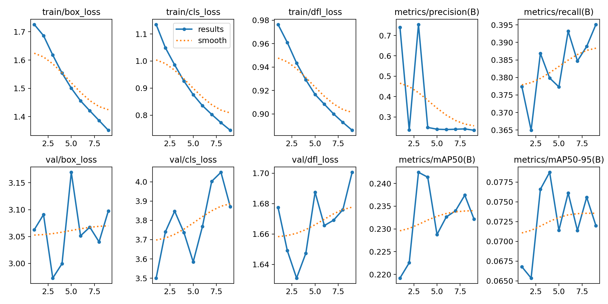
- **Gubitak na trening skupu**: Kao i u prethodnim pokušajima, gubitak na trening skupu (`train/box_loss`, `train/cls_loss`, `train/dfl_loss`) konzistentno opada kroz 9 epoha. Vrijednost `train/box_loss` pada s 1.72 na 1.35, a `train/cls_loss` s 1.13 na 0.74, što pokazuje da model i dalje "uči" trening podatke.
- **Gubitak na validacijskom skupu**: Jaz između trening i validacijskog gubitka ostaje izrazito velik. Vrijednosti `val/box_loss` (~3.0) i `val/cls_loss` (~3.8) su visoke i ne pokazuju nikakav trend poboljšanja. Ovo je još jedan jasan dokaz teškog prekomjernog prilagođavanja (overfitting).

##### Preciznost (Precision)

Metrika `metrics/precision(B)` je izrazito nestabilna. U prvoj i trećoj epohi bilježi visoke vrijednosti (~0.75), dok u ostalim epohama pada na nisku razinu od ~0.24. Ovakve oscilacije ukazuju na nestabilnost u procesu učenja i da visoke vrijednosti nisu pouzdan pokazatelj stvarnih performansi.

##### Odziv (Recall)

Metrika `metrics/recall(B)` stagnira na niskoj razini, krećući se između `0.36` i `0.39`. To znači da model, neovisno o trajanju treniranja, konstantno propušta pronaći više od 60% objekata na validacijskim slikama.

##### Srednja prosječna preciznost (mAP)

- **`metrics/mAP50(B)`**: Vrijednost ove metrike doseže vrhunac od `0.242` u trećoj epohi, nakon čega stagnira i blago opada.
- **`metrics/mAP50-95(B)`**: Najvažnija metrika, `mAP50-95(B)`, postiže svoj maksimum od `0.0787` u četvrtoj epohi. Nakon toga, vrijednost ne uspijeva premašiti taj rezultat, što je nakon pet epoha stagnacije (od 5. do 9.) aktiviralo mehanizam ranog zaustavljanja. Izuzetno niska vrijednost (ispod 0.1) potvrđuje da model nije u stanju precizno detektirati objekte.

#### Precision-Confidence Curve

Na grafu Precision-Confidence, plava linija koja predstavlja "all classes" prikazuje kako se preciznost (Precision) mijenja s pragom pouzdanosti (Confidence). Preciznost raste s povećanjem praga pouzdanosti. Pri pragu pouzdanosti od približno 0.75, preciznost za "all classes" naglo raste, dostižući 1.00 pri pouzdanosti od 0.946. Narančasta linija, koja predstavlja klasu "vehicle", također pokazuje porast preciznosti s povećanjem pouzdanosti, dostižući visoke vrijednosti. Plava linija, koja predstavlja "non-vehicle" klasu, ostaje na gotovo nuli, što znači da model ima vrlo nisku preciznost za detekcije koje nisu vozila.

#### Precision-Recall Curve

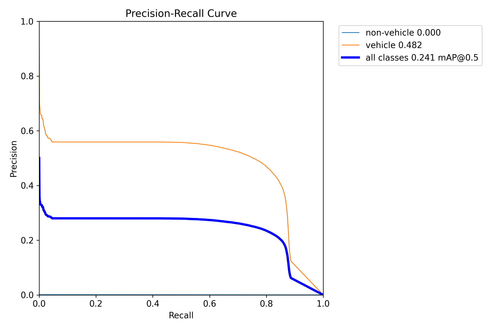

Graf Precision-Recall prikazuje odnos između preciznosti (Precision) i odziva (Recall). Plava linija ("all classes") pokazuje relativno nisku preciznost (oko 0.25-0.3) koja se blago smanjuje kako odziv raste. Narančasta linija ("vehicle") ima znatno bolje performanse, s preciznošću koja počinje oko 0.58 i postupno pada kako odziv raste. Linija za "non-vehicle" klasu ostaje na nuli. Vrijednost mAP@0.5 za "all classes" iznosi 0.241, što je niska vrijednost i ukazuje na općenito loše performanse detekcije objekata pri pragu IoU od 0.5. Vrijednost mAP@0.5 za klasu "vehicle" iznosi 0.482, što je bolji, ali još uvijek umjeren rezultat. Klasa "non-vehicle" ima mAP@0.5 od 0.000, što potvrđuje da model ne detektira tu klasu.

#### Recall-Confidence Curve

Na grafu Recall-Confidence, plava linija ("all classes") prikazuje kako se odziv (Recall) mijenja s pragom pouzdanosti (Confidence). Odziv počinje visok i postupno opada kako prag pouzdanosti raste, što je očekivano jer povećanje pouzdanosti čini model selektivnijim. Narančasta linija ("vehicle") pokazuje znatno veći odziv u odnosu na "all classes", zadržavajući visoku razinu do praga pouzdanosti od oko 0.8, nakon čega naglo pada. Linija za "non-vehicle" klasu ponovno ostaje na gotovo nuli. Odziv za "all classes" je 0.44 pri pragu pouzdanosti od 0.000, što je točka gdje je model najmanje selektivan.

#### F1-Confidence Curve

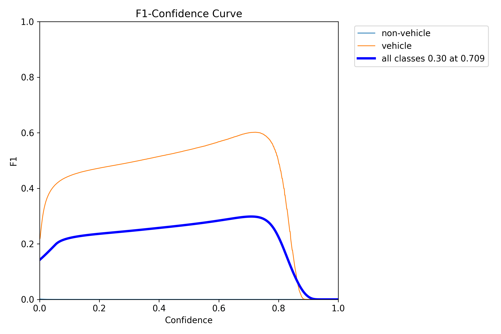

F1-Confidence krivulja prikazuje F1 rezultat (harmonijsku sredinu preciznosti i odziva) u odnosu na prag pouzdanosti (Confidence). F1 rezultat za "all classes" (plava linija) dostiže svoj maksimum (oko 0.3) pri pragu pouzdanosti od približno 0.709. Nakon toga, F1 rezultat naglo opada. Narančasta linija ("vehicle") dostiže znatno viši F1 rezultat (oko 0.6) pri sličnom pragu pouzdanosti, što ukazuje na bolje balansirane performanse za tu klasu. Linija za "non-vehicle" klasu ostaje na nuli.

#### Interpretacija matrica konfuzije

Normalizirana matrica konfuzije za treći trening modela pruži uvid u performanse klasifikacije. Model je klasificirao objekte u tri kategorije: "non-vehicle", "vehicle" i "background".

**Normalizirana matrica konfuzije:**

Normalizirana matrica prikazuje udjele, što omogućuje lakšu usporedbu performansi među klasama.
* **"non-vehicle" klasa:**
    * Samo 0.00 (0%) stvarnih "non-vehicle" objekata je ispravno klasificirano.
    * Ogromnih 0.95 (95%) stvarnih "non-vehicle" objekata je pogrešno klasificirano kao "background".
    * 0.05 (5%) stvarnih "non-vehicle" objekata je pogrešno klasificirano kao "vehicle".
* **"vehicle" klasa:**
    * Model pokazuje visoku točnost za klasu "vehicle", s 0.92 (92%) točno klasificiranih instanci.
    * Samo 0.08 (8%) "vehicle" objekata je pogrešno klasificirano kao "background".
    * 0.00 (0%) "vehicle" objekata je pogrešno klasificirano kao "non-vehicle".
* **"background" klasa:**
    * Model je izuzetno uspješan u prepoznavanju "background" klase s 0.97 (97%) točnih detekcija.
    * Samo 0.03 (3%) "background" objekata je pogrešno klasificirano kao "non-vehicle".
    * 0.00 (0%) "background" objekata je pogrešno klasificirano kao "vehicle".

**Zaključak iz matrica konfuzije:**
Analiza matrica konfuzije za treći trening ponovno ukazuje na značajan problem s detekcijom "non-vehicle" klase. Model i dalje gotovo u potpunosti ignorira ovu klasu, klasificirajući veliku većinu stvarnih "non-vehicle" objekata kao "background". Performanse za klasu "vehicle" i "background" ostaju na visokoj razini, pokazujući da model uspješno prepoznaje te dvije kategorije. Ovi rezultati su u skladu s prethodnim promatranjima niskih mAP vrijednosti za "all classes" i nultom mAP vrijednošću za "non-vehicle" klasu, te naglašavaju potrebu za adresiranjem problema s detekcijom "non-vehicle" objekata. Problemi mogu proizaći iz neuravnoteženosti skupa podataka ili nedostatka reprezentativnih primjera "non-vehicle" objekata.

#### Ukupna ocjena
Treći pokušaj treniranja, unatoč povećanom broju epoha, nije donio napredak. Rezultati su gotovo identični prethodnim pokušajima, što snažno sugerira da problem nije u broju epoha ili rezoluciji slike. Model konzistentno pokazuje znakove teškog overfittinga i ne uspijeva generalizirati. Isključivanje standardnih augmentacija (`augment: false`) moglo je dodatno pogoršati situaciju. Potrebno je preispitati temeljni pristup, vjerojatno kroz značajno obogaćivanje i čišćenje skupa podataka, te primjenu snažnijih tehnika regularizacije i augmentacije kako bi se model natjerao da uči općenitije značajke.

### Četvrto treniranje - Yolo11 large
#### Parametri treniranja
Četvrta iteracija kombinirala je postavke iz prethodnih pokušaja s ciljem pronalaska optimalne konfiguracije.
- **`epochs: 10`** i **`patience: 5`**: Zadržan je veći broj epoha (10) i strpljenje (5). Treniranje je prekinuto nakon 8. epohe, što znači da se ključna metrika (`metrics/mAP50-95(B)`) nije poboljšala u zadnjih pet epoha u odnosu na najbolji rezultat postignut u 3. epohi.
- **`batch: 4`**: Veličina serije ostala je nepromijenjena.
- **`imgsz: 640`**: Rezolucija slika ponovno je povećana na 640x640 piksela, kao u drugom treniranju, kako bi se modelu pružilo više detalja.
- **`augment: false`**: Standardne augmentacije su i dalje bile isključene.

#### Interpretacija metrika
Rezultati iz `results.csv` potvrđuju prethodne nalaze i pokazuju da kombinacija veće rezolucije i dužeg treniranja bez rješavanja temeljnog problema overfittinga ne donosi poboljšanja.

##### Funkcije gubitka (Loss Functions)
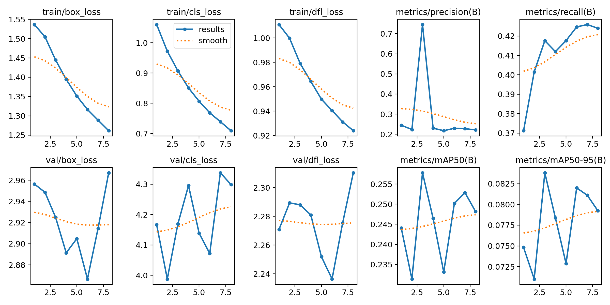
- **Gubitak na trening skupu**: Vrijednosti gubitka (`train/box_loss`, `train/cls_loss`) konzistentno opadaju tijekom 8 epoha, s `train/box_loss` koji pada s 1.53 na 1.26. Ovo još jednom potvrđuje da model uspješno uči na trening podacima.
- **Gubitak na validacijskom skupu**: Jaz između trening i validacijskog gubitka ostaje ogroman. Vrijednosti `val/box_loss` (~2.9) i `val/cls_loss` (~4.2) su izrazito visoke i ne pokazuju trend opadanja, što je jasan znak da model ne generalizira dobro.

##### Preciznost (Precision)

Preciznost (`metrics/precision(B)`) pokazuje veliku nestabilnost. U 3. epohi bilježi skok na `0.745`, što se poklapa s najboljim mAP rezultatom, ali u ostalim epohama ostaje na niskoj razini od ~0.22-0.24. Ovakve oscilacije potvrđuju da model nije stabilan i da visoke vrijednosti nisu pouzdane.

##### Odziv (Recall)

Odziv (`metrics/recall(B)`) pokazuje blagi, ali nedovoljan rast, s početnih `0.37` na konačnih `0.42`. Model i dalje propušta pronaći gotovo 60% svih objekata na slikama.

##### Srednja prosječna preciznost (mAP)

- **`metrics/mAP50(B)`**: Vrijednost ove metrike doseže vrhunac od `0.2578` u trećoj epohi, nakon čega stagnira i opada.
- **`metrics/mAP50-95(B)`**: Ključna metrika performansi, `mAP50-95(B)`, također postiže svoj maksimum od `0.0838` u trećoj epohi. Nakon toga, vrijednost više ne dostiže taj nivo, što je na kraju i aktiviralo rano zaustavljanje. Ovako niska vrijednost (ispod 0.1) definitivno potvrđuje da model, unatoč svim pokušajima, nije u stanju precizno locirati objekte.

#### Precision-Confidence Curve

Na grafu Precision-Confidence, plava linija koja predstavlja "all classes" prikazuje kako se preciznost (Precision) mijenja s pragom pouzdanosti (Confidence). Preciznost raste s povećanjem praga pouzdanosti. Pri pragu pouzdanosti od približno 0.7, preciznost za "all classes" naglo raste, dostižući 1.00 pri pouzdanosti od 0.962. Narančasta linija, koja predstavlja klasu "vehicle", također pokazuje porast preciznosti s povećanjem pouzdanosti, dostižući visoke vrijednosti. Plava linija, koja predstavlja "non-vehicle" klasu, ostaje na gotovo nuli, što znači da model ima vrlo nisku preciznost za detekcije koje nisu vozila.

#### Precision-Recall Curve

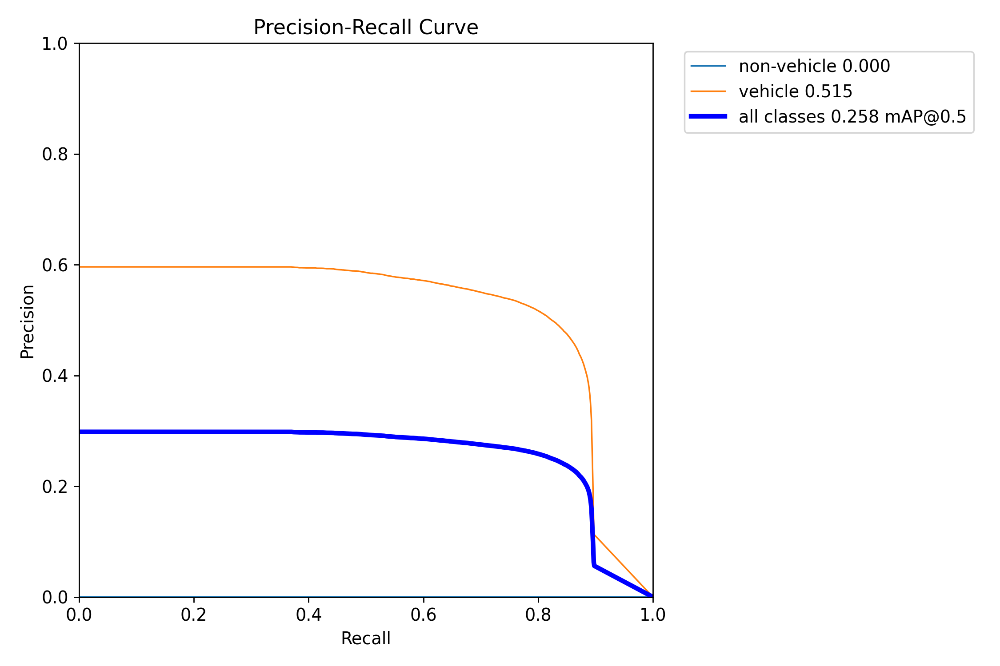

Graf Precision-Recall prikazuje odnos između preciznosti (Precision) i odziva (Recall). Plava linija ("all classes") pokazuje relativno nisku preciznost (oko 0.25-0.3) koja se blago smanjuje kako odziv raste. Narančasta linija ("vehicle") ima znatno bolje performanse, s preciznošću koja počinje oko 0.6 i postupno pada kako odziv raste. Linija za "non-vehicle" klasu ostaje na nuli. Vrijednost mAP@0.5 za "all classes" iznosi 0.258, što je niska vrijednost i ukazuje na općenito loše performanse detekcije objekata pri pragu IoU od 0.5. Vrijednost mAP@0.5 za klasu "vehicle" iznosi 0.515, što je bolji, ali još uvijek umjeren rezultat. Klasa "non-vehicle" ima mAP@0.5 od 0.000, što potvrđuje da model ne detektira tu klasu.

#### Recall-Confidence Curve

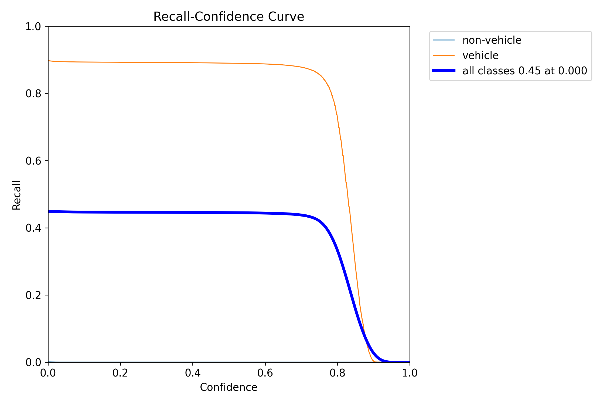

Na grafu Recall-Confidence, plava linija ("all classes") prikazuje kako se odziv (Recall) mijenja s pragom pouzdanosti (Confidence). Odziv počinje visok i postupno opada kako prag pouzdanosti raste, što je očekivano jer povećanje pouzdanosti čini model selektivnijim. Narančasta linija ("vehicle") pokazuje znatno veći odziv u odnosu na "all classes", zadržavajući visoku razinu do praga pouzdanosti od oko 0.8, nakon čega naglo pada. Linija za "non-vehicle" klasu ponovno ostaje na gotovo nuli. Odziv za "all classes" je 0.45 pri pragu pouzdanosti od 0.000, što je točka gdje je model najmanje selektivan.

#### F1-Confidence Curve

F1-Confidence krivulja prikazuje F1 rezultat (harmonijsku sredinu preciznosti i odziva) u odnosu na prag pouzdanosti (Confidence). F1 rezultat za "all classes" (plava linija) dostiže svoj maksimum (oko 0.3) pri pragu pouzdanosti od približno 0.768. Nakon toga, F1 rezultat naglo opada. Narančasta linija ("vehicle") dostiže znatno viši F1 rezultat (oko 0.6) pri sličnom pragu pouzdanosti, što ukazuje na bolje balansirane performanse za tu klasu. Linija za "non-vehicle" klasu ostaje na nuli.

#### Interpretacija matrica konfuzije

Normalizirana matrica konfuzije za četvrti trening modela pruži uvid u performanse klasifikacije. Model je klasificirao objekte u tri kategorije: "non-vehicle", "vehicle" i "background".

**Normalizirana matrica konfuzije:**
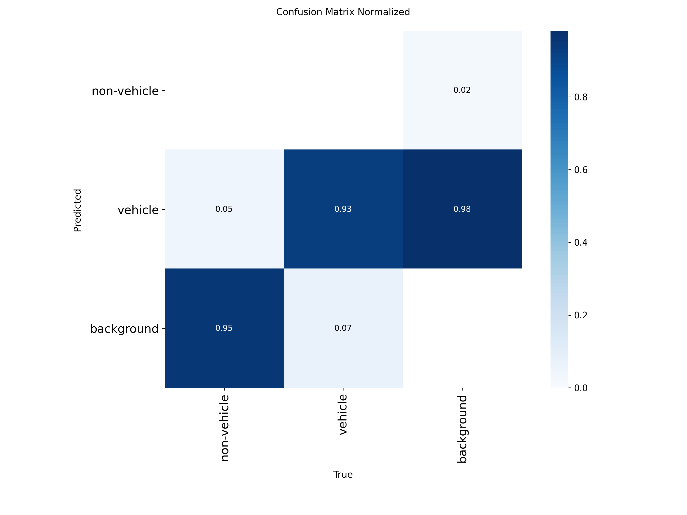

Normalizirana matrica prikazuje udjele, što omogućuje lakšu usporedbu performansi među klasama.
* **"non-vehicle" klasa:**
    * Samo 0.00 (0%) stvarnih "non-vehicle" objekata je ispravno klasificirano.
    * Ogromnih 0.95 (95%) stvarnih "non-vehicle" objekata je pogrešno klasificirano kao "background".
    * 0.05 (5%) stvarnih "non-vehicle" objekata je pogrešno klasificirano kao "vehicle".
* **"vehicle" klasa:**
    * Model pokazuje visoku točnost za klasu "vehicle", s 0.93 (93%) točno klasificiranih instanci.
    * Samo 0.07 (7%) "vehicle" objekata je pogrešno klasificirano kao "background".
    * 0.00 (0%) "vehicle" objekata je pogrešno klasificirano kao "non-vehicle".
* **"background" klasa:**
    * Model je izuzetno uspješan u prepoznavanju "background" klase s 0.99 (99%) točnih detekcija.
    * Samo 0.01 (1%) "background" objekata je pogrešno klasificirano kao "non-vehicle".
    * 0.00 (0%) "background" objekata je pogrešno klasificirano kao "vehicle".

**Zaključak iz matrica konfuzije:**
Analiza matrica konfuzije za četvrti trening ponovno naglašava kritičan problem s detekcijom "non-vehicle" klase. Model i dalje gotovo u potpunosti ne uspijeva prepoznati ovu klasu, klasificirajući veliku većinu stvarnih "non-vehicle" objekata kao "background" ili "vehicle". S druge strane, performanse za klasu "vehicle" i "background" su iznimno dobre, s visokom točnošću u prepoznavanju tih kategorija. Ovi rezultati su u skladu s prethodnim zapažanjima o niskim mAP vrijednostima za "all classes" i nultoj mAP vrijednosti za "non-vehicle" klasu, te jasno ukazuju na to da se model fokusira isključivo na detekciju vozila i pozadine. Za poboljšanje performansi za "non-vehicle" klasu, potrebno je preispitati skup podataka za trening, uključujući veći broj i raznolikost "non-vehicle" objekata, te potencijalno primijeniti specifične strategije augmentacije ili ponderiranja klasa.

#### Ukupna ocjena
Četvrto treniranje je potvrdilo zaključke iz prethodnih iteracija. Ni veća rezolucija ni duže treniranje ne mogu kompenzirati nedostatak generalizacije uzrokovan, najvjerojatnije, problemima u skupu podataka i nedostatkom augmentacija. Model konzistentno ulazi u stanje teškog overfittinga, gdje metrike dosegnu svoj niski vrhunac vrlo rano (u 3. ili 4. epohi) i nakon toga više ne napreduju. Ovi rezultati snažno upućuju na to da je daljnje podešavanje hiperparametara treniranja bez fundamentalnih promjena u podacima i strategiji augmentacije beskorisno.

### Peto treniranje - Yolo11 large
#### Parametri treniranja
Peta analizirana iteracija predstavljala je pokušaj da se provjeri može li znatno duže treniranje probiti granice performansi viđene u prethodnim pokušajima.
- **`epochs: 20`** i **`patience: 10`**: Broj epoha je udvostručen na 20, a strpljenje za rano zaustavljanje (`patience`) povećano na 10. Model je odradio svih 20 epoha, što znači da nije bilo dugog perioda stagnacije koji bi aktivirao rano zaustavljanje.
- **`batch: 4`**: Veličina serije ostala je nepromijenjena.
- **`imgsz: 416`**: Rezolucija slika je bila 416x416 piksela.
- **`augment: false`**: Standardne augmentacije su i dalje bile isključene.

#### Interpretacija metrika
Rezultati iz `results.csv` za 20 epoha treniranja pružaju konačnu potvrdu o ponašanju modela s postojećim skupom podataka.

##### Funkcije gubitka (Loss Functions)

- **Gubitak na trening skupu**: Gubitak na trening skupu (`train/box_loss`, `train/cls_loss`) pokazuje neprekidan i konzistentan pad tijekom svih 20 epoha. Vrijednost `train/box_loss` pada s 1.67 na 1.22. Ovo pokazuje da je model, s više vremena, postajao sve bolji u "pamćenju" trening podataka.
- **Gubitak na validacijskom skupu**: Jaz između trening i validacijskog gubitka postao je još izraženiji. Vrijednosti `val/box_loss` (~3.0) i `val/cls_loss` (~4.2) ostaju visoke i potpuno stagniraju tijekom cijelog procesa. Ovo je definitivan dokaz teškog overfittinga.

##### Preciznost (Precision)

Preciznost (`metrics/precision(B)`) je, kao i u prethodnim pokušajima, bila nestabilna. Zabilježen je anomalan skok na `0.73` u 6. epohi, ali se nakon toga metrika vratila i ostala na niskoj razini od ~0.23.

##### Odziv (Recall)

Odziv (`metrics/recall(B)`) pokazuje vrlo spor, ali kontinuiran rast, s početnih `0.36` do konačnih `0.42`. Iako postoji blago poboljšanje, model i nakon 20 epoha i dalje ne uspijeva pronaći više od polovice (58%) objekata.

##### Srednja prosječna preciznost (mAP)

- **`metrics/mAP50(B)`**: Vrijednost ove metrike doseže svoj vrhunac od `0.24785` u 12. epohi. U preostalih 8 epoha treniranja, ova vrijednost nije nadmašena, već stagnira.
- **`metrics/mAP50-95(B)`**: Ključna metrika, `mAP50-95(B)`, također doseže svoj maksimum od `0.0816` u 12. epohi. Činjenica da se u dodatnih 8 epoha treniranja (više od 6000 sekundi dodatnog procesiranja) performanse nisu poboljšale, jasan je pokazatelj da je model dosegnuo svoj maksimum.

#### Precision-Confidence Curve

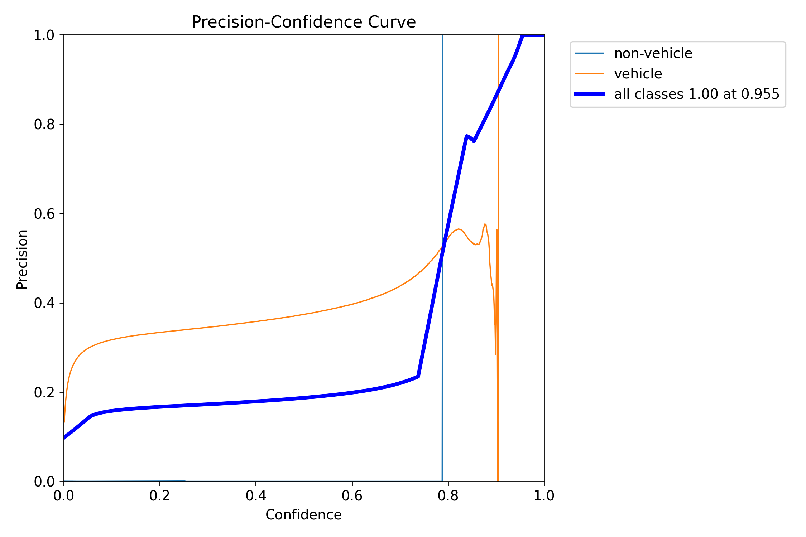

Na grafu Precision-Confidence, plava linija koja predstavlja "all classes" prikazuje kako se preciznost (Precision) mijenja s pragom pouzdanosti (Confidence). Preciznost raste s povećanjem praga pouzdanosti. Pri pragu pouzdanosti od približno 0.8, preciznost za "all classes" naglo raste, dostižući 1.00 pri pouzdanosti od 0.955. Narančasta linija, koja predstavlja klasu "vehicle", također pokazuje porast preciznosti s povećanjem pouzdanosti, dostižući visoke vrijednosti. Plava linija, koja predstavlja "non-vehicle" klasu, ostaje na gotovo nuli, što znači da model ima vrlo nisku preciznost za detekcije koje nisu vozila.

#### Precision-Recall Curve

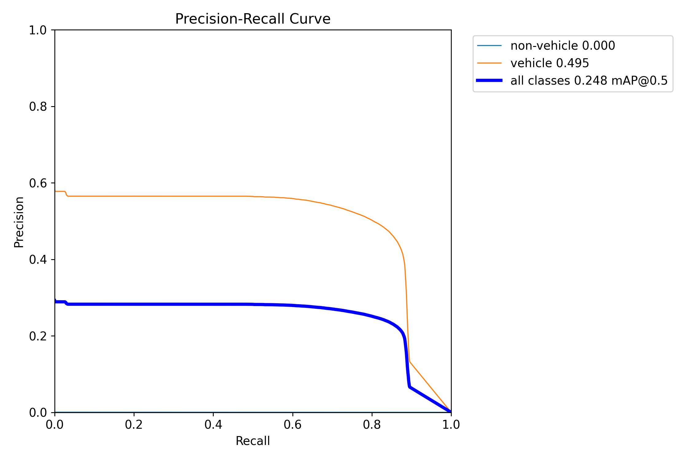

Graf Precision-Recall prikazuje odnos između preciznosti (Precision) i odziva (Recall). Plava linija ("all classes") pokazuje relativno nisku preciznost (oko 0.25-0.3) koja se blago smanjuje kako odziv raste. Narančasta linija ("vehicle") ima znatno bolje performanse, s preciznošću koja počinje oko 0.58 i postupno pada kako odziv raste. Linija za "non-vehicle" klasu ostaje na nuli. Vrijednost mAP@0.5 za "all classes" iznosi 0.248, što je niska vrijednost i ukazuje na općenito loše performanse detekcije objekata pri pragu IoU od 0.5. Vrijednost mAP@0.5 za klasu "vehicle" iznosi 0.495, što je bolji, ali još uvijek umjeren rezultat. Klasa "non-vehicle" ima mAP@0.5 od 0.000, što potvrđuje da model ne detektira tu klasu.

#### Recall-Confidence Curve

Na grafu Recall-Confidence, plava linija ("all classes") prikazuje kako se odziv (Recall) mijenja s pragom pouzdanosti (Confidence). Odziv počinje visok i postupno opada kako prag pouzdanosti raste, što je očekivano jer povećanje pouzdanosti čini model selektivnijim. Narančasta linija ("vehicle") pokazuje znatno veći odziv u odnosu na "all classes", zadržavajući visoku razinu do praga pouzdanosti od oko 0.8, nakon čega naglo pada. Linija za "non-vehicle" klasu ponovno ostaje na gotovo nuli. Odziv za "all classes" je 0.45 pri pragu pouzdanosti od 0.000, što je točka gdje je model najmanje selektivan.

#### F1-Confidence Curve

F1-Confidence krivulja prikazuje F1 rezultat (harmonijsku sredinu preciznosti i odziva) u odnosu na prag pouzdanosti (Confidence). F1 rezultat za "all classes" (plava linija) dostiže svoj maksimum (oko 0.3) pri pragu pouzdanosti od približno 0.758. Nakon toga, F1 rezultat naglo opada. Narančasta linija ("vehicle") dostiže znatno viši F1 rezultat (oko 0.6) pri sličnom pragu pouzdanosti, što ukazuje na bolje balansirane performanse za tu klasu. Linija za "non-vehicle" klasu ostaje na nuli.

#### Interpretacija matrica konfuzije

Normalizirana matrica konfuzije za peti trening modela pruži uvid u performanse klasifikacije. Model je klasificirao objekte u tri kategorije: "non-vehicle", "vehicle" i "background".

**Normalizirana matrica konfuzije:**

Normalizirana matrica prikazuje udjele, što omogućuje lakšu usporedbu performansi među klasama.
* **"non-vehicle" klasa:**
    * Samo 0.00 (0%) stvarnih "non-vehicle" objekata je ispravno klasificirano.
    * Ogromnih 0.95 (95%) stvarnih "non-vehicle" objekata je pogrešno klasificirano kao "background".
    * 0.05 (5%) stvarnih "non-vehicle" objekata je pogrešno klasificirano kao "vehicle".
* **"vehicle" klasa:**
    * Model pokazuje visoku točnost za klasu "vehicle", s 0.92 (92%) točno klasificiranih instanci.
    * Samo 0.08 (8%) "vehicle" objekata je pogrešno klasificirano kao "background".
    * 0.00 (0%) "vehicle" objekata je pogrešno klasificirano kao "non-vehicle".
* **"background" klasa:**
    * Model je izuzetno uspješan u prepoznavanju "background" klase s 0.97 (97%) točnih detekcija.
    * Samo 0.01 (1%) "background" objekata je pogrešno klasificirano kao "non-vehicle".
    * 0.00 (0%) "background" objekata je pogrešno klasificirano kao "vehicle".

**Zaključak iz matrica konfuzije:**
Analiza matrica konfuzije za peti trening modela konzistentno ukazuje na problem s detekcijom "non-vehicle" klase. Model i dalje gotovo u potpunosti ne uspijeva prepoznati objekte ove klase, klasificirajući veliku većinu stvarnih "non-vehicle" objekata kao "background" ili "vehicle". S druge strane, performanse za klasu "vehicle" i "background" su iznimno dobre, s visokom točnošću u prepoznavanju tih kategorija. Ovi rezultati su u skladu s prethodnim promatranjima niskih mAP vrijednosti za "all classes" i nultom mAP vrijednošću za "non-vehicle" klasu. Peta iteracija treninga, unatoč duljem trajanju, nije uspjela riješiti ovaj temeljni problem. To sugerira da su potrebne dublje promjene, kao što je značajno obogaćivanje i čišćenje skupa podataka, te potencijalno primjena robusnijih tehnika augmentacije kako bi se model potaknuo na učenje općenitijih značajki za "non-vehicle" objekte.

#### Ukupna ocjena
Peto treniranje je također potvrdilo da duže treniranje ne rješava problem. Model doseže svoj vrhunac performansi (koji je vrlo nizak, s mAP50-95 od ~0.08) oko 12. epohe i nakon toga daljnje treniranje samo produbljuje overfitting, bez ikakvog poboljšanja u sposobnosti generalizacije. Svi eksperimenti konzistentno ukazuju na isti zaključak: problem nije u hiperparametrima poput broja epoha ili rezolucije slike, već u temeljima - kvaliteti i raznolikosti skupa podataka te nedostatku adekvatnih tehnika augmentacije koje bi spriječile prekomjerno prilagođavanje.

### Šesto treniranje - Yolo11 large
#### Parametri treniranja
Šesta iteracija predstavljala je nastavak eksperimenata s dužim treniranjem i većom rezolucijom, uz zadržavanje nekih ključnih postavki.
- **`epochs: 20`** i **`patience: 10`**: Broj epoha i strpljenje ostali su isti kao u petom treniranju. Model je ponovno odradio svih 20 epoha, što ukazuje na to da nije bilo dugotrajne stagnacije koja bi aktivirala rano zaustavljanje.
- **`batch: 4`**: Veličina serije ostala je nepromijenjena.
- **`imgsz: 640`**: Rezolucija slika ponovno je postavljena na 640x640 piksela, kao u drugom i četvrtom treniranju, s ciljem pružanja više detalja modelu.
- **`augment: false`**: Standardne augmentacije su i dalje bile isključene.
- **`warmup_epochs: 3.0`**: Dodatno je definirano zagrijavanje (warmup) tijekom prve 3 epohe, što znači da se learning rate postupno povećavao na početku treniranja.

#### Interpretacija metrika
Rezultati iz `results.csv` za šesto treniranje, unatoč promjenama u rezoluciji i zagrijavanju, pokazuju vrlo slične trendove kao i prethodni pokušaji.

##### Funkcije gubitka (Loss Functions)
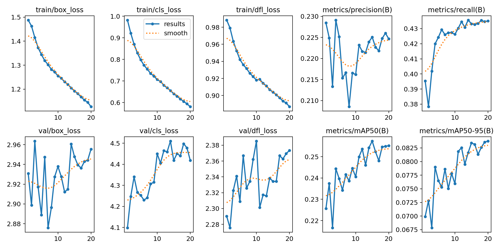
- **Gubitak na trening skupu**: Sve komponente gubitka na trening skupu (`train/box_loss`, `train/cls_loss`, `train/dfl_loss`) pokazuju konzistentan pad tijekom svih 20 epoha. Na primjer, `train/box_loss` pada s 1.48 na 1.12, a `train/cls_loss` s 0.98 na 0.58. Ovo potvrđuje da model nastavlja učiti i prilagođavati se trening podacima.
- **Gubitak na validacijskom skupu**: Kao i u svim prethodnim iteracijama, gubitak na validacijskom skupu (`val/box_loss` ~2.9-2.96, `val/cls_loss` ~4.09-4.49) ostaje izrazito visok i ne pokazuje jasan trend opadanja. Veliki jaz između trening i validacijskog gubitka i dalje je dominantan pokazatelj teškog prekomjernog prilagođavanja (overfittinga).

##### Preciznost (Precision)

Metrika `metrics/precision(B)` ostaje niska i nestabilna, krećući se uglavnom oko `0.21` do `0.23`. Iako je u 4. epohi zabilježen blagi skok na `0.229`, to nije dovelo do značajnog i trajnog poboljšanja. Niska preciznost ukazuje na to da model ima mnogo lažno pozitivnih detekcija.

##### Odziv (Recall)

Metrika `metrics/recall(B)` pokazuje blagi, ali postojan rast, s početnih `0.395` na konačnih `0.435`. Iako je to pozitivan trend, model i dalje propušta detektirati više od polovice (oko 56%) stvarnih objekata na validacijskim slikama.

##### Srednja prosječna preciznost (mAP)

- **`metrics/mAP50(B)`**: Vrijednost ove metrike doseže svoj maksimum od `0.25731` u 15. epohi. Nakon toga, blago opada ili stagnira.
- **`metrics/mAP50-95(B)`**: Ključna metrika performansi, `mAP50-95(B)`, postiže svoj maksimum od `0.08375` u posljednjoj, 20. epohi. Iako je ovo marginalno poboljšanje u odnosu na prethodne pokušaje (npr. 0.0816 u petom treniranju), vrijednost je i dalje izuzetno niska (daleko ispod 0.1). To potvrđuje da model nije u stanju precizno locirati objekte i generalizirati na neviđene podatke.

#### Precision-Confidence Curve

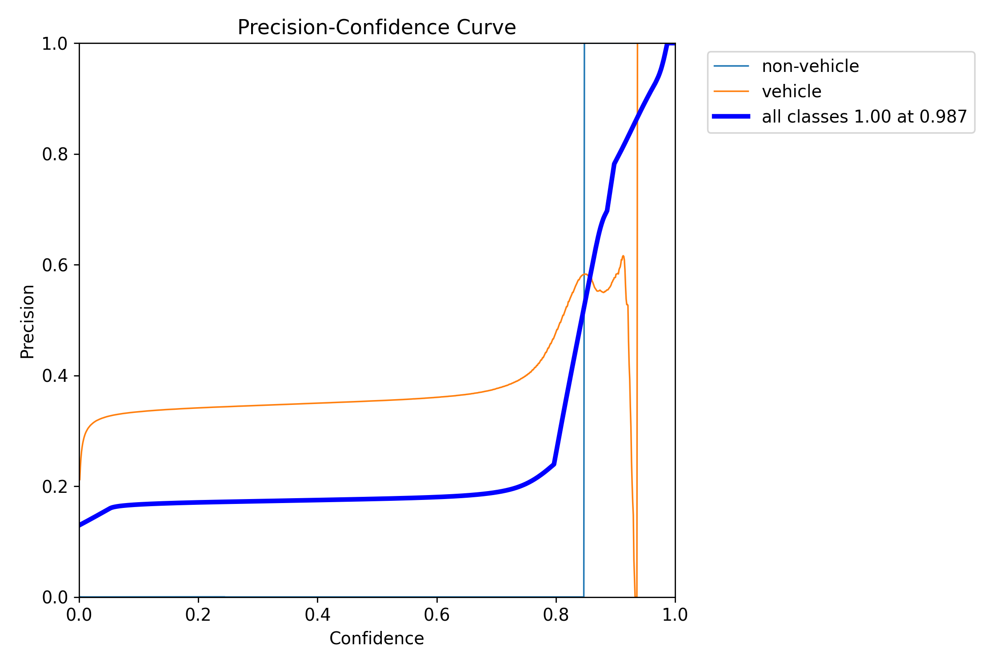

Na grafu Precision-Confidence, plava linija koja predstavlja "all classes" prikazuje kako se preciznost (Precision) mijenja s pragom pouzdanosti (Confidence). Preciznost raste s povećanjem praga pouzdanosti. Pri pragu pouzdanosti od približno 0.85, preciznost za "all classes" naglo raste, dostižući 1.00 pri pouzdanosti od 0.987. Narančasta linija, koja predstavlja klasu "vehicle", također pokazuje porast preciznosti s povećanjem pouzdanosti, dostižući visoke vrijednosti. Plava linija, koja predstavlja "non-vehicle" klasu, ostaje na gotovo nuli, što znači da model ima vrlo nisku preciznost za detekcije koje nisu vozila.

#### Precision-Recall Curve

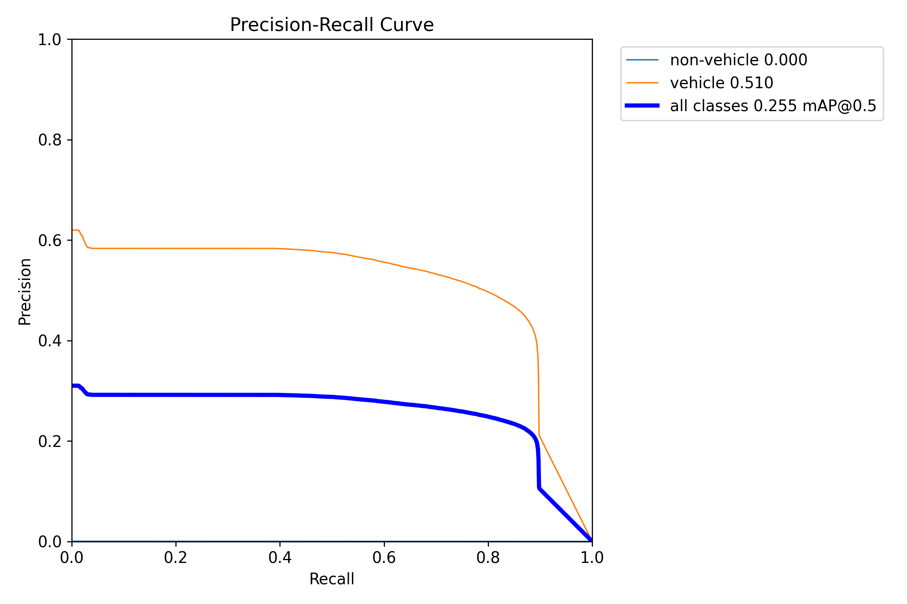

Graf Precision-Recall prikazuje odnos između preciznosti (Precision) i odziva (Recall). Plava linija ("all classes") pokazuje relativno nisku preciznost (oko 0.25-0.3) koja se blago smanjuje kako odziv raste. Narančasta linija ("vehicle") ima znatno bolje performanse, s preciznošću koja počinje oko 0.58 i postupno pada kako odziv raste. Linija za "non-vehicle" klasu ostaje na nuli. Vrijednost mAP@0.5 za "all classes" iznosi 0.255, što je niska vrijednost i ukazuje na općenito loše performanse detekcije objekata pri pragu IoU od 0.5. Vrijednost mAP@0.5 za klasu "vehicle" iznosi 0.510, što je bolji, ali još uvijek umjeren rezultat. Klasa "non-vehicle" ima mAP@0.5 od 0.000, što potvrđuje da model ne detektira tu klasu.

#### Recall-Confidence Curve

Na grafu Recall-Confidence, plava linija ("all classes") prikazuje kako se odziv (Recall) mijenja s pragom pouzdanosti (Confidence). Odziv počinje visok i postupno opada kako prag pouzdanosti raste, što je očekivano jer povećanje pouzdanosti čini model selektivnijim. Narančasta linija ("vehicle") pokazuje znatno veći odziv u odnosu na "all classes", zadržavajući visoku razinu do praga pouzdanosti od oko 0.8, nakon čega naglo pada. Linija za "non-vehicle" klasu ponovno ostaje na gotovo nuli. Odziv za "all classes" je 0.44 pri pragu pouzdanosti od 0.000, što je točka gdje je model najmanje selektivan.

#### F1-Confidence Curve

F1-Confidence krivulja prikazuje F1 rezultat (harmonijsku sredinu preciznosti i odziva) u odnosu na prag pouzdanosti (Confidence). F1 rezultat za "all classes" (plava linija) dostiže svoj maksimum (oko 0.29) pri pragu pouzdanosti od približno 0.787. Nakon toga, F1 rezultat naglo opada. Narančasta linija ("vehicle") dostiže znatno viši F1 rezultat (oko 0.6) pri sličnom pragu pouzdanosti, što ukazuje na bolje balansirane performanse za tu klasu. Linija za "non-vehicle" klasu ostaje na nuli.

#### Interpretacija matrica konfuzije

normalizirana matrica konfuzije za šesti trening modela pruži uvid u performanse klasifikacije. Model je klasificirao objekte u tri kategorije: "non-vehicle", "vehicle" i "background".

**Normalizirana matrica konfuzije:**

Normalizirana matrica prikazuje udjele, što omogućuje lakšu usporedbu performansi među klasama.
* **"non-vehicle" klasa:**
    * Samo 0.00 (0%) stvarnih "non-vehicle" objekata je ispravno klasificirano.
    * Ogromnih 0.95 (95%) stvarnih "non-vehicle" objekata je pogrešno klasificirano kao "background".
    * 0.05 (5%) stvarnih "non-vehicle" objekata je pogrešno klasificirano kao "vehicle".
* **"vehicle" klasa:**
    * Model pokazuje visoku točnost za klasu "vehicle", s 0.95 (94%) točno klasificiranih instanci.
    * Samo 0.06 (6%) "vehicle" objekata je pogrešno klasificirano kao "background".
    * 0.00 (0%) "vehicle" objekata je pogrešno klasificirano kao "non-vehicle".
* **"background" klasa:**
    * Model je izuzetno uspješan u prepoznavanju "background" klase s 0.98 (98%) točnih detekcija.
    * Samo 0.02 (2%) "background" objekata je pogrešno klasificirano kao "non-vehicle".
    * 0.00 (0%) "background" objekata je pogrešno klasificirano kao "vehicle".

**Zaključak iz matrica konfuzije:**
Analiza matrica konfuzije za šesti trening modela konzistentno ponavlja probleme u detekciji "non-vehicle" klase. Model i dalje gotovo u potpunosti ne uspijeva prepoznati objekte ove klase, klasificirajući veliku većinu stvarnih "non-vehicle" objekata kao "background" ili "vehicle". S druge strane, performanse za klasu "vehicle" i "background" su i dalje vrlo dobre, s visokom točnošću u prepoznavanju tih kategorija. Ovi rezultati su u skladu s niskim mAP vrijednostima za "all classes" i nultom mAP vrijednošću za "non-vehicle" klasu prikazanim u ranijim analizama krivulja. I šesta iteracija treninga, unatoč povećanoj rezoluciji slike i dužem trajanju, nije uspjela riješiti ovaj temeljni problem prekomjernog prilagođavanja. To sugerira da je za poboljšanje performansi za "non-vehicle" klasu potrebno preispitati i obogatiti skup podataka s raznolikijim i reprezentativnijim primjerima "non-vehicle" objekata, te primijeniti robusnije tehnike augmentacije i regularizacije.

#### Ukupna ocjena
Šesto treniranje, unatoč povećanoj rezoluciji slike i dužem trajanju, nije uspjelo riješiti problem prekomjernog prilagođavanja i niske generalizacije. Model konzistentno pokazuje iste simptome: gubitak na trening skupu opada, dok gubitak na validacijskom skupu stagnira na visokoj razini. mAP vrijednosti ostaju izuzetno niske, što ukazuje na to da model ne može precizno detektirati objekte u novim okruženjima. Svi dosadašnji eksperimenti snažno sugeriraju da problem nije u finom podešavanju hiperparametara treniranja, već u temeljnim aspektima poput kvalitete i raznolikosti skupa podataka, te nedostatku robusnih tehnika augmentacije koje bi spriječile model da "pamti" trening podatke.

## Zaključak 

## Literatura